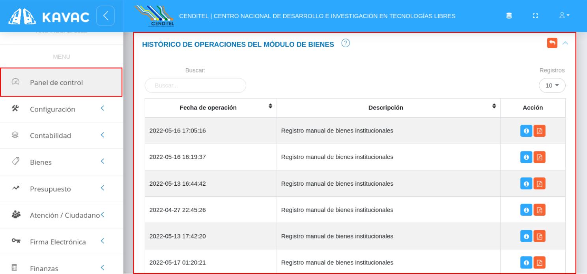
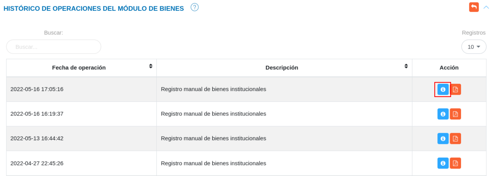
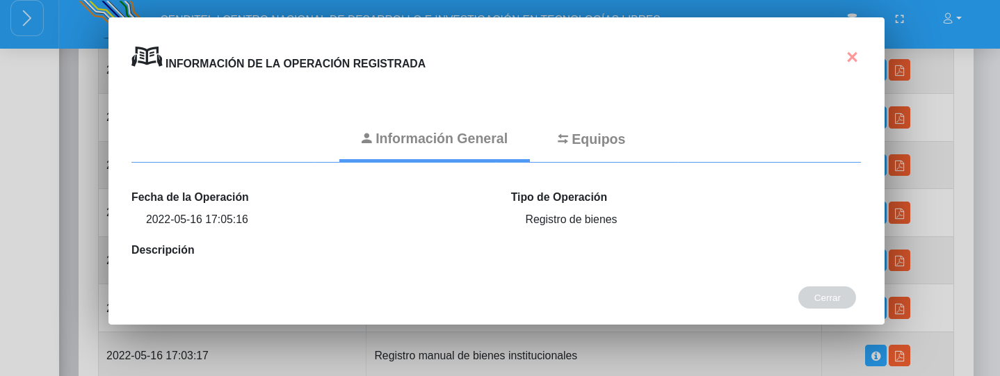
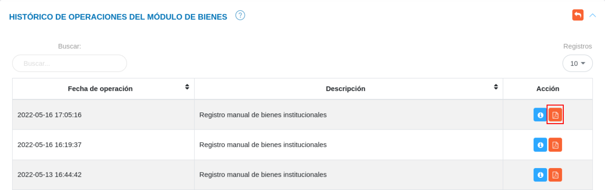

# Panel de Control Módulo de Bienes 
**********************************

 

## Historial de operaciones módulo de bienes

La sección **Historial de Operaciones Módulo de Bienes** es una funcionalidad que permite al administrador del sistema realizar un seguimiento de los registros realizados en el módulo de bienes, incluye una tabla de registros que describen la fecha de operación y descripción del registro. De igual forma, es posible consultar información sobre el registro y generar un archivo en formato pdf con detalles sobre el registro.    

Para acceder a la sección de historial de operaciones módulo de bienes del panel control se deben seguir los siguientes pasos:

***Usuario Administrador***

-   Acceder al sistema e iniciar sesión con usuario y contraseña.
-   Ingresar a través del panel lateral a **Panel de Control** y dirigirse a la sección **Historial de Operaciones Módulo de Bienes**.

Figura 149: Historial de Operaciones en el Módulo de Bienes

-   Presione el botón **Consultar registro**  ubicado en la columna titulada **Acción** de un registro que se desee consultar. 

Figura 150: Historial de Operaciones en el Módulo de Bienes

-   A continuación el sistema despliega una sección donde se describen los datos del registro seleccionado.

Figura 151: Historial de Operaciones en el Módulo de Bienes

-   Presione el botón **Imprimir registro**  ubicado en la columna titulada **Acción** de un registro seleccionado. 

Figura 152: Historial de Operaciones en el Módulo de Bienes

