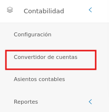
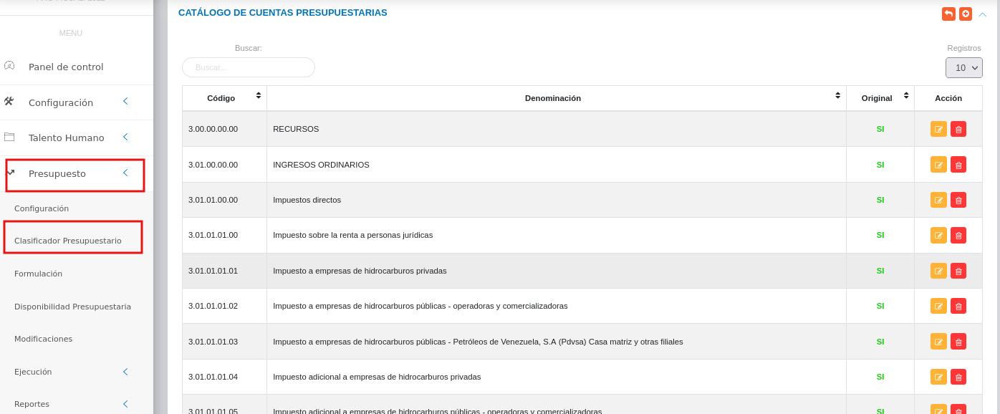
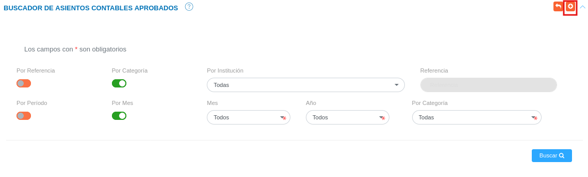
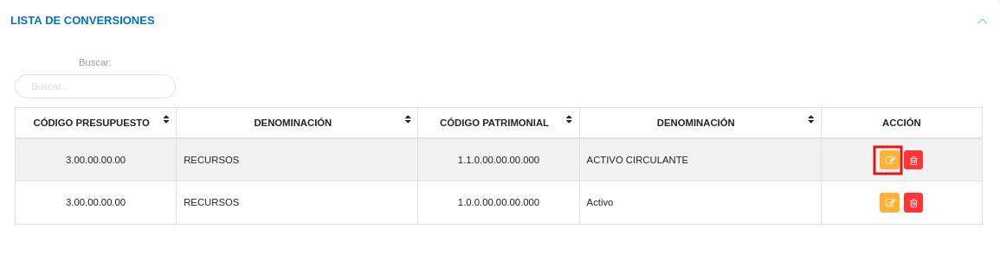

# Gestión de  Convertidor de Cuentas
************************

El usuario selecciona el módulo de Contabilidad en el menú lateral de los módulos del sistema, ahí visualizara las opciones **Configuración**, **Convertidor de cuentas**,  **Asientos Contables** y **Reportes**, debiendo pulsar **Convertidor de cuentas** 

Figura 9: Menú del Módulo de Contabilidad

## Buscador de conversiones

Esta funcionalidad le permite al analista de contabilidad o al usuario con permisos sobre el módulo, filtrar los registros realizados referentes a la **Conversión de Cuentas**. 

Buscar conversiones:

- Dirigirse al **Módulo de Contabilidad**, luego a **Conversión de Cuentas** y ubicarse en la sección **Buscador de Conversiones** (Figura 10).
- Haciendo uso de los botones de selección es posible filtrar los registros por código
presupuestario o código patrimonial. 
- A continuación se elige un registro inicial y uno final en los campos **Desde** y **Hasta**, para filtrar la búsqueda dentro de este intervalo de registros. 
- De otra forma es posible observar todos los registros según su categoría ya sea por código presupuestario o código patrimonial haciendo uso del botón de selección **Seleccionar Todas**.
- Se presiona el botón **Buscar**  y el sistema filtra los registros y los muestra en la sección **Lista de Conversiones** (Figura 3).

Figura 10: Buscador de Conversiones

  

### Registrar conversión de cuentas

El **Módulo de Contabilidad** permite establecer una relación entre las cuentas patrimoniales y presupuestarias a través de la funcionalidad **Conversión de Cuentas**. 

- Dirigirse al **Módulo de Contabilidad**, luego a **Conversión de Cuentas** y ubicarse en la sección **Buscador de Conversiones**.
- Haciendo uso del botón **Crear**  ubicado en la esquina superior derecha de esta sección, se procede a registrar una nueva conversión.
-   Complete el formulario **Conversión de cuentas** (ver Figura 13).  Asigne una cuenta presupuestaria y una cuenta patrimonial para la conevrsión de cuentas a través de los campos **Cuentas presupuestarias** y **Cuentas patrimoniales**.

!!! note "Nota" 
    Los campos de selección del apartado **Gestión de conversiones de cuentas** incluyen información configurada previamente a través de los registros comunes del módulo de contabilidad y del módulo de presupuesto. Si se requiere incluir información diferente a la que se encuentra por defecto, se recomienda agregar estos registros en la configuración de registros comunes. 

 Para agregar cuentas patrimoniales acceda a **Contabilidad** > **Configuración** > **Registros Comunes** > **Catálogo de cuentas**

   

 Para agregar cuentas presupuestarias acceda a **Presupuesto** > **Clasificador Presupuestario**

   

-   Presione el botón **Guardar**   para registrar los cambios efectuados.
-   Presione el botón **Cancelar**   para cancelar registro y regresar a la ruta anterior.
-   Presione el botón **Borrar**  para eliminar datos del formulario.
-   Si desea recibir ayuda guiada, presione el botón .
-   Para retornar a la ruta anterior, presione el botón .

Figura 13:  Formulario para registrar una conversión de cuentas

## Gestionar conversión de cuentas

La gestión de cotización se lleva a cabo a través del apartado **Conversión de Cuentas**. 

-   Para acceder a esta sección debe dirigirse a **Contabilidad** y ubicarse en la sección **Conversión de Cuentas** apartado **Listado de conversiones** (ver Figura 14).

A través del apartado **Listado de conversiones de Cuentas** se listan los registros de **Listado de conversiones de cuentas** en una tabla.   

Desde este apartado se pueden llevar a cabo las siguientes acciones: 

-   ***Registrar conversión de cuentas***.   
-   ***Editar registros***. 
-   ***Eliminar registros***. 

Figura 14: Lista de Conversiones

### Registrar conversiones de cuentas

-   Presione el botón **Crear registro**  ubicado en la parte superior derecha del apartado **Conversión de cuentas** (ver Figura 10)
-   A continuación complete el formulario siguiendo los pasos descritos en el apartado [Registrar conversiiones](##Registrar-conversión-de-cuentas).
-   Presione el botón **Guardar**   para registrar los cambios efectuados.

Figura 15: Registrar conversión de cuentas

### Editar registros

-   Presione el botón **Editar registro**   ubicado en la columna titulada **Acción** del registro de conversión de cuentas que se desee seleccionar para actualizar datos. 

Figura 16: Editar Registros de conversiones de cuentas

-   Actualice los datos del formulario siguiendo los pasos descritos en el apartado [Registrar conversión de cuentas](#registrar-conversion_de_cuentas).
-   Presione el botón **Guardar**   para registrar los cambios efectuados.

### Eliminar registros

-   Presione el botón **Eliminar registro**   ubicado en la columna titulada **Acción** del registro de conversión de cuentas que se desee seleccionar para eliminar del sistema. 

Figura 17: Eliminar Registros de conversión de cuentas

-   Confirme que esta seguro de eliminar el registro seleccionado a través de la ventana emergente, mediante el botón **Confirmar** y efectue los cambios.  

   