# Gestión de Asientos Contables
********************

El usuario selecciona el módulo de Contabilidad en el menú lateral de los módulos del sistema, ahí visualizara las opciones **Configuración**, **Convertidor de cuentas**,  **Asientos Contables** y **Reportes**, debiendo pulsar **Asientos Contables** 

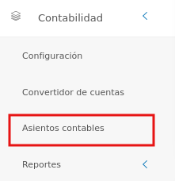
Figura 18: Menú del Módulo de Contabilidad

## Buscador de asientos contables 

Esta funcionalidad se ubica en la sección principal de **Asientos Contables**, a través de esta herramienta es posible listar todos los registros de asientos contables aprobados o sin aprobar.	
 

## Buscar asientos contables:

- Dirigirse al **Módulo de Contabilidad**, luego a **Asientos Contables** y ubicarse en la sección **Buscador de Asientos Contables** (Figura 19).
- Haciendo uso de los botones de selección es posible filtrar los registros.
- Se presiona el botón **Buscar**  y el sistema filtra estos registros y los muestra en la sección **Listado de Asientos Contables**.

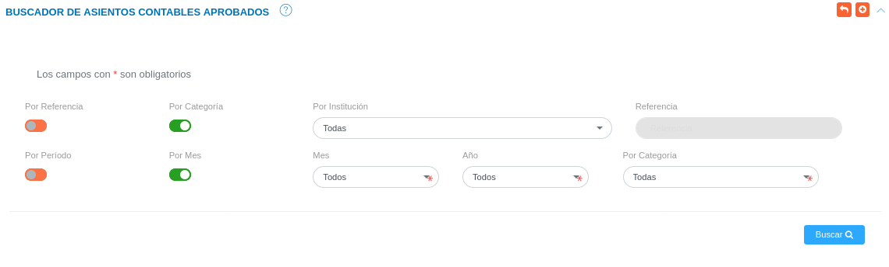
Figura 19: Buscador de Asientos Contables

### Registrar asiento contable 

- Dirigirse al **Módulo de Contabilidad**, luego a **Asientos Contables** y ubicarse en la sección **Buscador de asientos contables**.
- Haciendo uso del botón **Crear**  ubicado en la esquina superior derecha de esta sección, se procede a registrar una nueva conversión.
-   Complete el formulario **Asientos Contables** (ver Figura 20). 

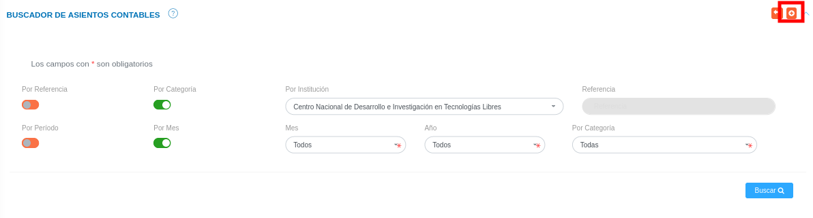
Figura 21: Registrar asiento contable

###  Gestión de asiento contable

- Complete el formulario del apartado **Gestión de asiento contable**. Tenga en consideración completar los campos obligatorios que son requeridos para el registro de un asiento contable.

!!! note "Nota" 
    Los campos de selección del apartado **Gestión de asientos contables** incluyen información configurada previamente a través de los registros comunes del módulo de contabilidad y del sistema. Si se requiere incluir información diferente a la que se encuentra por defecto, se recomienda agregar estos registros en la configuración de registros comunes. 

  Para agregar tipo de moneda dentro del sistema acceda a **Configuración** > **General** > **Registros Comunes**. 

   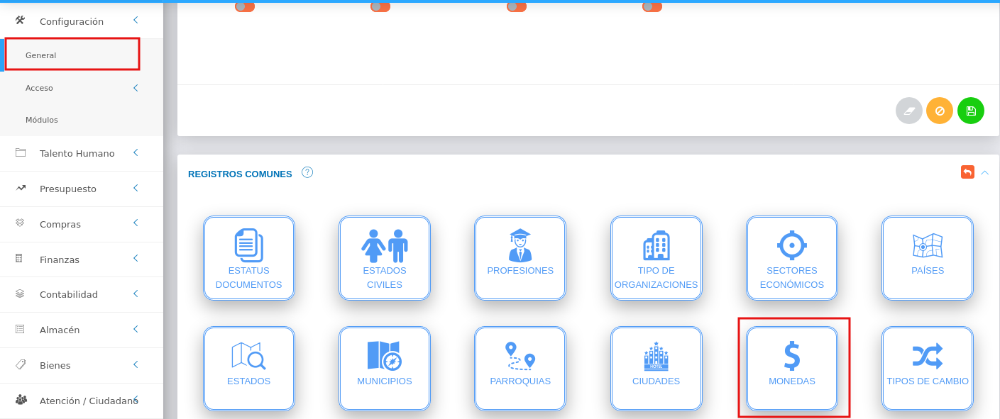

Para agregar categorías de origen dentro del sistema acceda a **Contabilidad** > **Configuración** > **Registros Comunes** > **Categorías de Origen**. 

   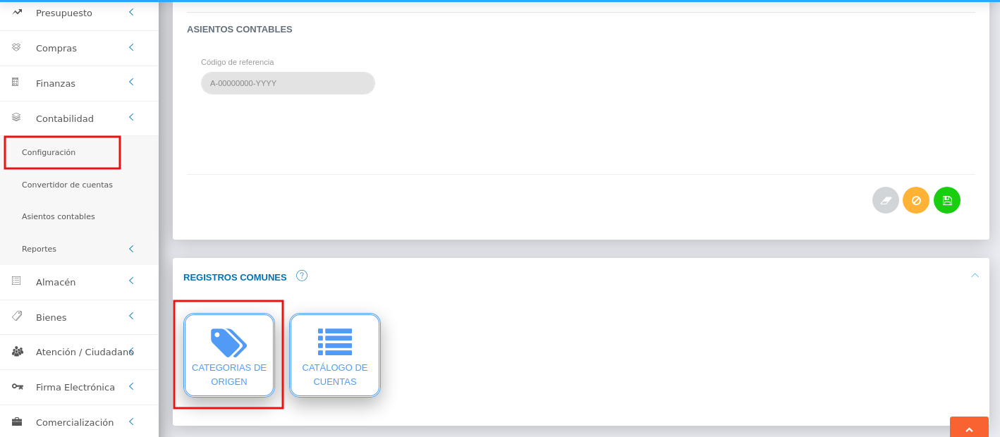

###  Asiento Contable 

- Complete el formulario del apartado **Asiento contable**. Se formula el registro, ingresando la cuenta patrimonial y los datos numéricos de la partida doble (Debe y Haber). Cabe mencionar, que el sistema no permitirá guardar el asiento contable sin haber registrado en ambas partidas.

 Para agregar cuentas patrimoniales acceda a **Contabilidad** > **Congifuración** > **Registros Comunes** > **Catálogo de cuentas**

   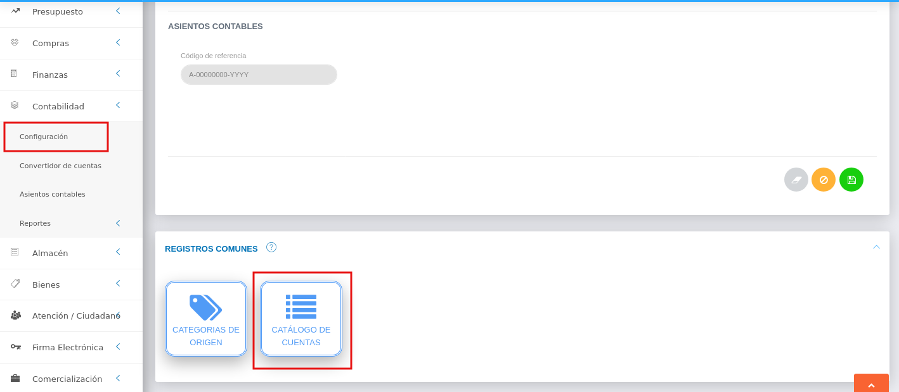

-   Presione el botón **Guardar**   para registrar los cambios efectuados.
-   Presione el botón **Cancelar**   para cancelar registro y regresar a la ruta anterior.
-   Presione el botón **Borrar**  para eliminar datos del formulario.
-   Si desea recibir ayuda guiada, presione el botón .
-   Para retornar a la ruta anterior, presione el botón .

A continuación se muestra un registro de **Asiento Contable** para póliza de Nomina (Figura 25). 

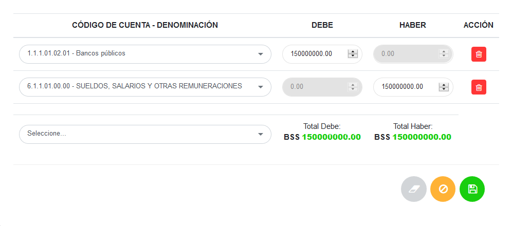
Figura 25: Asiento Contable

## Gestionar asientos contables

La gestión de asientos contables se lleva a cabo a través del apartado **Asientos Contables**. 

-   Para acceder a esta sección debe dirigirse a **Contabilidad** y ubicarse en la sección **Asientos Contables** apartado **Listado de asientos contables** (ver Figura 26).

Desde este apartado se pueden llevar a cabo las siguientes acciones: 

-   ***Registrar asientos contables***.
-   ***Consultar asiento contable***.
-   ***Aprobar/Negar Asiento contable***  
-   ***Imprimir Registro***. 
-   ***Editar registros***. 
-   ***Eliminar registros***. 

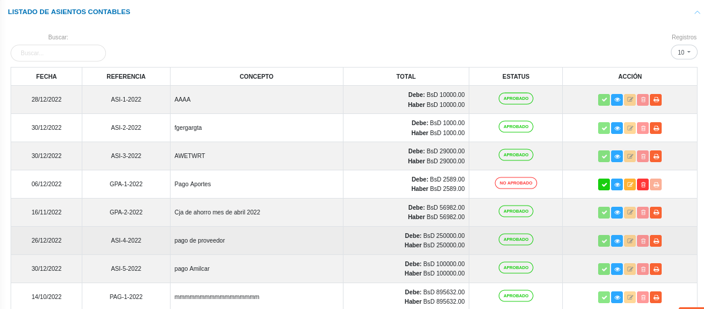
Figura 26: Listado de Asientos Contables

### Registrar asientos contables

-   Presione el botón **Crear registro**  ubicado en la parte superior derecha del apartado **Buscador de asientos Asientos Contables** (ver Figura 21)
-   A continuación complete el formulario siguiendo los pasos descritos en el apartado [Registrar asientos contables](##Registrar-asientos-contables).
-   Presione el botón **Guardar**   para registrar los cambios efectuados.

Figura 27: Registrar asiento contable

### Aprobar asientos contables 

- Dirigirse al **Módulo de Contabilidad**, luego a **Asientos Contables** y ubicarse en la sección **Listado de Asientos Contables** (Figura 26).
- Identifique el registro de asiento contable que desea aprobar y presione el botón **Aprobar**  ubicado en la columna titulada **Acción**. 
- Presione el botón **Confirmar** en la ventana emergente para aprobar el asiento contable.

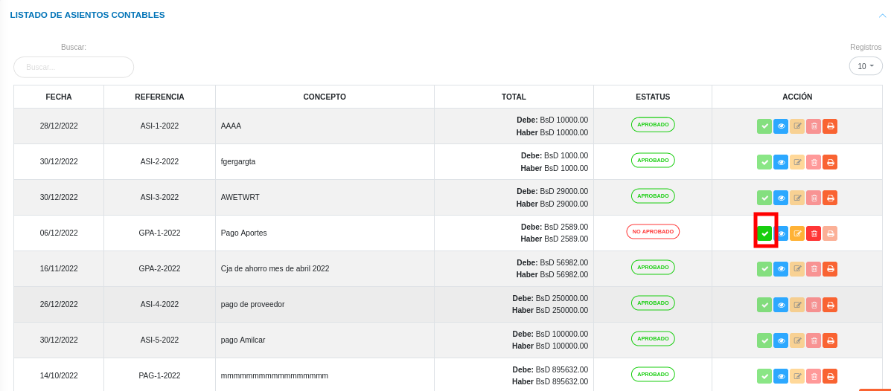
Figura 28: Aprobar un asiento contable

### Consultar registros

-   Presione el botón **Consultar registro**  ubicado en la columna titulada **Acción** de un registro de asiento contable que se prefiere consultar. 

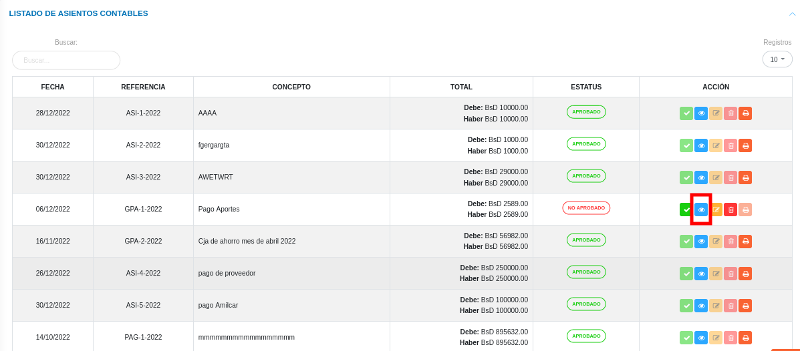
Figura 29: Consultar Registros de asientos contables 

-   A continuación el sistema despliega una sección donde se describen los datos del asiento contable seleccionado. 

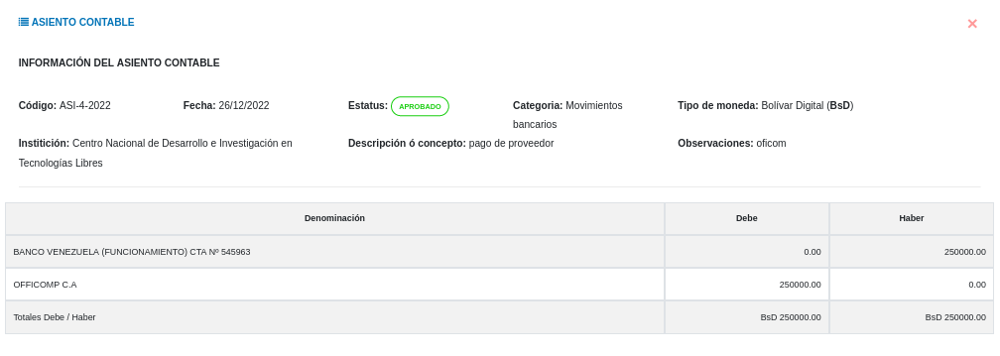
Figura 30: Datos del asiento contable

### Imprimir registro

-   Presione el botón **Imprimir regristro**   ubicado en la columna titulada **Acción** del registro del asiento contable que se desee seleccionar para imprimir el reporte. 

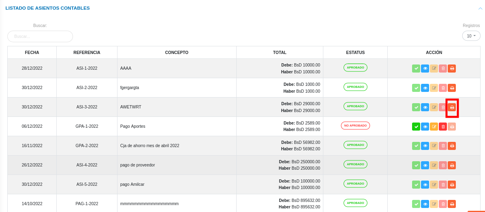
Figura 31: Imprimir asiento contable

- El sistema presenta en un documento PDF, el archivo generado con el asiento contable. 

### Editar registros

-   Presione el botón **Editar registro**   ubicado en la columna titulada **Acción** del registro de conversión de cuentas que se desee seleccionar para actualizar datos. 

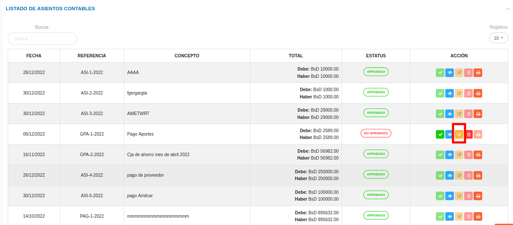
Figura 32: Editar Registros de asientos contables

-   Actualice los datos del formulario siguiendo los pasos descritos en el apartado [Registrar asiento contable](#registrar-asiento-contable).
-   Presione el botón **Guardar**   para registrar los cambios efectuados.

### Eliminar registros

-   Presione el botón **Eliminar registro**   ubicado en la columna titulada **Acción** del registro de asiento contable que se desee seleccionar para eliminar del sistema. 

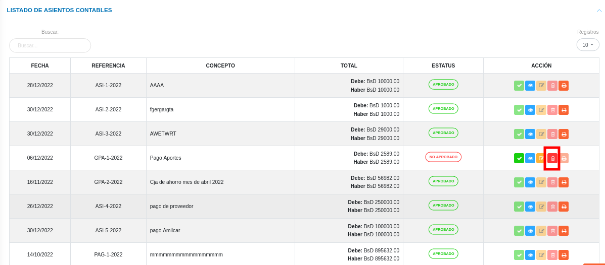
Figura 33: Eliminar Registros de asientos contables

-   Confirme que esta seguro de eliminar el registro seleccionado a través de la ventana emergente, mediante el botón **Confirmar** y efectue los cambios.  

   
