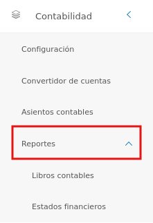
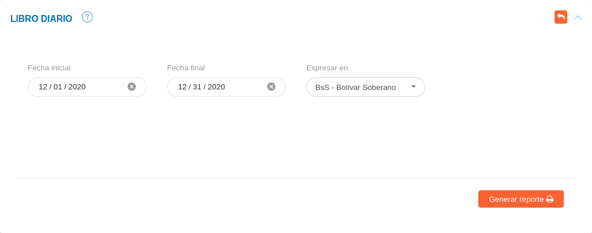
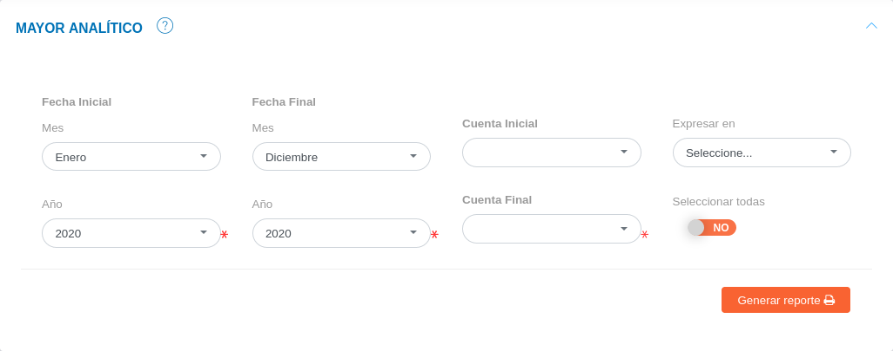
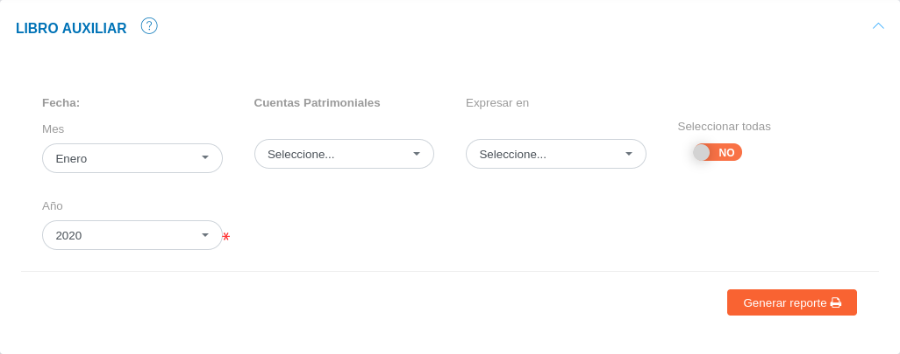
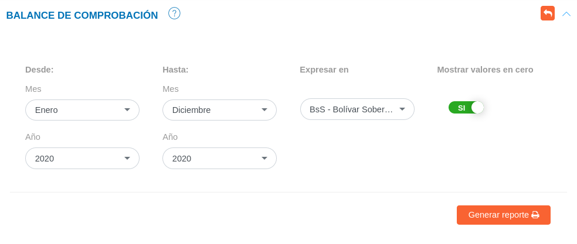
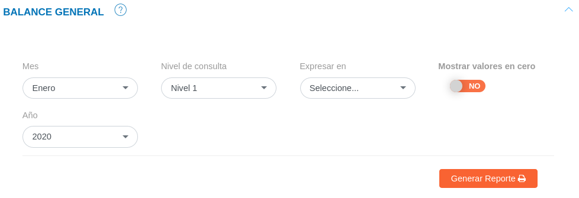

# Reportes del Módulo de Contabilidad
*************************************

El usuario selecciona el módulo de Contabilidad en el menú lateral de los módulos del sistema, ahí visualizara las opciones **Configuración**, **Convertidor de cuentas**,  **Asientos Contables** y **Reportes**, debiendo pulsar **Reportes** 

Figura 34: Menú del Módulo de Contabilidad

A través de esta funcionalidad es posible visualizar los reportes generados por el sistema, con el objetivo de realizar un seguimiento a la gestión financiera de la empresa en una fecha determinada. La funcionalidad cuenta con dos tipos de reportes: **Libros contables**, y **Estados financieros**.

A continuación se muestran las siguientes secciones para la generación de reportes:

## Libros contables

El KAVAC "Sistema de Gestión de Recursos", cuenta con la generación de reportes para tres (3) libros contables: libro diario, mayor analítico, y libro auxiliar. A través de estos reportes es posible obtener una sucesión de asientos contables ordenados de forma cronológica, así como también un resumen de cuentas, anotando todos los movimientos que afecten al debe, haber y saldo de la cuenta correspondiente, de la misma forma un resumen de las operaciones económicas registradas por cada cuenta.

Para acceder a esta funcionalidad, el usuario se dirige al **Módulo de contabilidad** > **Reportes** > **Libros contables**.

Figura 35: Reportes Libros Contables

### Generar reporte de libro diario

- Dirigirse al **Módulo de Contabilidad**, luego a **Reportes**, ingresar a **Libros Contables** y ubicarse en la sección **Libro Diario**.
- Seleccionar los parámetros de búsqueda.
- Seleccionar la opción **Generar Reporte** y verificar el documento generado por el sistema.

Figura 36: Generar Reporte de Libro Diario

### Generar reporte de mayor analítico

- Dirigirse al **Módulo de Contabilidad**, luego a **Reportes**, ingresar a **Libros Contables** y ubicarse en la sección **Mayor Analítico**.
- Seleccionar los parámetros de búsqueda.
- Seleccionar la opción **Generar Reporte** y verificar el documento generado por el sistema.

Figura 37 Generar Reporte de Mayor Analítico

### Generar reporte de libro auxiliar 

- Dirigirse al **Módulo de Contabilidad**, luego a **Reportes**, ingresar a **Libros Contables** y ubicarse en la sección **Libro Auxiliar**.
- Seleccionar los parámetros de búsqueda.
- Seleccionar la opción **Generar Reporte** y verificar el documento generado por el sistema.

Figura 38: Generar Reporte de Libro Auxiliar

## Estados financieros

Mediante esta funcionalidad se visualizará informes financieros o estados contables que muestran la estructura económica de la organización, donde se plasman las actividades económicas que se realizan en la empresa durante un determinado periodo.  El KAVAC "Sistema de Gestión de Recursos", cuenta con la generación de reportes para tres (3) estados financieros: balance general, estado de resultados y balance de comprobación. 

Para acceder a esta funcionalidad, el usuario se dirige al **Módulo de contabilidad** > **Reportes** > **Estados Financieros**.

Figura 39: Reportes Estados Financieros 

### Generar reporte de balance de comprobación 

El reporte de balance de comprobación es un instrumento financiero que se utiliza para visualizar la lista del total de los débitos y de los créditos de las cuentas, junto al saldo de cada una de ellas (ya sea deudor o acreedor). De esta forma, permite establecer un resumen básico de un estado financiero. 

Para generar un reporte de balance de comprobación es necesario:
 
- Dirigirse al **Módulo de Contabilidad**, luego a **Reportes**, ingresar a **Estados financieros** y ubicarse en la sección **Balance de Comprobación**.
- Seleccionar los parámetros de búsqueda.
- Seleccionar la opción **Generar Reporte** y verificar el documento generado por el sistema.

Figura 40: Generar Reporte de Balance de Comprobación. 

### Generar reporte de estado de resultados

A través de este reporte es posible obtener un estado de ganancias y pérdidas en base a un periodo determinado.  Este informe muestra de manera detallada los ingresos obtenidos, los gastos y como consecuencia, el beneficio o pérdida que ha generado la organización usuaria en dicho periodo de tiempo.    

Para generar un reporte de estado de resultados es necesario:

- Dirigirse al **Módulo de Contabilidad**, luego a **Reportes**, ingresar a **Estados financieros** y ubicarse en la sección **Estado de Resultados**.
- Seleccionar los parámetros de búsqueda. 
- Seleccionar la opción **Generar Reporte** y verificar el documento generado por el sistema.

Figura 41: Generar Reporte de Estado de Resultados

!!! note "Nota"

	Al seleccionar los parámetros de búsqueda, el sistema permite elegir diferentes niveles de consulta, a tráves, del campo **Nivel de consulta**.  El sistema permite elegir seis (6) niveles de consultas que definen las cuentas a mostrar.  Cada nivel incorpora las cuentas hijas, de esta forma el nivel uno (1) muestra las cuentas patrimoniales como cuentas principales y el nivel seis (6) muestra por su parte todas las cuentas involucradas. 

	Cabe destacar que según sea el nivel de consulta seleccionado, algunas cuentas no se incluyen en el reporte, sin embargo, son cuentas involucradas en los procesos contables.  
	    

### Generar reporte de balance general

Este informe financiero muestra detalladamente el valor de cada una de las propiedades (activos), obligaciones (pasivos), capital (patrimonio),	así como el valor de las cuentas de orden.

Para generar un reporte de balance general es necesario:

- Dirigirse al **Módulo de Contabilidad**, luego a **Reportes**, ingresar a **Estados financieros** y ubicarse en la sección **Balance General**.
- Seleccionar los parámetros de búsqueda, 
- Seleccionar la opción **Generar Reporte** y verificar el documento generado por el sistema.

Figura 42: Generar Reporte de Balance General

!!! note "Nota"

	Al seleccionar los parámetros de búsqueda, el sistema permite elegir diferentes niveles de consulta, a tráves, del campo **Nivel de consulta**.  El sistema permite elegir seis (6) niveles de consultas que definen las cuentas a mostrar.  Cada nivel incorpora las cuentas hijas, de esta forma el nivel (1) uno muestra las cuentas patrimoniales como cuentas principales y el nivel seis (6) muestra por su parte todas las cuentas involucradas. 

	Cabe destacar que según sea el nivel de consulta seleccionado, algunas cuentas no se incluyen en el reporte, sin embargo, son cuentas involucradas en los procesos contables. 

