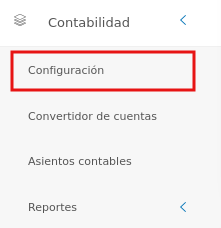
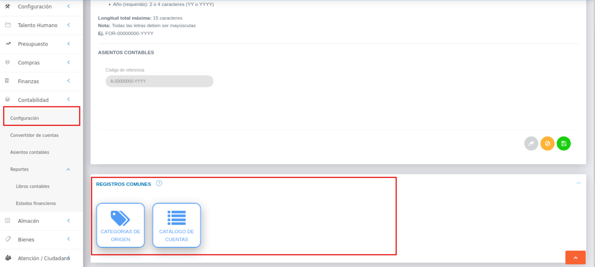
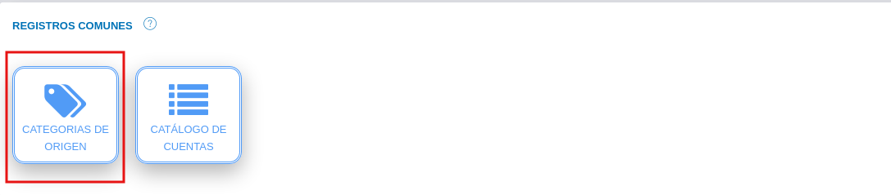
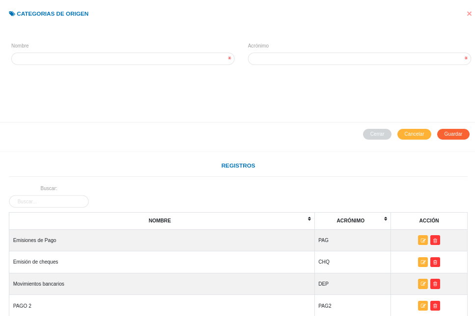
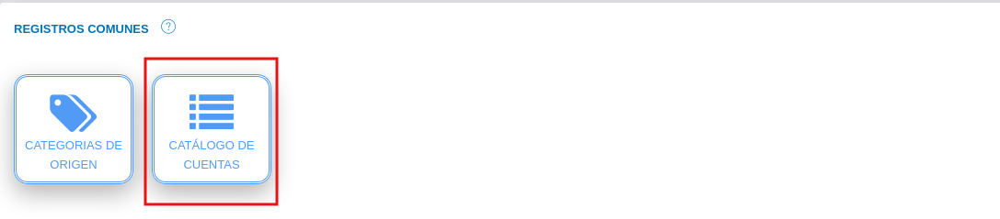
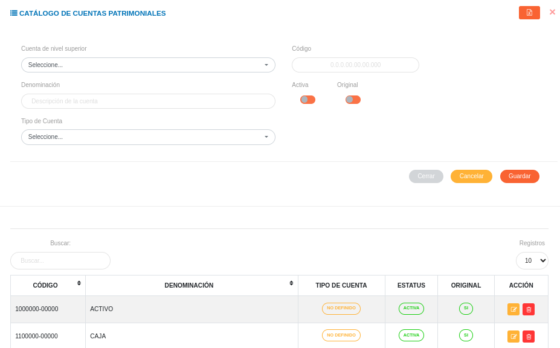
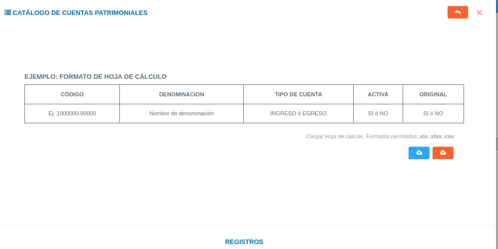
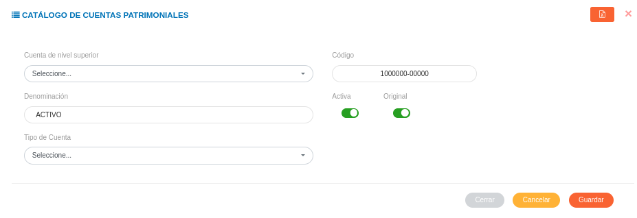
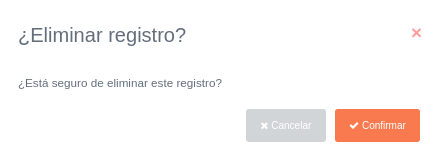

# Configuración Módulo de Contabilidad
*************************************

El usuario selecciona el módulo de Contabilidad en el menú lateral de los módulos del sistema, ahí visualizara las opciones **Configuración**, **Convertidor de cuentas**,  **Asientos Contables** y **Reportes**, debiendo pulsar **Configuración** 

Figura 1: Menú del Módulo de Contabilidad

## Registros Comunes

La sección de registros comunes es una herramienta de la **Configuración del Módulo de Contabilidad** que permite al administrador o un usuario con permisos especiales sobre el módulo de contabilidad, ajustar el módulo a la organización usuaria a través de parámetros configurables.   Los datos registrados en esta sección serán considerados en todas las funcionalidades del módulo.

El usuario ingresará a **Registros Comunes**, visualizando 2 iconos **Categorías de Origen** y **Catálogo de cuentas**.

Figura 2: Registros Comunes del Módulo de Contabilidad

### Categorías de origen 

Esta sección está orientada a la gestión de categorías de origen que generan un asiento contable.  Desde esta sección es posible crear una nueva categoría o gestionar alguna, editando o eliminando una categoría registrada.

El usuario selecciona el icono **Categorías de Origen**

#### Registro de categorías de origen 

-   Complete el formulario **Categorías de Origen**.   Asigne un nombre y acrónimo para la categoría de origen a través de los campos **Nombre** y **Acrónimo**.
-   Presione el botón  **Guardar** para registrar los cambios efectuados.
-   Presione el botón  **Cancelar** para limpiar datos del formulario.
-   Presione el botón  **Cerrar** para cerrar el formulario.

Figura 3:  Formulario para registrar una categoría de origen

 

***Gestión de registros de categorías de origen***

-   Para editar un registro de **Categorías de Origen** presione el botón **Editar**  del registro seleccionado de la tabla **Registros**.  A continuación complete el formulario **Categorías de Origen** y presione el botón **Guardar** para almacenar los cambios efectuados.
-   Para eliminar un registro de **Categorías de Origen** presione el botón **Eliminar**  del registro seleccionado de la tabla **Registros**. 

### Catálogo de cuentas

Esta sección permite listar las cuentas patrimoniales del sistema, importar cuentas patrimoniales desde una hoja de cálculo, crear un nuevo registro de una cuenta y gestionar una cuenta. 

Para entrar, el usuario selecciona el icono **Catálogo de cuentas**

#### Registro de catálogo de cuentas

El sistema mostrará un formulario para el registro de catálogo de cuentas patrimoniales y una tabla con las cuentas registradas:

Figura 4: Formulario de Catálogo de Cuentas

 

Utilice el formulario para filtrar los datos requeridos a través de los campos de selección:

-   **Cuenta de nivel superior:** indique el tipo de cuenta, como "Caja chica".

-   **Denominación:** redacte una denominación para la cuenta.

-   **Tipo de cuenta:** indique el tipo, como "activo" o "pasivo".

-   **Código:** indique un código con el formato determinado.

-   **Activa:** indique si la cuenta se encuentra activa o inactiva.

-   **Original:** para generar una cuenta de movimiento, seleccione “No”. Si la cuenta pertenece a una cuenta de nivel superior, seleccione “Sí”.

Una vez seleccionados todos los campos, utilice el botón **Guardar** . 

#### Importar/Exportar registro de cuentas

A tráves de esta funcionalidad es posible realizar un registro de carga masiva importando una hoja de cálculo de cuentas patrimoniales.	Para importar una hoja de cálculo se deben seguir los siguientes pasos:

-   Para importar un archivo, utilice la opción “Importar archivo”  y seleccione el archivo a cargar. Una vez guardado, la información se mostrará en la tabla de registros.

-   Para exportar un archivo, utilice la opción “Exportar archivo” . El sistema descargará un archivo con las cuentas cargadas previamente.

**Nota:** Los formatos de archivo permitidos son csv, xls, xlsx y ods.

Figura 5: Importar/Exportar datos de cuentas

#### Modificar registro de catálogo de cuenta

-   Para editar un registro, use el botón **Modificar registro** . 

-   El sistema presentará un formulario para editar la información del registro seleccionado. 

-   Una vez modificados los campos requeridos, utilice el botón **Guardar** . 

Figura 6: Modificar registro de cuenta

***Eliminar registro de cuentas patrimoniales***

-   Para editar un registro, use el botón **Eliminar registro** . 

-   El sistema ofrecerá un mensaje de confirmación. 

-   Una vez modificados los campos requeridos, utilice el botón **Confirmar** . 

Figura 7: Eliminar registro de cuenta

