# Asignación de Bienes  
**********************

## Asignación de bienes 

En la sección de **Asignación de Bienes**, el usuario puede asignar bienes a los trabajadores o a un espacio de trabajo de la organización.

Para acceder a esta funcionalidad debe Dirigirse al **Módulo de Bienes**, luego a **Asignaciones**.

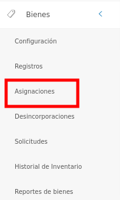
Figura: Opción Asignaciones de Bienes

 Luego, el sistema presenta un panel central con las secciones **Asignación de Bienes** y  **Entrega de Bienes Pendientes**. 

 En la sección **Asignación de Bienes** muestra la lista de todos los registros de asignaciones realizados y permite crear, ver información detallada, editar, eliminar y generar un acta de asignación de un bien.

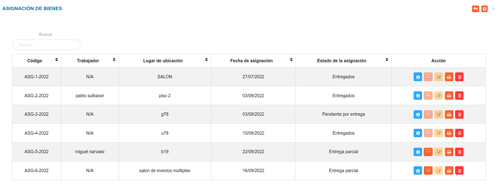
Figura: Lista de Asignación de Bienes

### Crear una nueva asignación 

- Dirigirse al **Módulo de Bienes**, luego a **Asignaciones** y ubicarse en la sección **Asignación de Bienes**.
- Haciendo uso del botón **Crear**  ubicado en la esquina superior derecha de esta sección, se procede a realizar una nueva asignación.
- Se completa el formulario de registro de la sección **Asignación de Bienes**.
- Se presiona el botón **Guardar**  ubicado al final de esta sección, y se verifica en la lista de registros en **Ingresos de Almacén**.
- Se Presiona el botón **Cancelar**   para cancelar registro y regresar a la ruta anterior.
- Se Presiona el botón **Borrar**  para eliminar datos del formulario.
- Si desea recibir ayuda guiada presione el botón .
- Para retornar a la ruta anterior presione el botón . 

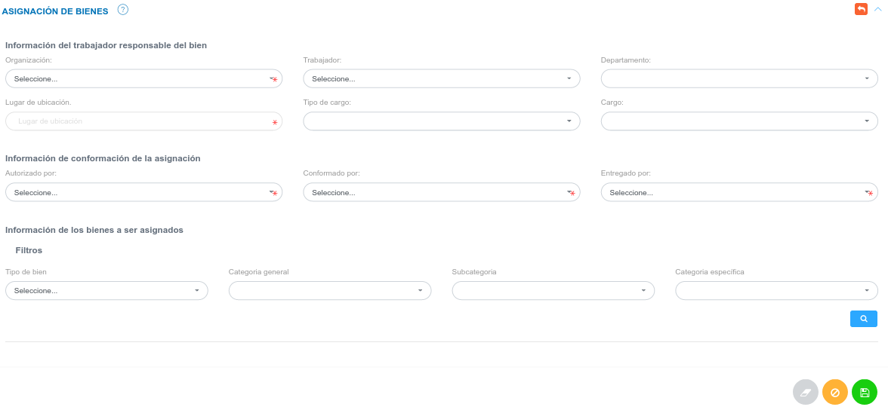
Figura: Asignar Bien

!!! note "Nota"
	Una vez se seleccione la organización, el sistema lista los bienes disponibles que pueden ser asignados.  

	Para asignar uno o más bienes, se hace uso del botón **Checkbox** ubicado en la primera columna de la tabla de registros, finalmente se presiona el botón **Guardar** para registrar la asignación.
  

###Gestión de registros

Mediante los botones ubicados en la columna titulada **Acción** es posible visualizar la información de forma detallada, entregar bienes, imprimir el acta de asignación, eliminar y modificar un registro.  

#### Consultar registros

- Para ver información detalla de un registro pulse el botón **Ver**   para un registro de interés.

- Seguidamente, el sistema muestra una interfaz con la información ingresada previamente de la asignación del bien.

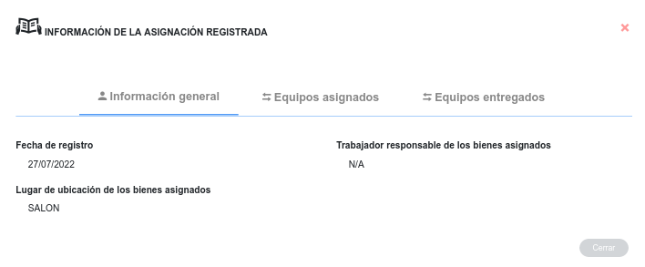
Figura: Interfaz consultar información de una asignación

#### Editar registros

- Presione el botón **Editar registro**  para un registro de interés.
- Luego, el sistema muestra el formulario en forma de edición.
- Modifique la información que requiera.
- Presione el botón **Guardar**   para registrar los cambios efectuados.

!!! note "Nota"
	Una vez se realice la entrega de algún bien, el sistema deshabilita el botón **Editar**.

#### Entregar bienes

- Para realizar la entrega de bienes pulse el botón **Entregar Equipos**.

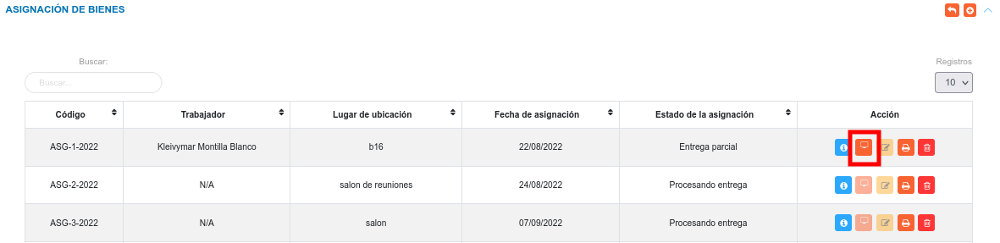
Figura: Botón entregar equipo

- Seguidamente, el sistema muestra un modal donde permite seleccionar los bienes a entregar.

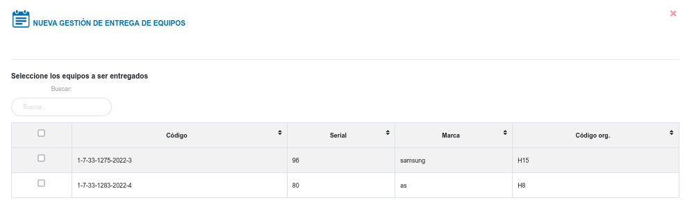
Figura: Interfaz entregar bienes

- Luego, el usuario indica los bienes que requiere entregar y pulsa Guardar.

- El sistema lista la solicitud de entrega de bienes, en la tabla de registros de **Entrega de Bienes Pendientes**.

!!! note "Nota"
	- Una vez se realice la entrega de un equipo esta toma  el Estado como **Pendiente**, y el sistema deshabilita el botón **Entregar Equipos**.

	- Cuando el usuario realice la entrega total de los bienes, el sistema deshabilita el botón **Entregar Equipos**.

#### Eliminar registros

- Presione el botón **Eliminar**   para un registro de interés.
- Seguidamente, el sistema presenta un modal con un mensaje de confirmación de si está seguro de eliminar el ingreso de almacén, y muestra los botones Confirmar y Cancelar.
- Pulse el botón **Confirmar** si está seguro de eliminar el registro seleccionado.
- El sistema elimina el registro.
- Si pulsa el botón **Cancelar**, el sistema no ejecuta ninguna acción. 

#### Imprimir acta de asignación de bienes

- Para imprimir el acta de asignación pulse el botón **Imprimir acta**. 

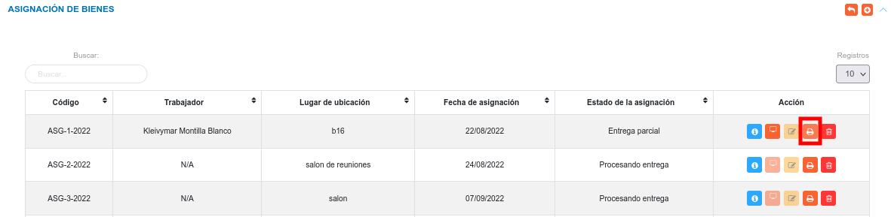
Figura: Botón imprimir acta de asignación

- Seguidamente, el sistema genera el archivo PDF del Acta de Asignación de Bienes.

###Entrega de Bienes Pendientes

En esta sección se presentan las solicitudes de entrega pendientes, el encargado de bienes institucionales evalúa la solicitud y mediante los botones ubicados en la columna titulada **Acción** puede: aceptar o rechazar la entrega de bienes, eliminar y generar un acta de asignación de un bien.

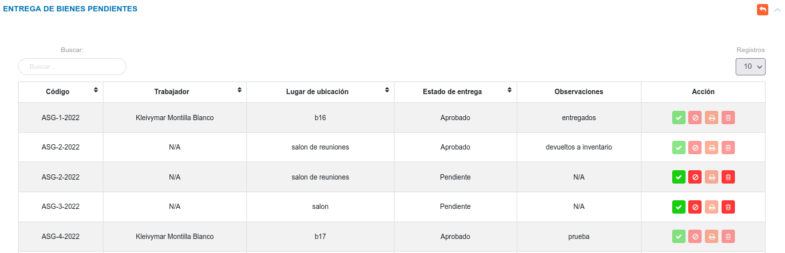
Figura: Lista de entrega de bienes pendientes

#### Aceptar entrega de bienes

- Pulse el boton **Aceptar Solicitud** para aprobar la entrega de bienes.

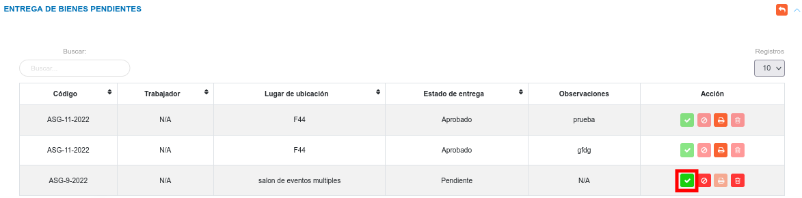
Figura: Botón aprobar entrega de bienes

- El sistema presenta una interfaz, donde solicita datos, como: observaciones generales, aprobado por y recibido por, junto con las opciones **Cancelar** y **Confirmar**. 

- Pulse el botón **Confirmar** para aprobar la entrega de bienes.

- El sistema cambia el estado de la entrega a **Aprobado**.

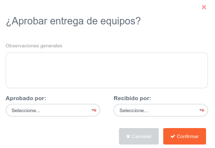
Figura: Interfaz confirmar entrega de bienes

!!! note "Nota"
	- Una vez se apruebe la entrega de bienes, el sistema deshabilita los botones **Rechazar** y **Eliminar**.

#### Rechazar entrega de bienes

- Pulse el boton **Rechazar Solicitud** para negar la entrega de bienes.

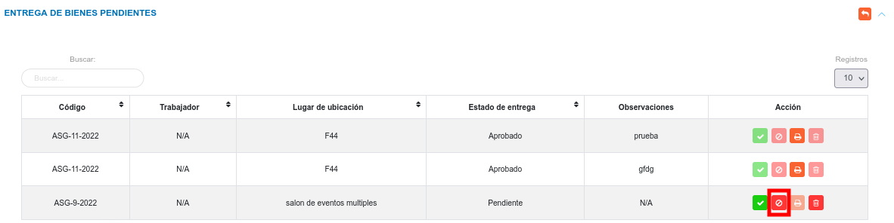
Figura: Botón rechazar entrega de bienes

- El sistema presenta un mensaje de confirmación para rechazar la solicitud, junto con las opciones **Cancelar** y **Confirmar**.

- Pulse el botón **Confirmar** para negar la entrega de bienes.

- El sistema cambia el estado de la entrega a **Rechazado**.

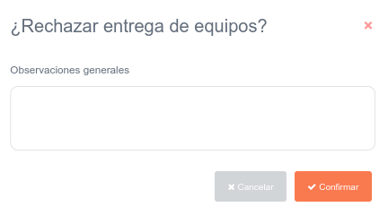
Figura: Interfaz rechazar solicitud

!!! note "Nota"
	- Una vez se rechace la entrega de bienes, el estado de la asignación cambia a  **Asignado**, y los botones **Imprimir acta** , **Rechazar** y **Eliminar** se deshabilitan.

#### Eliminar registros

- Presione el botón **Eliminar**   para un registro de interés.
- Seguidamente, el sistema presenta un modal con un mensaje de confirmación de si está seguro de eliminar el ingreso de almacén, y muestra los botones Confirmar y Cancelar.
- Pulse el botón **Confirmar** si está seguro de eliminar el registro seleccionado.
- El sistema elimina el registro.
- Si pulsa el botón **Cancelar**, el sistema no ejecuta ninguna acción. 

!!! note "Nota"
	- Una vez se apruebe la entrega de bienes, el sistema deshabilita el botón **Eliminar**.

#### Imprimir acta de entrega de bienes

- El botón para generar el acta de entrega de bienes se habilita una vez se apruebe la solicitud de entrega. 

- Para imprimir el acta de asignación pulse el botón **Imprimir acta**. 

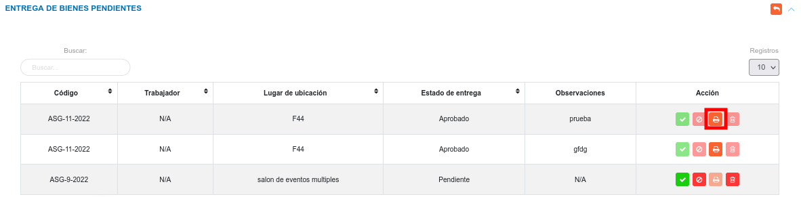
Figura: Botón imprimir acta de entrega de bienes

- Seguidamente, el sistema genera el archivo PDF del Acta de Entrega de Bienes.

   