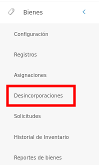
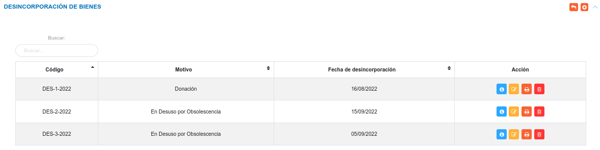
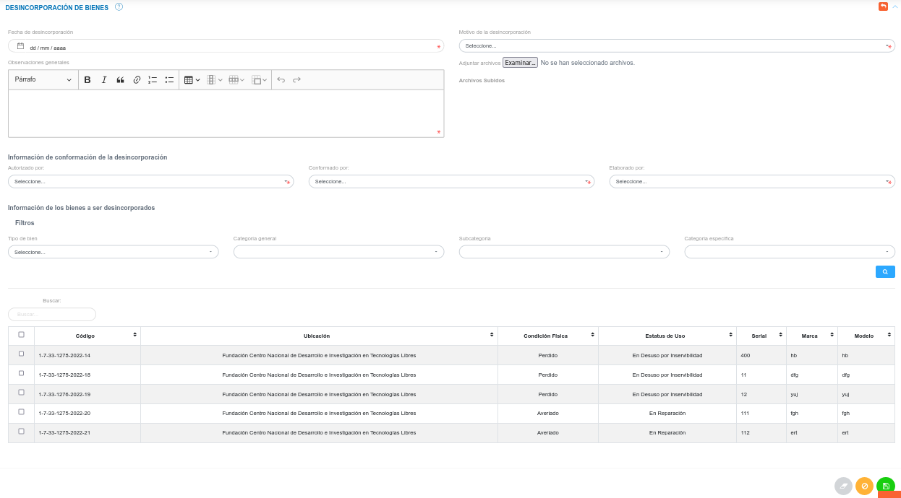
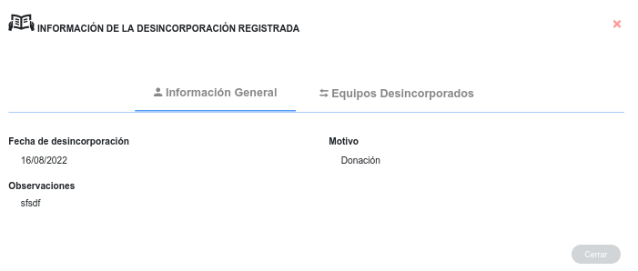
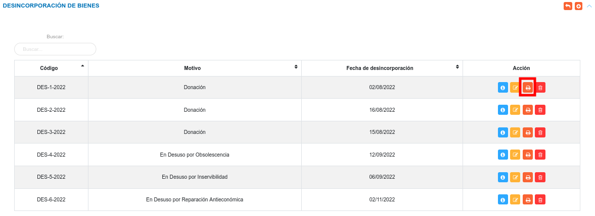

# Desincorporación de Bienes  
****************************

## Desincorporación de bienes 

La funcionalidad de **Desincorporaciones** permite realizar el retiro de bienes de la organización. 

Para acceder a esta funcionalidad debe Dirigirse al **Módulo de Bienes**, luego a **Desincorporaciones**.

Figura: Opción Desincorporaciones de Bienes

Luego, el sistema presenta la sección **Desincorporación de Bienes** donde muestra una lista con todos los registros de las desincorporaciones realizadas y permite crear, ver información detallada, editar, eliminar y generar un acta de desincoporación de un bien.

Figura: Tabla de registro de los bienes desincorporados

###Crear una nueva desincorporación

- Dirigirse al **Módulo de Bienes**, luego a **Desincorporación** y ubicarse en la sección **Desincorporación de Bienes Institucionales**.
- Haciendo uso del botón **Crear**  ubicado en la esquina superior derecha de esta sección, se procede a realizar una nueva desincorporación.
- Se completa el formulario ingresando datos, como: fecha y motivo de la desincorporación, la información asociada a la conformación de la desincorporación, se seleccionan los bienes a desincorporar, también  es posible adjuntar varios archivos que justifiquen la desincorporación.  Los archivos permitidos son: odt, pdf, png, jpg, jpeg, doc y docx. 
- Se presiona el botón **Guardar**  ubicado al final de esta sección, y se verifica en la lista de registros en **Ingresos de Almacén**.
- Se Presiona el botón **Cancelar**   para cancelar registro y regresar a la ruta anterior.
- Se Presiona el botón **Borrar**  para eliminar datos del formulario.
- Si desea recibir ayuda guiada presione el botón .
- Para retornar a la ruta anterior presione el botón .   

Figura: Desincorporar Bienes 

!!! note "Nota"
	Para desincorporar más de un bien, se hace uso del botón **Checkbox** ubicado en la primera columna de la tabla de registros.

	

###Gestión de registros

#### Consultar registros

- Para ver información detalla de un registro pulse el botón  **Ver** , para un registro de interés.

- Seguidamente, el sistema muestra una interfaz con la información ingresada previamente de la desincorporación del bien.

Figura: Interfaz consultar información de una desincorporación de un bien

#### Editar registros

- Presione el botón **Editar registro**  para un registro de interés.
- Luego, el sistema muestra el formulario en forma de edición.
- Modifique la información que requiera.
- Presione el botón **Guardar**   para registrar los cambios efectuados.

#### Eliminar registros

- Presione el botón **Eliminar**   para un registro de interés.
- Seguidamente, el sistema presenta un modal con un mensaje de confirmación de si está seguro de eliminar el ingreso de almacén, y muestra los botones Confirmar y Cancelar.
- Pulse el botón **Confirmar** si está seguro de eliminar el registro seleccionado.
- El sistema elimina el registro.
- Si pulsa el botón **Cancelar**, el sistema no ejecuta ninguna acción. 

#### Imprimir acta de asignación de bienes

- Para imprimir el acta de asignación pulse el botón **Imprimir acta**. 

Figura: Botón imprimir acta de desincorporación

- Seguidamente, el sistema genera el archivo PDF del Acta de Desincorporación de Bienes.

   