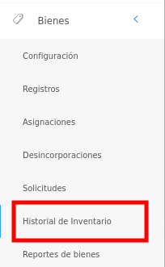
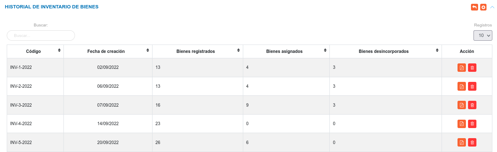

# Historial de Inventario de Bienes 
***********************************

## Historial de inventario de bienes 

En esta sección se gestiona el reporte de  inventario de bienes.	

Para acceder a esta funcionalidad debe Dirigirse al **Módulo de Bienes**, luego a **Historial de Inventario**.

Figura: Opción Historial de Inventario

Luego, el sistema muestra una interfaz que lista los registros de inventario y mediante los botones ubicados en la columna titulada **Acción** es posible generar un reporte en formato PDF o eliminar el registro de inventario.  

Figura: Historial de Inventario de Bienes

### Crear un nuevo registro de inventario 

- Pulse el botón **Crear**  ubicado en la esquina superior derecha de esta sección, se guarda el estado actual del inventario.    
- Verifique que el registro de inventario se genero en la tabla de registro. 
- Pulse el botón **Generar reporte de bienes**,   para un registro de interés.para un registro de interés.
- Luego el sistema genera el reporte en formato PDF.

   