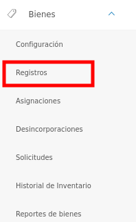
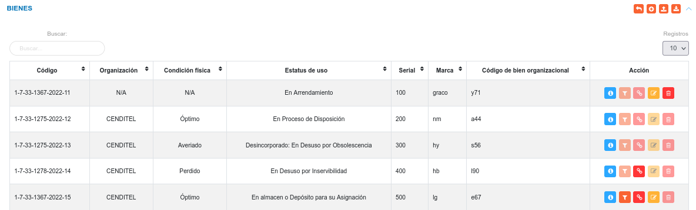
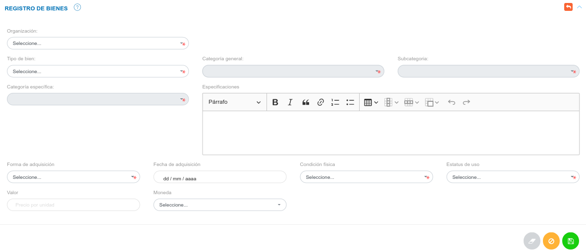
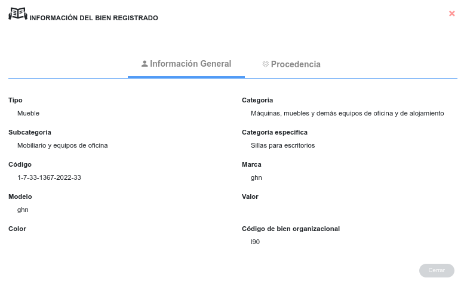
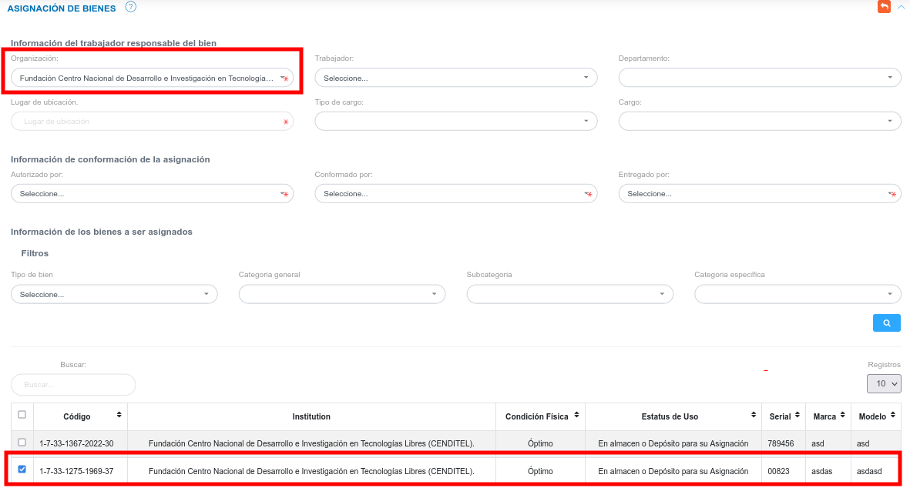
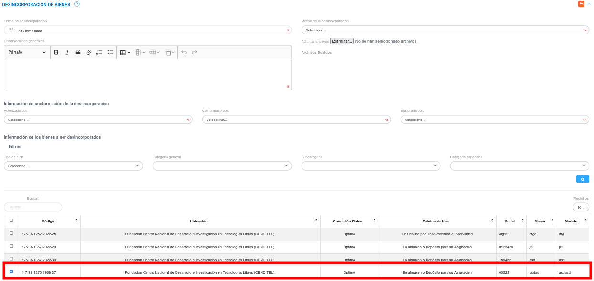

# Gestión de Registros de Bienes 
********************************

## Registros de Bienes

En la sección de **Registros de Bienes**, el usuario puede ingresar los diferentes bienes que gestiona la organización.

Para acceder a esta funcionalidad debe Dirigirse al **Módulo de Bienes**, luego a **Registros** y ubicarse en la sección **Bienes**.

Figura: Opción Registros de Bienes

En esta sección se listan todos los registros de bienes y se muestra información relevante sobre los mismos. La tabla de registros contiene datos del bien, como lo son: código, organización, condición física, estatus de uso, serial, marca, código de bien organizacional. 

En la columna titulada **Acción** el encargado de bienes institucionales o usuario con permisos especiales puede: observar información detallada, asignar, desincorporar, editar o eliminar un bien registrado.   

Figura: Registros de Bienes

### Crear un nuevo registro

- Desde la tabla de registro pulse el botón **Crear**  ubicado en la esquina superior derecha de esta sección, se procede a realizar un nuevo registro. 
- Se completa el formulario de la sección **Registro Manual de Bienes**.
- Se presiona el botón **Guardar**  ubicado al final de esta sección, y se verifica en la lista de registros en **Ingresos de Almacén**.
- Se Presiona el botón **Cancelar**   para cancelar registro y regresar a la ruta anterior.
- Se Presiona el botón **Borrar**  para eliminar datos del formulario.
- Si desea recibir ayuda guiada presione el botón .
- Para retornar a la ruta anterior presione el botón .  

Figura: Formulario para el Registro Manual de Bienes

Este registro corresponde al método de forma manual, el cual permite registrar solo un bien institucional.  Es importante considerar, que en el formulario de esta sección se solicita información asociada al bien (tipo de bien, categoría general de bien, subcategoría de bien, categoría específica de bien), que debe ser añadida previamente en la configuración del módulo. 	

!!! note "Nota"

    Para el registro de un Tipo de Bien Mueble , los campos serial y Código de bien organizacional son únicos.
    
	El **Estatus de uso** de cada Bien, define las acciones que se pueden ejecutar sobre dicho bien.  Por esta razón es importante considerar lo siguiente:

	*	Un bien debe tener el **Estatus de uso** definido como: "En almacén o Depósito para su asignación", y Condición física óptimo para formar parte de una solicitud de préstamo.
	*	Un bien debe tener el **Estatus de uso** definido como: "En almacén o Depósito para su asignación", y Condición física óptimo, para ser asignado desde la sección de **Registros**.  Por otro lado es posible realizar la asignación manual de cualquier bien desde la sección **Asignaciones**.
		  

### Importar registro

El sistema permite realizar una carga masiva de registros de bienes.	Para realizar esta importación de registros se debe tomar en cuenta seguir un formato de hoja de cálculo y cumplir con los formatos permitidos para la carga del archivo.

!!! warning "Advertencia"
	Los formatos permitidos para la carga de archivos son:  **csv**, **xls**, **xlsx** y **ods**.   

###Funcionalidad para importar registros

La carga de registros de forma masiva es una funcionalidad que se presenta en varios módulos de la aplicación. Es importante que el usuario encargado de hacer uso de esta funcionalidad tenga presente los parámetros y requerimientos a seguir para un correcto manejo de la misma. 

Se recomienda al usuario que va a importar un archivo; realizar antes una exportación de los registros (registros de bienes) que se encuentran en el sistema. Esto permitirá al usuario editar esta copia del archivo de registros y usar su infomarción para realizar una importación.    

El formato de hoja de cálculo establecido en el archivo a importar contiene una serie de columnas identificadas con los campos para el registro de bienes, si el usuario ha exportado un archivo, este mantiene sus columnas identificadas por defecto y no es necesario modificar un campo.

Cada uno de los campos asociados a un registro se encuentran identificados por un **id** el cual representa un identificador único.

A continuación se presenta una tabla con los siguientes registros: Dos tipos de bienes identificados por un id único, y las distintas categorías asociadas al tipo de bien identificadas por su respectivo id. 

|asset_type_id |asset_type |asset_category_id |asset_category|          
|---|---|---|---|  
|1 |Mueble  |1 |Maquinaria y demás equipos de construcción, campo, industria y taller|         
|  |        |2 |Equipos de transporte, tracción y elevación                          |         
|  |        |3 |Equipos de comunicaciones y de señalamiento                          |     
|  |        |4 |Equipos médicos - quirúrgicos, dentales y veterinarios               |         
|  |        |5 |Equipos científicos, religiosos, de enseñanza y recreación           |   
|  |        |6 |Equipos de defensa y seguridad del Estado                            |     
|  |        |7 |Máquinas, muebles y demás equipos de oficina y de alojamiento        |         
|  |        |8 |Semovientes                                                          |   
|2 |Inmueble|1 |Edificaciones, Tierras y Terrenos                                    |  

Los id son generados cada vez que se realiza un nuevo registro en la configuración del módulo y es posible visualizarlos una vez se exporte un archivo de registros (registros de bienes) desde el sistema. 

El archivo que el usuario ha exportado permite la edición de cualquier registro que se ha realizado previamente.  Sin embargo, el manejo de este contenido se debe realizar con precaución, ya que los registros pueden encontrase asociados a través de sus id (identificadores únicos).  

**Para Importar un registro**

- Dirigirse al **Módulo de Bienes**, luego a **Registros** y ubicarse en la sección **Bienes**.
- Haciendo uso del botón **Importar**  ubicado en la esquina superior derecha de esta sección, se procede a realizar la carga masiva.  
- Seleccionar el archivo del directorio local, para transferir a la aplicación.  
- Verificar que la información se haya almacenado en la lista de registros. 

###Exportar registro

La aplicación permite obtener una hoja de cálculo con todos los registros de bienes realizados, y la información asociada a cada uno. 

**Para Exportar los registros**

- Dirigirse al **Módulo de Bienes**, luego a **Registros** y ubicarse en la sección **Bienes**.
- Haciendo uso del botón **Exportar**  ubicado en la esquina superior derecha de esta sección, se procede a la exportación de datos.  
- El sistema transfiere una copia del archivo desde la aplicación al equipo del usuario. Este archivo contiene todos los registros de bienes en el sistema.

###Gestión de registros 

La columna titulada **Acción** de la tabla de registros de la sección **Bienes** cuenta con los botones que permiten: **Ver información detallada**, **Asignar**, **Desincorporar**, **Editar** o **Eliminar** un bien registrado. 

 

!!! warning "Advertencia"
	Una vez que un bien sea asignado, solicitado en calidad de préstamo o desincorporado, el sistema no permite  editar o eliminar el registro asociado al bien.  

#### Consultar registros

- Presione el botón **Consultar registro**  para un registro de interés. 

Figura: Consultar registro de un bien ingresado 

- Seguidamente, el sistema muestra una interfaz con la información ingresada previamente del registro del bien.

Figura: Datos del registro del bien

#### Asignar un bien

- Presione el botón **Asignar bien**  para un registro de interés. 

Figura: Botón asignar bien 

!!! note "Nota"
	Se puede observar en la imagen anterior que el botón **Asignar bien**, para algunos bienes de la tabla de registro se muestran deshabilitados, esto se debe a que los mismos se encuentran **En Uso**, **Desincorporados** o en **Reparación**.

- Seguidamente, el sistema habilita el formulario de Asignación de Bienes y una vez se indique la organización se listan todos los bienes que pueden ser asignados, y el bien para el cual se pulso el botón **Asignar bien** por defecto se muestra seleccionado.

Figura: Formulario de Asignación de Bienes

!!! note "Nota"
	Desde la tabla de registro de bienes se puede realizar la asignación de un bien, pero dicha funcionalidad se explica detalladamente en la sección de Asignaciones.

#### Desincorporar un bien

- Presione el botón **Desincorporar bien**  para un registro de interés. 

Figura: Botón desincorporar bien 

!!! note "Nota"
	Se puede observar en la imagen anterior que el botón **Desincorporar bien**, para algunos bienes de la tabla de registro se muestran deshabilitados, esto se debe a que los mismos se encuentran **En Uso**, **Desincorporados** o en **Reparación**.

- Seguidamente, el sistema habilita el formulario de Desincorporación de Bienes y lista todos los bienes que pueden ser desincorporados, y el bien para el cual se pulso el botón **Desincorporar bien** por defecto se muestra seleccionado.

Figura: Formulario de Desincorporación de Bienes

!!! note "Nota"
	Desde la tabla de registro de bienes se puede realizar la desincorporación de un bien, pero dicha funcionalidad se explica detalladamente en la sección de Desincorporacioenes.

#### Editar registros

- Presione el botón **Editar registro**  para un registro de interés.
- Luego, el sistema muestra el formulario en forma de edición.
- Modifique la información que requiera.
- Presione el botón **Guardar**   para registrar los cambios efectuados.

#### Eliminar registros

- Presione el botón **Eliminar**   para un registro de interés.
- Seguidamente, el sistema presenta un modal con un mensaje de confirmación de si está seguro de eliminar el ingreso de almacén, y muestra los botones Confirmar y Cancelar.
- Pulse el botón **Confirmar** si está seguro de eliminar el registro seleccionado.
- El sistema elimina el registro.
- Si pulsa el botón **Cancelar**, el sistema no ejecuta ninguna acción. 

   