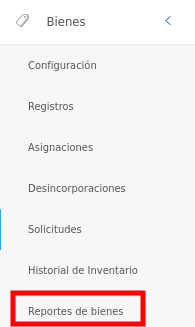
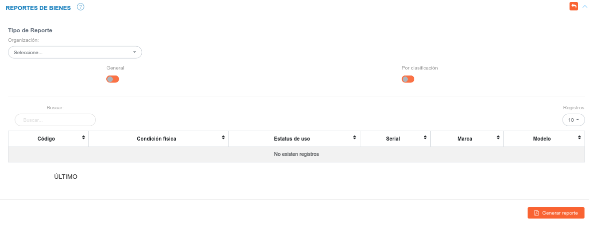
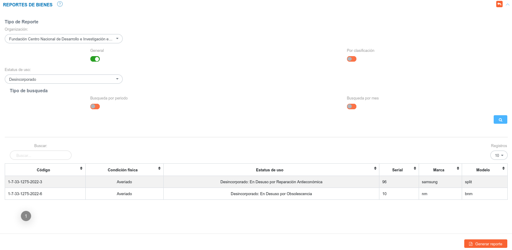
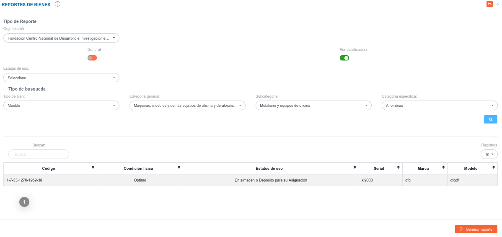

# Reportes de Bienes 
********************

## Generar reporte de bienes

La sección de reportes del módulo de bienes permite generar informes sobre los bienes, esta funcionalidad permite filtrar los bienes para los cuales se va a generar un reporte.   Es posible generar un reporte general o por clasificación.   

Para acceder a esta funcionalidad debe Dirigirse al **Módulo de Bienes**, luego a **Reportes de Bienes**.

Figura: Opción Reportes de Bienes

Luego el sistema muestra la interfaz **Reportes de Bienes**, la cual cuenta con los campos: Organización, General y Por Clasificación.

Figura: Interfaz Reportes de Bienes

Si el usuario indica la organización y activa el botón **General**, el sistema habilita el campo **Estatus de uso**, la **Búsqueda por período** y la **Búsqueda por mes**

Figura: Filtrar Registros de Bienes mediante el botón General

Si el usuario indica la organización y activa el botón **Por clasificación**, el sistema habilita los campos: **Estatus de uso**, **Tipo de bien**, **Categoría general**, **Subcategoría** y **Categoría específica**.

Figura: Filtrar por clasificación

Una vez que el usuario ingresa los parámetros de consulta y pulsa el botón **Buscar**, el sistema lista en la tabla de resultados los registros asociados.

!!! note ""
     

Para generar un reporte en formato PDF, pulse el botón **Generar Reporte**, ubicado al final de la lista de registros.

!!! note "" 
    .

   