# Solicitudes de Bienes  
***********************

## Solicitudes de bienes

En la sección de **Solicitudes de Bienes**, el usuario puede realizar tres tipos de solicitudes, las cuales son: para uso interno, uso externo y para agentes externos.

Para acceder a esta funcionalidad debe Dirigirse al **Módulo de Bienes**, luego a **Solicitudes**.

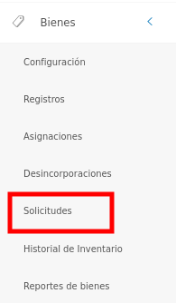
Figura: Opción Solicitudes de Bienes

Luego, el sistema presenta un panel central con las secciones: solicitudes de bienes, solicitudes de bienes pendientes, solicitudes de prórrogas pendientes y entrega de bienes pendientes.

La sección **Solicitudes de Bienes** presenta una lista con todos los registros de las solicitudes de préstamo realizadas, y permite crear,  ver información detallada, solicitar prórroga, registrar eventos, entregar equipo, editar solicitud y eliminar registros. 

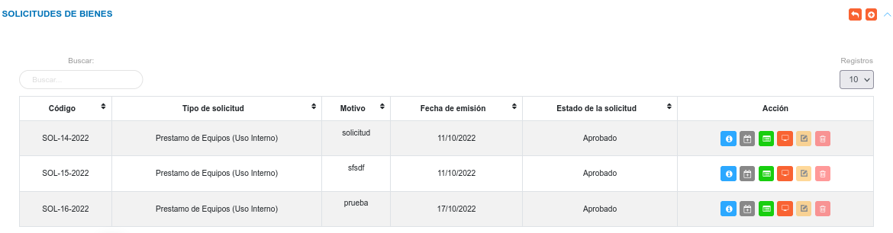
Figura: Solicitudes de Bienes

### Crear una nueva solicitud

!!! warning "Advertencia"
	*	Los bienes disponibles para la sección de solicitudes, son aquellos identificados bajo el **Estatus de uso** "En Almacén o Depósito para su asignación", y **Condición física** óptimo para formar parte de una solicitud de préstamo. En caso de que un bien se encuentre asignado es necesario liberar este bien de dicha asignación y cambiar su estatus de uso, permitiendo así su disponibilidad para una solicitud.   

**Para crear un nuevo registro**

- Dirigirse al **Módulo de Bienes**, luego a **Solicitudes** y ubicarse en la sección **Solicitudes de Bienes**.
- Haciendo uso del botón **Crear**  ubicado en la esquina superior derecha de esta sección, se procede a realizar una nueva solicitud.
- Se completa el formulario ingresando datos, como: fecha, motivo, tipo de solicitud, se seleccionan los bienes a solicitar, también  es posible adjuntar varios archivos que justifiquen la solicitud del préstamo.  Los archivos permitidos son: odt, pdf, png, jpg, jpeg, doc y docx. 
- Se presiona el botón **Guardar**  ubicado al final de esta sección, y se verifica en la lista de registros en **Ingresos de Almacén**.
- Se Presiona el botón **Cancelar**   para cancelar registro y regresar a la ruta anterior.
- Se Presiona el botón **Borrar**  para eliminar datos del formulario.
- Si desea recibir ayuda guiada presione el botón .
- Para retornar a la ruta anterior presione el botón .  

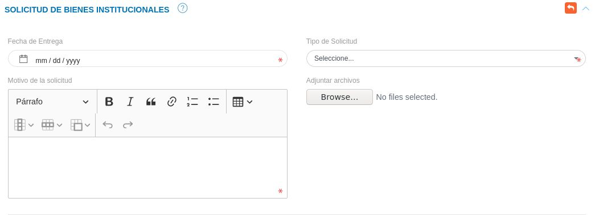
Figura: Solicitud de Bienes

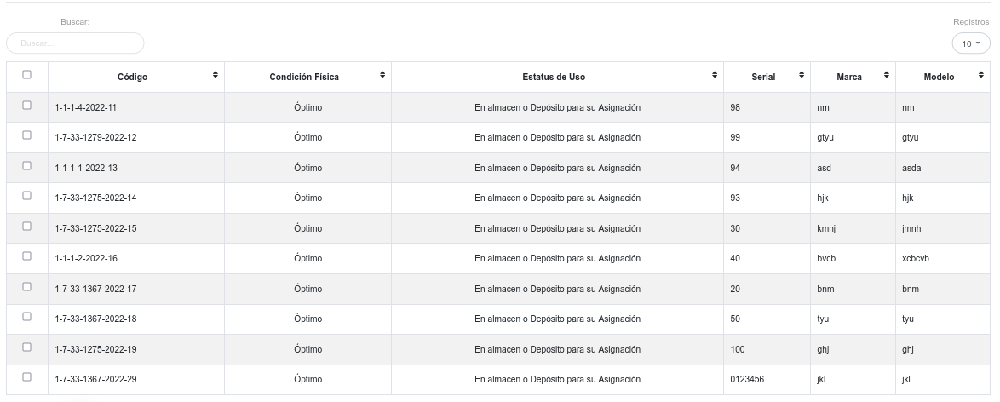
Figura: Lista de bienes disponible para las solicitudes

###Gestión de registros

Mediante los botones ubicados en la columna titulada **Acción** es posible visualizar la información de forma detallada, solicitar prórroga de entrega de bines, reportar eventos, entregar bienes, editar y eliminar un registro.  

 

#### Consultar registros

- Para ver información detalla de un registro pulse el botón **Ver**   para un registro de interés.

- Seguidamente, el sistema muestra una interfaz con la información ingresada previamente de la solicitud de préstamo del bien.

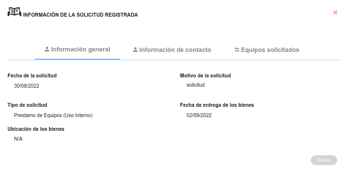
Figura: Interfaz consultar información de una solicitud

#### Solicitar prórroga 

Esta funcionalidad le permite al usuario responsable del equipo  solicitar una extensión de tiempo para la entrega del equipo.

- Para realizar una solicitud de prórroga pulse el botón **Solicitud de Prórroga**  
!!! info "Botón solicitar prorroga"
	 

- Seguidamente, el sistema muestra una interfaz donde muestra por defecto la fecha actual de entrega de los bienes.

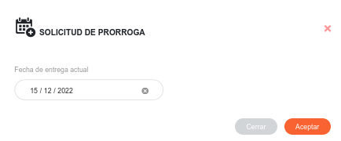
Figura: Interfaz solicitud de prórroga

-El usuario  indica la nueva fecha de entrega del equipo, y pulsa **Aceptar**.

-Luego el sistema lista la solicitud de prórroga en la tabla de **Solicitudes de Prórrogas Pendientes**.	

!!! note "Nota"

	- El botón **Solicitud de Prórroga** se activa una vez se apruebe la solicitud.
	- El botón **Solicitud de Prórroga** se desactiva una vez se realice la entrega de equipos.
	

#### Registrar evento

Esta funcionalidad le permite al usuario responsable del equipo reportar un evento, en caso de que el equipo de la solicitud presente alguna avería o pérdida, 

- Para reportar un evento, pulse el botón **Registro de Eventos** 
!!! info "Botón reportar evento"
	 

- Seguidamente, el sistema muestra una interfaz donde muestra por defecto la fecha actual de entrega de los bienes.

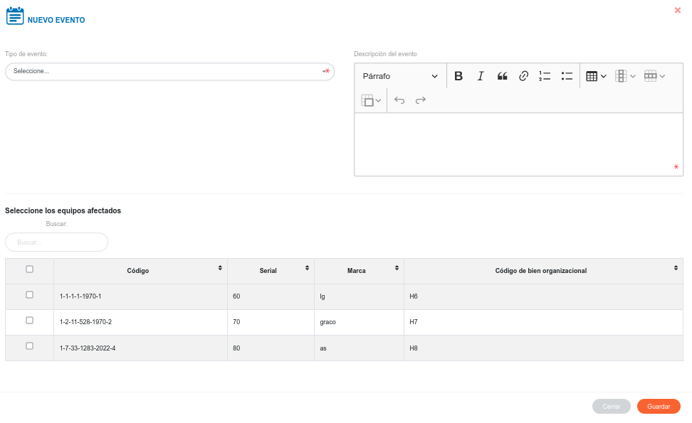
Figura: Interfaz registro de evento

-El usuario  indica el tipo de evento, la descripción, selecciona los bienes afectados, y pulsa **Aceptar**.

- Una vez que el usuario pulse **Aceptar**, el sistema lo lista en la tabla de registros de eventos.

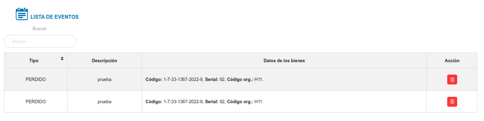
Figura: Interfaz lista de registros de evento

- Si el usuario pulsar el botón **Eliminar** para un evento de interés, el sistema lo lista nuevamente en el formulario de eventos.

!!! note "Nota"

	- El botón **Registro de Eventos** se activa una vez se apruebe la solicitud.
	- Una vez que el usurio reporte un evento para un bien, este ya no puede ser asignado, ni solicitado para un préstamo.

#### Entrega de bienes  

Meidante esta funcionalidad el usuario registra  la entrega de equipos, el cual debe ser evaluada posteriormente por el encargado de bienes institucionales para su respectiva aprobación.  

- Para realizar la entrega de bienes, pulse el botón **Entregar Equipos**.
!!! info "Botón entregar equipo"
	  

-Luego el sistema lista la entrega de bienes en la tabla de **Entrega de Bienes Pendientes**.	

## Solicitudes de bienes pendientes 

Una vez se genera una nueva solicitud, además de añadirse a la tabla **Solicitudes de Bienes**, el registro se almacena en la tabla de **Solicitudes de Bienes Pendientes**, desde esta sección se gestiona la aprobación o rechazo de solicitud. 

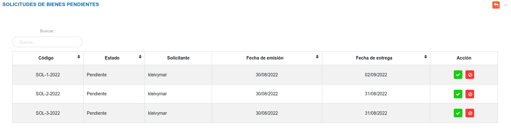
Figura: Solicitudes de Bienes Pendientes

- Pulse el boton **Aceptar Solicitud** para aprobar la solicitud de préstamo de equipos.

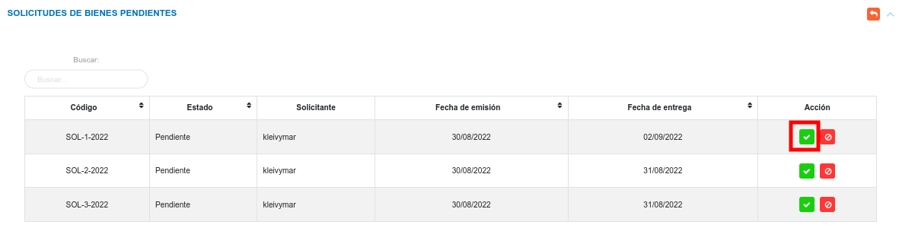
Figura: Botón aprobar solicitud

- El sistema presenta un mensaje de confirmación, junto con las opciones **Cancelar** y **Confrimar**. Una vez se confirme la solicitud esta toma el estado **Aprobado**.

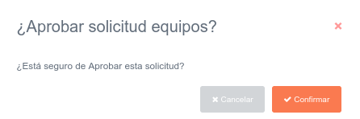
Figura: Interfaz confirmar solicitud

- Pulse el boton **Rechazar Solicitud** para negar la solicitud de préstamo de equipos.

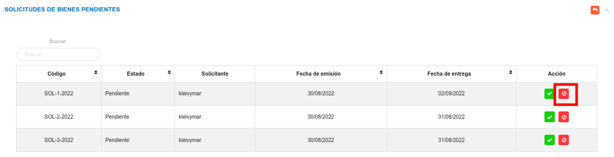
Figura: Botón rechazar solicitud

- El sistema presenta un mensaje de confirmación para rechazar la solicitud, junto con las opciones **Cancelar** y **Confrimar**. Una vez se confirme el rechazo de la solicitud esta toma el estado **Rechazado**.

Figura: Interfaz rechazar solicitud

!!! note "Nota"
     - Una vez que el usuario apruebe una solicitud, el sistema cambia el **Estatus de Uso** del bien a **En uso**, y este ya no puede ser asignado ni solicitado en calidad de préstamo.

     - Una vez que el usuario rechace una solicitud, el sistema envía nuevamente al inventario el bien, y este puede ser asignado o solicitado en calidad de préstamo.

## Solicitudes de prórrogas pendientes

En esta sección se presentan las solicitudes de prórrogas pendientes, el encargado de bienes institucionales evalúa la solicitud y a través de los botones ubicados en la columna titulada **Acción** puede: aceptar o rechazar una solicitud de prórroga. 

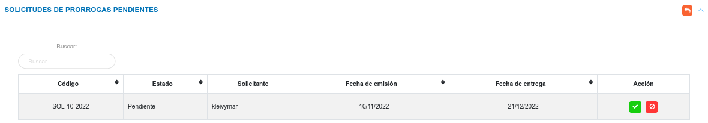
Figura: Solicitudes de Prórrogas Pendientes

- Pulse el boton **Aceptar Solicitud** para aprobar la solicitud de prórroga.

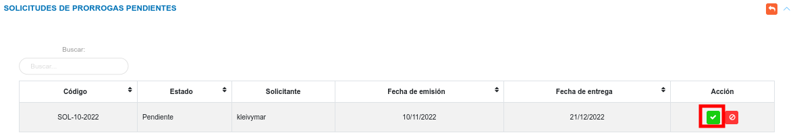
Figura: Botón aprobar solicitud de prórroga

- El sistema presenta un mensaje de confirmación, junto con las opciones **Cancelar** y **Confrimar**. Una vez se confirme la solicitud esta toma el estado **Aprobado**.

Figura: Interfaz confirmar solicitud

- Pulse el boton **Rechazar Solicitud** para negar la solicitud de prórroga.

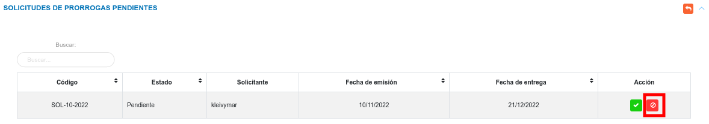
Figura: Botón rechazar solicitud de prórroga

- El sistema presenta un mensaje de confirmación para rechazar la solicitud, junto con las opciones **Cancelar** y **Confrimar**. Una vez se confirme el rechazo de la solicitud esta toma el estado **Rechazado**.

Figura: Interfaz rechazar solicitud

## Entregas de bienes pendientes

En esta sección se listan las solicitudes para entrega de bienes.	El encargado de bienes institucionales evalúa la entrega y mediante los botones ubicados en la columna titulada acción puede: aceptar solicitud, rechazar solicitud o eliminar el registro. 

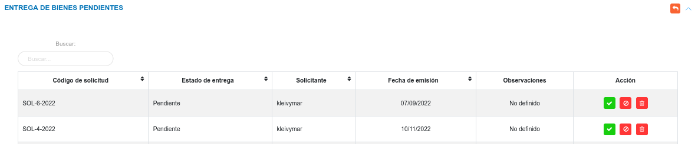
Figura: Solicitudes de Entrega Pendientes

#### Aceptar entrega de bienes

- Pulse el boton **Aceptar Solicitud** para aprobar la entrega de bienes.

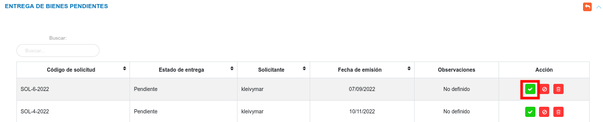
Figura: Botón aprobar entrega de bienes

- El sistema presenta una interfaz, donde solicita información en el campo observaciones generales, junto con las opciones **Cancelar** y **Confirmar**. 

- Pulse el botón **Confirmar** para aprobar la entrega de bienes.

- El sistema cambia el estado de la entrega a **Aprobado**.

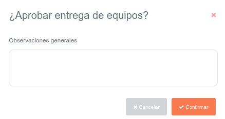
Figura: Interfaz confirmar entrega de bienes

!!! note "Nota"
	- Una vez se apruebe la entrega de bienes, el sistema deshabilita los botones **Rechazar** y **Eliminar**.

#### Rechazar entrega de bienes

- Pulse el boton **Rechazar Solicitud** para negar la entrega de bienes.

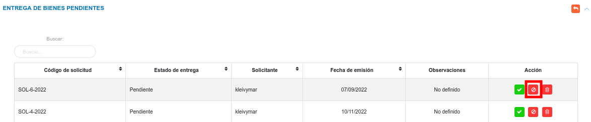
Figura: Botón rechazar entrega de bienes

- El sistema presenta un mensaje de confirmación para rechazar la solicitud, junto con las opciones **Cancelar** y **Confirmar**.

- Pulse el botón **Confirmar** para negar la entrega de bienes.

- El sistema cambia el estado de la entrega a **Rechazado**.

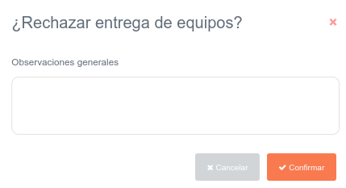
Figura: Interfaz rechazar entrega de bienes

!!! note "Nota"
	- Una vez se rechace la entrega de bienes los botones **Aceptar**, **Rechazar** y **Eliminar** se deshabilitan.

#### Eliminar registros

- Presione el botón **Eliminar**   para un registro de interés.
- Seguidamente, el sistema presenta un modal con un mensaje de confirmación de si está seguro de eliminar el ingreso de almacén, y muestra los botones Confirmar y Cancelar.
- Pulse el botón **Confirmar** si está seguro de eliminar el registro seleccionado.
- El sistema elimina el registro.
- Si pulsa el botón **Cancelar**, el sistema no ejecuta ninguna acción. 

   