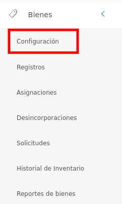
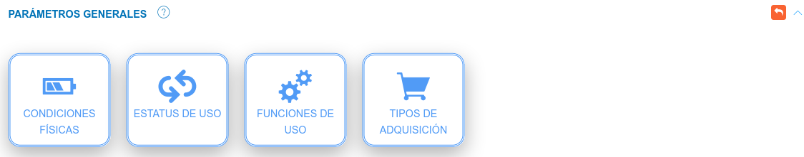
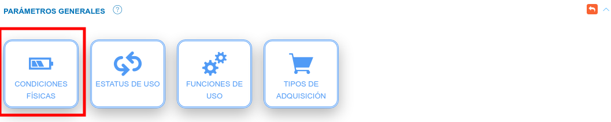
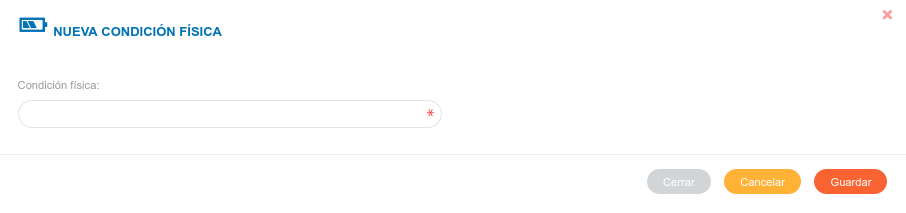
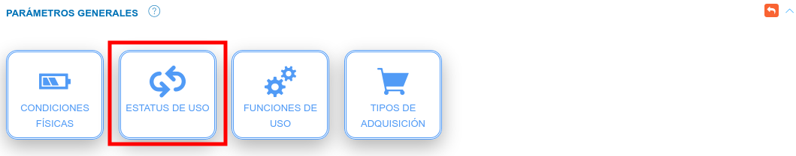
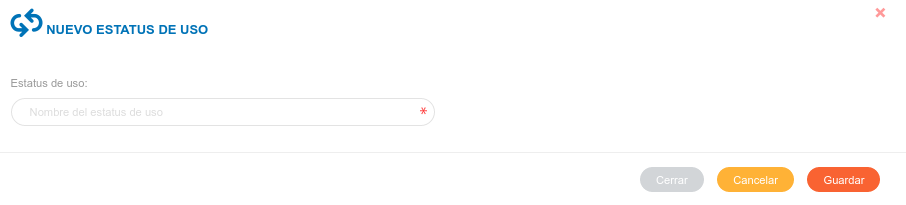
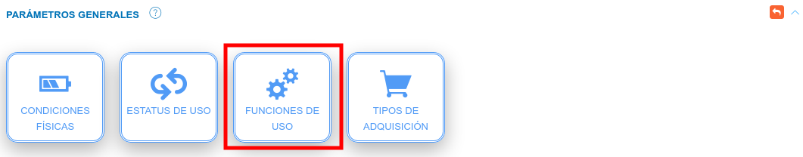
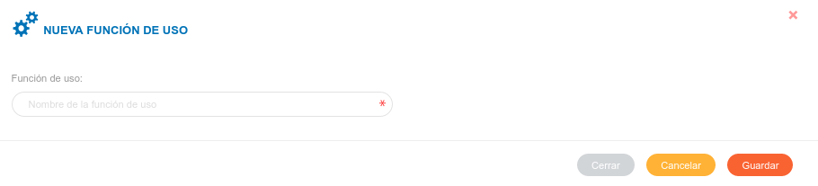
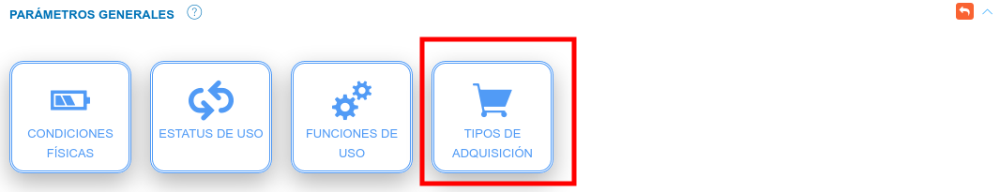
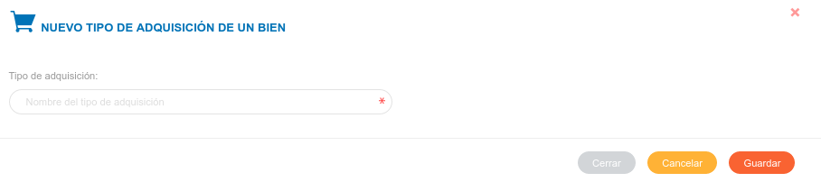

#Configuración Módulo de Bienes
*******************************

##Parámetros generales 

En la sección de **Parámetros Generales**, el usuario puede configurar las características asociadas a las condiciones físicas, estatus de uso, funciones de uso y tipos de adquisición de los bienes de la organización.

Para acceder a la configuración de parámetros generales debe realizar los siguientes pasos:

- En panel lateral ubique el módulo de **Bienes**. Luego pulse la opción **Configuración**.

Figura: Opción Configuración

- Seguidamente ubique la sección **Parámetros Generales**.

Figura: Sección parámetros generales

###Condiciones físicas

Esta funcionalidad permite registrar la condición física de los bienes institucionales.   

Figura: Opción Condiciones Físicas

#### Crear un registro de una condición física

- Pulse la opción  **Condiciones Físicas** en la sección **Parámetros Generales**.
- Complete el formulario ingresando el nombre de la condición física.   
- Presione el botón  **Guardar** para registrar los cambios efectuados.
- Presione el botón  **Cancelar** para limpiar datos del formulario.
- Presione el botón  **Cerrar** para cerrar el formulario.

Figura: Formulario Condiciones Físicas

#### Gestión de registros: 

Para **Editar** o **Eliminar** un registro se debe hacer uso de los botones ubicados en la columna titulada **Acción** de la tabla de **Registros**.

  

#### Editar registros

- Presione el botón **Editar registro**  para un registro de interés.
- Luego, el sistema muestra el formulario en forma de edición.
- Modifique la información que requiera.
- Presione el botón **Guardar**   para registrar los cambios efectuados.

#### Eliminar registros

- Presione el botón **Eliminar**   para un registro de interés.
- Seguidamente, el sistema presenta un modal con un mensaje de confirmación de si está seguro de eliminar el ingreso de almacén, y muestra los botones Confirmar y Cancelar.
- Pulse el botón **Confirmar** si está seguro de eliminar el registro seleccionado.
- El sistema elimina el registro.
- Si pulsa el botón **Cancelar**, el sistema no ejecuta ninguna acción. 

###Estatus de uso 

Esta funcionalidad permite registrar el estatus de uso de los bienes institucionales.  

Figura: Opción Estatus de Uso
 

#### Crear un registro de estatus de uso: 

- Pulse la opción **Estatus de uso** en la sección **Parámetros Generales**.
- Complete el formulario ingresando el nombre del estatus de uso.   
- Presione el botón  **Guardar** para registrar los cambios efectuados.
- Presione el botón  **Cancelar** para limpiar datos del formulario.
- Presione el botón  **Cerrar** para cerrar el formulario. 

Figura: Formulario Estatus de Uso

#### Gestión de registros: 

Para **Editar** o **Eliminar** un registro se debe hacer uso de los botones ubicados en la columna titulada **Acción** de la tabla de **Registros**.

    

#### Editar registros

- Presione el botón **Editar registro**  para un registro de interés.
- Luego, el sistema muestra el formulario en forma de edición.
- Modifique la información que requiera.
- Presione el botón **Guardar**   para registrar los cambios efectuados.

#### Eliminar registros

- Presione el botón **Eliminar**   para un registro de interés.
- Seguidamente, el sistema presenta un modal con un mensaje de confirmación de si está seguro de eliminar el ingreso de almacén, y muestra los botones Confirmar y Cancelar.
- Pulse el botón **Confirmar** si está seguro de eliminar el registro seleccionado.
- El sistema elimina el registro.
- Si pulsa el botón **Cancelar**, el sistema no ejecuta ninguna acción. 

###Funciones de uso 

Esta funcionalidad permite registrar las funciones de uso de los bienes institucionales. 

Figura: Opción Funciones de Uso
 

#### Crear función de uso: 

- Pulse la opción  **Condiciones Físicas** en la sección **Parámetros Generales**.
- Complete el formulario ingresando el nombre de la función de uso.   
- Presione el botón  **Guardar** para registrar los cambios efectuados.
- Presione el botón  **Cancelar** para limpiar datos del formulario.
- Presione el botón  **Cerrar** para cerrar el formulario. 
 

Figura: Formulario Funciones de Uso

#### Gestión de registros: 

Para **Editar** o **Eliminar** un registro se debe hacer uso de los botones ubicados en la columna titulada **Acción** de la tabla de **Registros**.

#### Editar registros

- Presione el botón **Editar registro**  para un registro de interés.
- Luego, el sistema muestra el formulario en forma de edición.
- Modifique la información que requiera.
- Presione el botón **Guardar**   para registrar los cambios efectuados.

#### Eliminar registros

- Presione el botón **Eliminar**   para un registro de interés.
- Seguidamente, el sistema presenta un modal con un mensaje de confirmación de si está seguro de eliminar el ingreso de almacén, y muestra los botones Confirmar y Cancelar.
- Pulse el botón **Confirmar** si está seguro de eliminar el registro seleccionado.
- El sistema elimina el registro.
- Si pulsa el botón **Cancelar**, el sistema no ejecuta ninguna acción. 

### Tipo de adquisición 

Esta funcionalidad permite registrar el tipo de adquisición de los bienes institucionales.   

Figura: Opción Tipo de Adquisición

#### Crear tipo de adquisición:  

- Pulse la opción **Estatus de uso** en la sección **Parámetros Generales**.
- Complete el formulario ingresando el nombre del tipo de adquisición.   
- Presione el botón  **Guardar** para registrar los cambios efectuados.
- Presione el botón  **Cancelar** para limpiar datos del formulario.
- Presione el botón  **Cerrar** para cerrar el formulario. 
 

Figura: Formulario Tipo de Adquisición

#### Gestión de registros: 

Para **Editar** o **Eliminar** un registro se debe hacer uso de los botones ubicados en la columna titulada **Acción** de la tabla de **Registros**.

#### Editar registros

- Presione el botón **Editar registro**  para un registro de interés.
- Luego, el sistema muestra el formulario en forma de edición.
- Modifique la información que requiera.
- Presione el botón **Guardar**   para registrar los cambios efectuados.

#### Eliminar registros

- Presione el botón **Eliminar**   para un registro de interés.
- Seguidamente, el sistema presenta un modal con un mensaje de confirmación de si está seguro de eliminar el ingreso de almacén, y muestra los botones Confirmar y Cancelar.
- Pulse el botón **Confirmar** si está seguro de eliminar el registro seleccionado.
- El sistema elimina el registro.
- Si pulsa el botón **Cancelar**, el sistema no ejecuta ninguna acción. 
