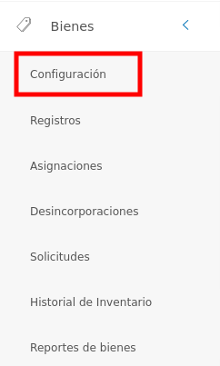

#Configuración Módulo de Bienes
*******************************

## Parámetros específicos del clasificador de bienes 

En la sección de **Parámetros específicos del clasificador de bienes**, el usuario puede configurar las características asociadas a tipos de bienes, categorias generales, subcategorías y categorías específicas.

Para acceder a la configuración de Parámetros específicos del clasificador de bienes debe realizar los siguientes pasos:

- En panel lateral ubique el módulo de **Bienes**. Luego pulse la opción **Configuración**.

Figura: Opción Configuración

- Seguidamente ubique la sección **Parámetros específicos del clasificador de bienes**.

Figura: Sección parámetros específicos del clasificador de bienes

### Tipos de bienes

Esta funcionalidad permite registrar los tipos de bienes institucionales.   

Figura: Opción Tipos de Bienes

#### Crear tipo de bien: 

- Pulse la opción **Tipos de Bienes** en la sección **Parámetros Específicos del Clasificador de Bienes**.
- Complete el formulario ingresando el nombre del tipo de bien.  
- Presione el botón  **Guardar** para registrar los cambios efectuados.
- Presione el botón  **Cancelar** para limpiar datos del formulario.
- Presione el botón  **Cerrar** para cerrar el formulario.

Figura: Formulario Tipos de Bienes

#### Gestión de registros: 

Para **Editar** o **Eliminar** un registro se debe hacer uso de los botones ubicados en la columna titulada **Acción** de la tabla de **Registros**.

#### Editar registros

- Presione el botón **Editar registro**  para un registro de interés.
- Luego, el sistema muestra el formulario en forma de edición.
- Modifique la información que requiera.
- Presione el botón **Guardar**   para registrar los cambios efectuados.

#### Eliminar registros

- Presione el botón **Eliminar**   para un registro de interés.
- Seguidamente, el sistema presenta un modal con un mensaje de confirmación de si está seguro de eliminar el ingreso de almacén, y muestra los botones Confirmar y Cancelar.
- Pulse el botón **Confirmar** si está seguro de eliminar el registro seleccionado.
- El sistema elimina el registro.
- Si pulsa el botón **Cancelar**, el sistema no ejecuta ninguna acción. 

### Categorías generales

Esta funcionalidad permite registrar las categorías generales de los bienes institucionales.     

Figura: Opción Categorías generales

#### Crear categoría general:

- Pulse la opción **Categorías Generales** en la sección **Parámetros Específicos del Clasificador de Bienes**.
- Complete el formulario ingresando el tipo de bien al que pertenece la categoría, código de la categoría general y el nombre de la categoría general.
- Presione el botón  **Guardar** para registrar los cambios efectuados.
- Presione el botón  **Cancelar** para limpiar datos del formulario.
- Presione el botón  **Cerrar** para cerrar el formulario. 

Figura: Formulario Categorías Generales

Gestión de registros: 

Para **Editar** o **Eliminar** un registro se debe hacer uso de los botones ubicados en la columna titulada **Acción** de la tabla de **Registros**.

#### Editar registros

- Presione el botón **Editar registro**  para un registro de interés.
- Luego, el sistema muestra el formulario en forma de edición.
- Modifique la información que requiera.
- Presione el botón **Guardar**   para registrar los cambios efectuados.

#### Eliminar registros

- Presione el botón **Eliminar**   para un registro de interés.
- Seguidamente, el sistema presenta un modal con un mensaje de confirmación de si está seguro de eliminar el ingreso de almacén, y muestra los botones Confirmar y Cancelar.
- Pulse el botón **Confirmar** si está seguro de eliminar el registro seleccionado.
- El sistema elimina el registro.
- Si pulsa el botón **Cancelar**, el sistema no ejecuta ninguna acción. 

### Subcategorías

Esta funcionalidad permite registrar las subcategorías  de los bienes institucionales.   

Figura: Opción Subcategoria

#### Crear subcategoría: 

- Pulse la opción **Subcategorías** en la sección **Parámetros Específicos del Clasificador de Bienes**.
- Complete el formulario  ingresando el tipo de bien al que pertenece la categoría, la categoría general, Código de la subcategoría y el nombre de la subcategoría.
- Presione el botón  **Guardar** para registrar los cambios efectuados.
- Presione el botón  **Cancelar** para limpiar datos del formulario.
- Presione el botón  **Cerrar** para cerrar el formulario.

Figura: Formulario de Subcategorías

#### Gestión de registros: 

Para **Editar** o **Eliminar** un registro se debe hacer uso de los botones ubicados en la columna titulada **Acción** de la tabla de **Registros**.

 

#### Editar registros

- Presione el botón **Editar registro**  para un registro de interés.
- Luego, el sistema muestra el formulario en forma de edición.
- Modifique la información que requiera.
- Presione el botón **Guardar**   para registrar los cambios efectuados.

#### Eliminar registros

- Presione el botón **Eliminar**   para un registro de interés.
- Seguidamente, el sistema presenta un modal con un mensaje de confirmación de si está seguro de eliminar el ingreso de almacén, y muestra los botones Confirmar y Cancelar.
- Pulse el botón **Confirmar** si está seguro de eliminar el registro seleccionado.
- El sistema elimina el registro.
- Si pulsa el botón **Cancelar**, el sistema no ejecuta ninguna acción. 

### Categorías específicas
	
Esta funcionalidad permite registrar las categorías específicas de los bienes institucionales.   

Figura: Opción Categoria Específica

####Crear categoría específica:  

- Pulse la opción  **Categorías Específicas** en la sección **Parámetros Específicos del Clasificador de Bienes**.
- Complete el formulario ingresando el tipo de bien al que pertenece la categoría, la categoría general, la subcategoría, el código de la categoría específica y el nombre de la categoría específica. 
- Presione el botón  **Guardar** para registrar los cambios efectuados.
- Presione el botón  **Cancelar** para limpiar datos del formulario.
- Presione el botón  **Cerrar** para cerrar el formulario. 

Figura: Formulario de Categorías Específicas

#### Gestión de registros: 

Para **Editar** o **Eliminar** un registro se debe hacer uso de los botones ubicados en la columna titulada **Acción** de la tabla de **Registros**.

 

#### Editar registros

- Presione el botón **Editar registro**  para un registro de interés.
- Luego, el sistema muestra el formulario en forma de edición.
- Modifique la información que requiera.
- Presione el botón **Guardar**   para registrar los cambios efectuados.

#### Eliminar registros

- Presione el botón **Eliminar**   para un registro de interés.
- Seguidamente, el sistema presenta un modal con un mensaje de confirmación de si está seguro de eliminar el ingreso de almacén, y muestra los botones Confirmar y Cancelar.
- Pulse el botón **Confirmar** si está seguro de eliminar el registro seleccionado.
- El sistema elimina el registro.
- Si pulsa el botón **Cancelar**, el sistema no ejecuta ninguna acción. 
