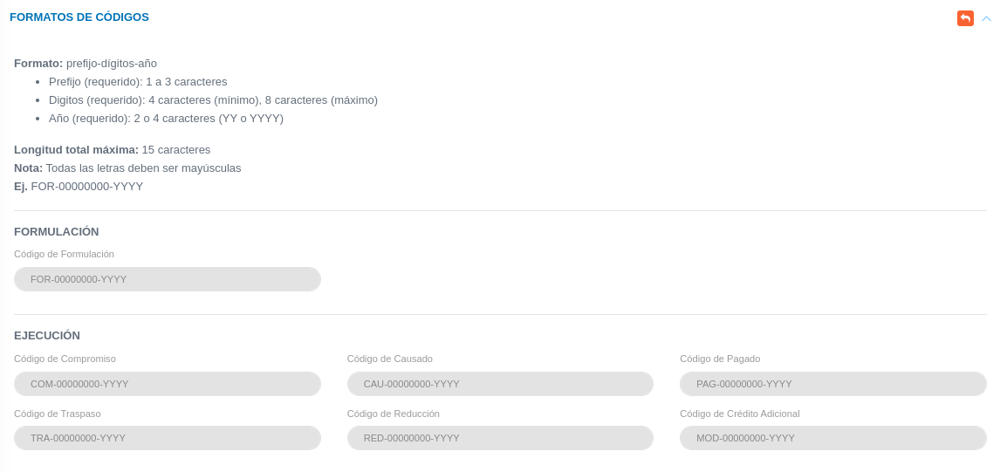

# Configuración Módulo de Presupuesto 
************************************

El usuario selecciona el módulo de Presupuesto en el menú lateral de los módulos del sistema, ahí se visualizan las opciones **Configuración**, **Clasificador Presupuestario**, **Formulación**, **Disponibilidad Presupuestaria**, **Modificaciones**, **Ejecución** y **Reportes**.

Figura 1: Menú del Módulo de Presupuesto

## Formatos de códigos

La sección de **Formatos de Códigos** permite establecer un código de referencia para los registros posteriores (formulación, modificaciones presupuestarias y ejecución). Para completar esta configuración, debemos dirigirnos al **Módulo de Presupuesto**, luego a **Configuración** y ubicarnos en la sección **Formatos de Códigos**.

Figura 2: Formulario de formato de código

 

Cada código debe establecerse de acuerdo a un formato específico el cual se divide en tres (3) secciones: prefijo-dígitos-año.

- **Prefijo:** debe contener entre 1 a 3 caracteres y debe ser único.
- **Dígitos:** Establece el número del registro y comprende una longitud de entre 4 a 8 caracteres como máximo. Para establecer la longitud de la numeración se debe indicar con ceros (0) de acuerdo a la cantidad de dígitos máximos que se desea registrar.
- **Año:** Indica el formato del año para el código el cual se debe indicar con la letra "**Y**" de acuerdo al formato deseado. Los valores posibles son: **YY** para formato de año corto y **YYYY** para el formato de año largo.

Una vez se establezca el formato de códigos en la parte inferior derecha de este formato, el sistema presenta los siguientes botones: **Borrar datos del formulario**, **Cancelar y regresar** y **Guardar registro**. El usuario puede hacer uso de estas opciones, como: 

-   Presionar el botón **Borrar datos del formulario**   elimina datos del formulario.
-   Presionar el botón **Cancelar y regresar**   cancela el registro y regresar a la ruta anterior.
-   Presionar el botón **Guardar registro**  guarda la información agregada en el formulario.

En la parte superior derecha de este formato de códigos el sistema presenta los siguientes botones: **Ir atrás** y **Minimizar**. El usuario puede hacer uso de estas opciones, como: 

-   Presionar el botón **Ir atrás**   retorna a la pantalla anterior.
-   Presionar el botón **Minimizar**   minimiza la sección de formato de código
