# Gestión de Solicitudes 
************************

El usuario selecciona el módulo de Compras en el menú lateral de los módulos del sistema, ahí visualizara las opciones **Configuración**, **Solicitudes**,  **Reportes** y **Ingresar cronograma**, debiendo pulsar **Solicitudes** 

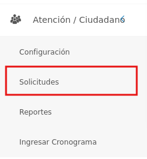
Figura 7: Menú del Módulo de OAC

## Solicitudes 

En esta sección se listan todos los registros de solicitudes realizadas y permite formular una nueva solicitud.  Desde la tabla de registros se puede gestionar la información sobre la solicitud haciendo uso de los botones ubicados en la columna titulada **Acción** que permiten: ver información detallada, editar o eliminar el registro.

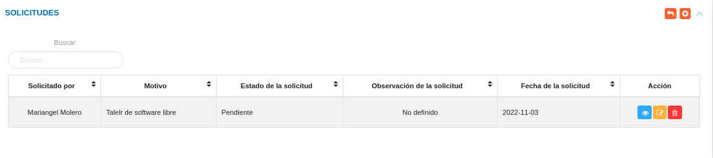
Figura 8: Tabla de Solicitudes del módulo de OAC
  

### Registrar una nueva solicitud 

- Dirigirse al **Módulo de Oficina de Atención al Ciudadano** e ingresar en **Solicitudes**.
- Ubicarse en la sección **Solicitudes**.
- Presionar el botón **Crear**  ubicado en la esquina superior derecha de esta sección. 
- Complete el formulario de solicitudes. Tenga en consideración completar los campos obligatorios que son requeridos para el registro de una nueva solicitud. 

#### Datos de la persona solicitante 

- Complete el formulario del apartado **Datos de la persona solicitante**. Tenga en consideración completar los campos obligatorios que son requeridos para el registro de una solicitud. 

!!! note "Nota"
    Los camṕos en la selección del apartado **Datos de la persona solicitante** incluyen configurada previamente a través de los registros comunes del módulo de OAC y del sistema en general. Si se requiere incluir información diferente a la que se encuentra por defecto, se recomienda agregar estos registros en al configuración de registros comunes. 

  Para agregar registros comunes del sistema acceda a **Configuración** > **General** > **Registros Comunes**. 

   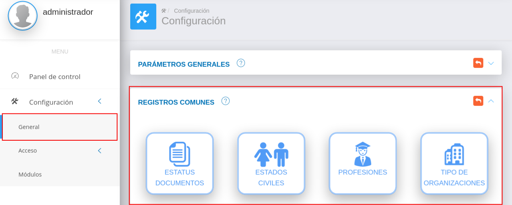

   -   ***País***: Para crear un nuevo registro de país acceda a **Configuración** > **General** > **Registros Comunes** > **Países**. 
   -   ***Estado***: Para crear un nuevo registro de estado acceda a **Configuración** > **General** > **Registros Comunes** > **Estados**. 
   -   ***Municipio***: Para crear un nuevo registro de municipio acceda a **Configuración** > **General** > **Registros Comunes** > **Municipios**. 
   -   ***Ciudad***: Para crear un nuevo registro de ciudad acceda a **Configuración** > **General** > **Registros Comunes** > **Ciudades**.
   -   ***Parroquia***: Para crear un nuevo registro de parroquia acceda a **Configuración** > **General** > **Registros Comunes** > **Parroquia**.

  
  Para agregar registros comunes del módulo de OAC, acceda a **Atención/Ciudadano** > **Configuración** > **Registros comunes**.
 

   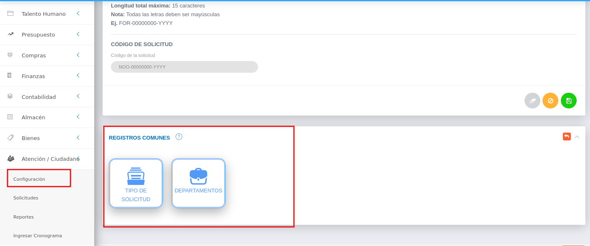

   -   ***Tipo de solicitud***: Para crear un nuevo registro de tipo de solicitud acceda a **Atención/Ciudadano** > **Configuración** > **Registros Comunes** > **Tipo de solicitud**. 
   -   ***Departamento***: Para crear un nuevo registro de departamento acceda a *Atención/Ciudadano** > **Configuración** > **Registros Comunes** > **Departamento**. 
  

#### Institución (SI o NO)

Si la persona pertenece a una institución u organización debe presionar el switch **Institución** 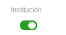 ubicado en la parte inferior del formulario de registro. 

- Complete el formulario del apartado **Institución**.
- Presione el botón **Guardar**   para registrar los cambios efectuados.
- Presione el botón **Cancelar**   para cancelar registro y regresar a la ruta anterior.
- Presione el botón **Borrar**  para eliminar datos del formulario.
- Si desea recibir ayuda guiada presione el botón .
- Para retornar a la ruta anterior presione el botón .

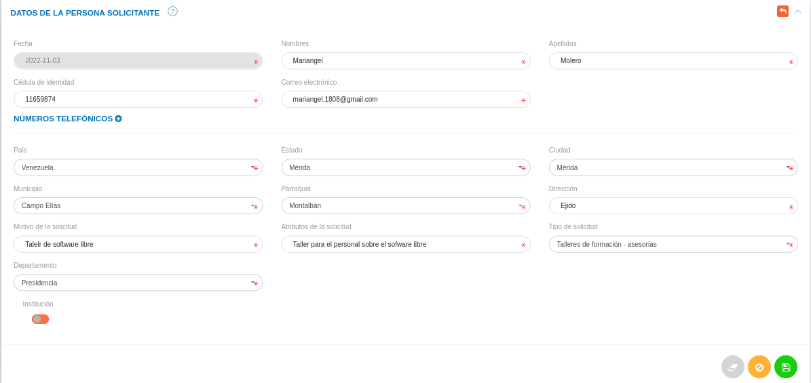
Figura 9: Formulario de solicitud de OAC
  

### Gestionar solicitudes 

La gestión de solicitudes se lleva a cabo a traves del apartado **Solicitudes**. 

 - Para acceder a esta sección debe dirigirse a **Atención/Ciudadano** y ubicarse en la sección **Solicitudes** apartado **Solicitudes** (ver Figura 10).

A través del apartado **Solicitudes** se listan los registros de **Solicitudes** en una tabla.   

Desde este apartado se pueden llevar a cabo las siguientes acciones: 

-   ***Registrar solicitudes***.   
-   ***Consultar registros***.
-   ***Editar registros***. 
-   ***Eliminar registros***. 
-   ***Solicitudes pendientes***.
-   ***Cierre de solicitudes***.

Figura 10: Solicitudes Registradas

### Registrar solicitud

-   Presione el botón **Crear registro**  ubicado en la parte superior derecha del apartado **Solicitudes** (ver Figura 11)
-   A continuación complete el formulario siguiendo los pasos descritos en el apartado [Registrar una nueva solicitud](##Registrar-una-nueva-solicitud).
-   Presione el botón **Guardar**   para registrar los cambios efectuados.

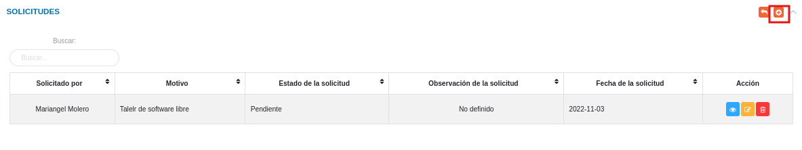
Figura 11: Registrar solicitudes

### Consultar registros

-   Presione el botón **Consultar registro**  ubicado en la columna titulada **Acción** de un registro de solicitudes que se prefiere consultar. 

Figura 12: Consultar Registros de solicitudes 

-   A continuación el sistema despliega una sección donde se describen los datos de la solicitud seleccionada. 

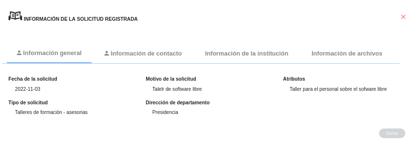
Figura 13: Datos de la solicitud

### Editar registros

-   Presione el botón **Editar registro**   ubicado en la columna titulada **Acción** del registro de la solicitud que se desee seleccionar para actualizar datos. 

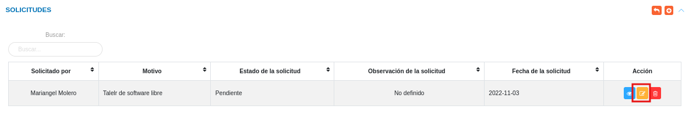
Figura 14: Editar Registros de solicitudes

-   Actualice los datos del formulario siguiendo los pasos descritos en el apartado [Registrar solicitud](##Registrar-una-nueva-solicitud).
-   Presione el botón **Guardar**   para registrar los cambios efectuados.

### Eliminar registros

-   Presione el botón **Eliminar registro**   ubicado en la columna titulada **Acción** del registro de una solicitud que se desee seleccionar para eliminar del sistema. 

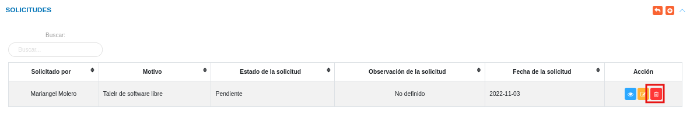
Figura 15: Eliminar Registros de solicitud

-   Confirme que esta seguro de eliminar el registro seleccionado a través de la ventana emergente, mediante el botón **Confirmar** y efectue los cambios.

## Solicitudes Pendientes

Una vez se genera una nueva solicitud, además de añadirse a la tabla **Solicitudes**, el registro se almacena en la tabla de **Solicitudes Pendientes**, desde esta sección se gestiona la aprobación o rechazo de solicitud.

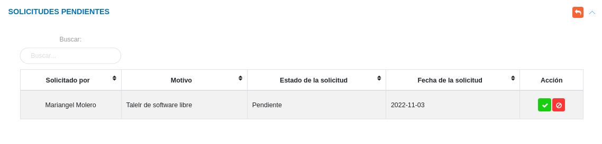
Figura 16: Solicitudes Pendientes
  

- Presione el botón **Aprobar**   para aprobar una solicitud de OAC, seguidamente agregue un comentario u obsevación referente a la solicitud. Una vez es aprobada una solicitud, el registro cambia su estado de **Pendiente** a **Iniciado**
- Presione el botón **Cancelar**   para negar una solicitud de OAC.

## Cierre de solicitudes

Una vez la solicitud ha sido aprobada, este registro cambia su estado como **Iniciado**. Luego de que la solicitud ha sido atendida, desde la sección **Cierre de Solicitud** se culmina el proceso haciendo uso del botón **Cerrar** ubicado en la columna titulada **Acción** de esta tabla de registros. 

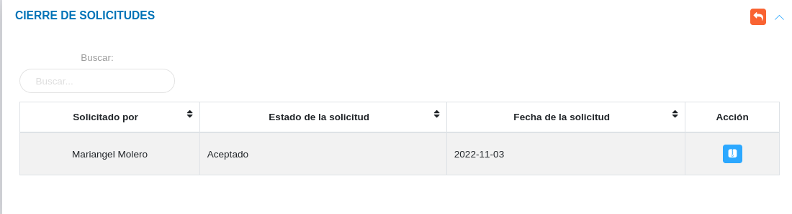
Figura 17: Cierre de Solicitudes
  

Una vez se inicia el cierre de solicitud se muestra una ventana emergente, en la que el jefe de oficina de atención al ciudadano o usuario con permisos especiales debe realizar las siguientes acciones:

-	Indicar la fecha de verificación.
-	Subir uno o varios archivos asociados a la solicitud.
-	Guardar el registro para dar cierre a la solicitud. 

!!! warning "Advertencia"
	Los formatos permitidos para la carga de archivos son **.doc**, **.docx**, **.odt**, **.pdf**, **.png**, **.jpeg** y **.jpg**

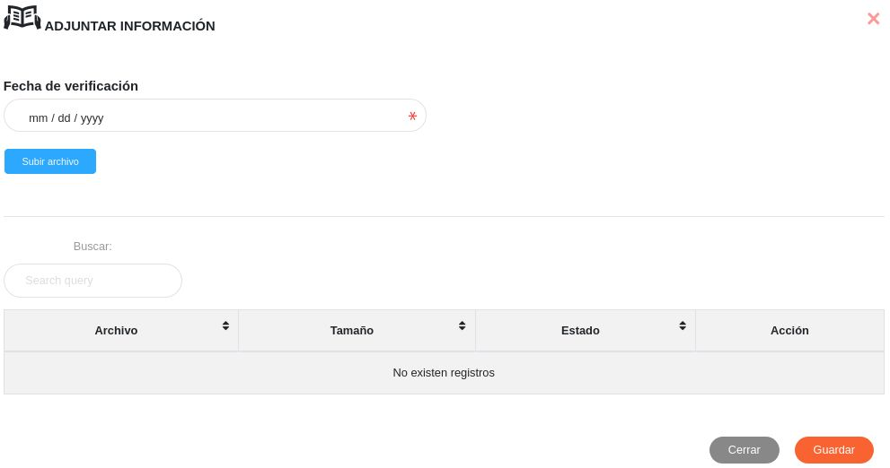
Figura 18: Cierre de Solicitud
  

Una vez la solicitud ha sido ejecutada y se completa el cierra de solicitud, el registro cambia su estado de **Iniciado** a **Culminado**.

   