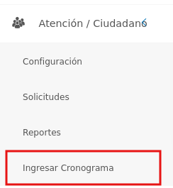
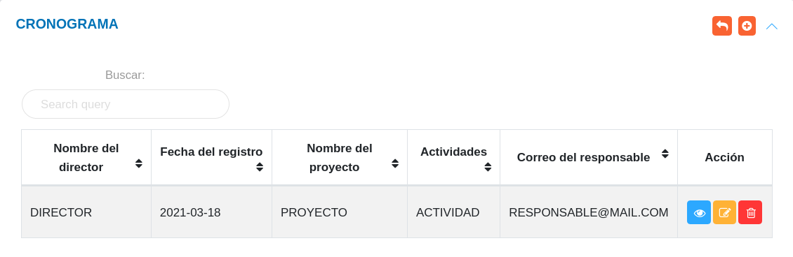
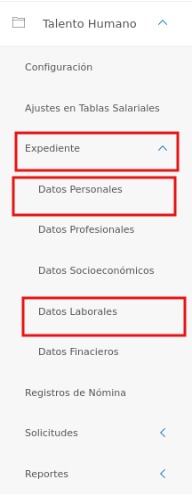
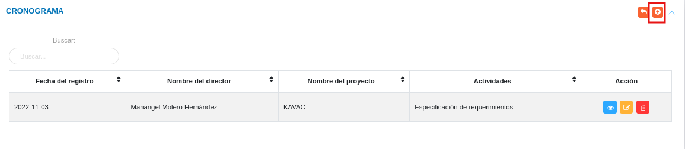
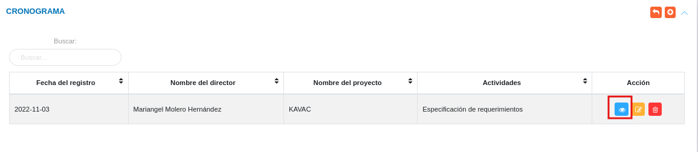
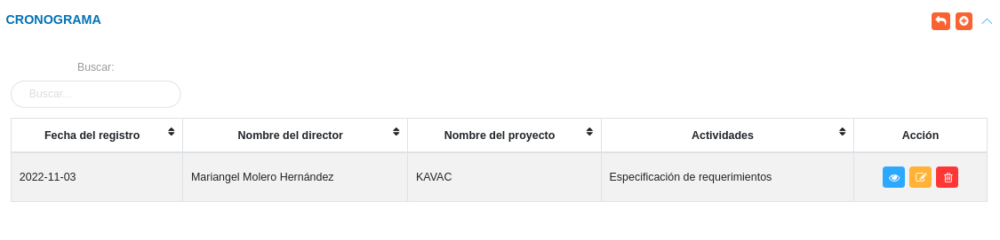
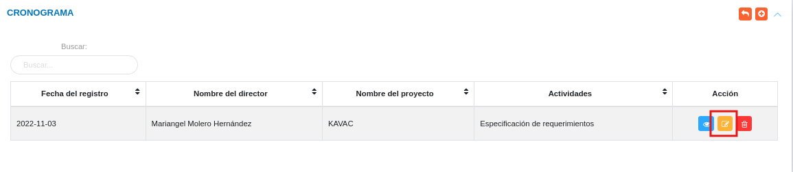
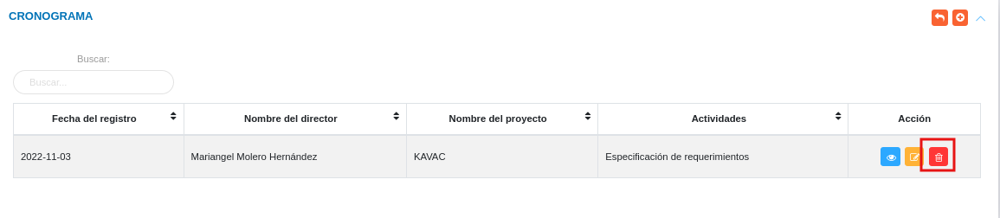

# Cronograma de actividades  
***************************

El usuario selecciona el módulo de Compras en el menú lateral de los módulos del sistema, ahí visualizara las opciones **Configuración**, **Solicitudes**,  **Reportes** y **Ingresar cronograma**, debiendo pulsar **Ingresar Cronograma** 

Figura 21: Menú del Módulo de OAC

## Cronograma de actividades 

En la sección **Cronograma** se listan todas las actividades asignadas que han sido formuladas desde el módulo de oficina de atención al ciudadano (OAC). La tabla de registros incluye información detallada sobre la asignación de actividades como el nombre del director, fecha de asignación, nombre del proyecto, actividades y la dirección de correo electrónico del responsable. 

Figura 22: Cronograma

### Registrar cronograma de actividades

- Dirigirse al **Módulo de Oficina de Atención al Ciudadano**, luego a **Cronograma de Actividades** y ubicarse en la sección **Cronograma**.
- Haciendo uso del botón **Crear**  ubicado en la esquina superior derecha de esta sección, se procede a realizar un nuevo registro.
- Completar el formulario de la sección **Cronograma de actividades**.

Para agregar personal o responsable acceda a **Talento Humano** > **Expediente** > **Datos Personales y Datos Laborales**. 

   

   -   ***Datos personales***: Para crear un nuevo registro de datos personales acceda a **Talento Humano** > **Expediente** > **Datos personales**.
   -   ***Datos laborales***: Para crear un nuevo registro de datos laborales acceda a **Talento Humano** > **Expediente** > **Datos laborales**

Figura 23: Formulario de Cronograma de Actividades

- Presione el botón **Guardar**   para registrar los cambios efectuados.
- Presione el botón **Cancelar**   para cancelar registro y regresar a la ruta anterior.
- Presione el botón **Borrar**  para eliminar datos del formulario.
- Si desea recibir ayuda guiada presione el botón .
- Para retornar a la ruta anterior presione el botón .

### Gestionar cronograma de actividades

La gestión de cronograma de actividades se lleva a cabo a través del apartado **Cronograma de actividades**. 

-   Para acceder a esta sección debe dirigirse a **atención/ciudadano** y ubicarse en la sección **Ingresar cronograma** apartado **Cronograma** (ver Figura 22).

A través del apartado **Cronograma** se listan los registros de **Cronograma de actividades** en una tabla.   

Desde este apartado se pueden llevar a cabo las siguientes acciones: 

-   ***Registrar cronograma***.   
-   ***Consultar registros***. 
-   ***Editar registros***. 
-   ***Eliminar registros***. 

Figura 23: Cronograma de actividades registrados

### Registrar cronograma de actividades

-   Presione el botón **Crear registro**  ubicado en la parte superior derecha del apartado **Cronograma de actividades** (ver Figura 11)
-   A continuación complete el formulario siguiendo los pasos descritos en el apartado [Registrar cronograma de actividades](##Registrar-cronograma-de-actividades).
-   Presione el botón **Guardar**   para registrar los cambios efectuados.

Figura 24: Registrar cronograma

### Consultar registros

-   Presione el botón **Consultar registro**  ubicado en la columna titulada **Acción** de un registro de cronograma de actividades que se prefiere consultar. 

Figura 25: Consultar Registros de cronogramas 

-   A continuación el sistema despliega una sección donde se describen los datos del cronograma seleccionado. 

Figura 26: Datos del cronograma

### Editar registros

-   Presione el botón **Editar registro**   ubicado en la columna titulada **Acción** del registro de cronograma de actividades que se desee seleccionar para actualizar datos. 

Figura 29: Editar Registros de cronograma de actividades

-   Actualice los datos del formulario siguiendo los pasos descritos en el apartado [Registrar cronograma de actividades](#registrar-cronograma-de-actividades).
-   Presione el botón **Guardar**   para registrar los cambios efectuados.

### Eliminar registros

-   Presione el botón **Eliminar registro**   ubicado en la columna titulada **Acción** del registro de cronograma de actividades que se desee seleccionar para eliminar del sistema. 

Figura 30: Eliminar Registros de cronograma de actividades

-   Confirme que esta seguro de eliminar el registro seleccionado a través de la ventana emergente, mediante el botón **Confirmar** y efectue los cambios. 