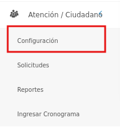
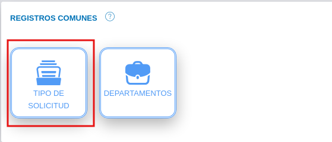
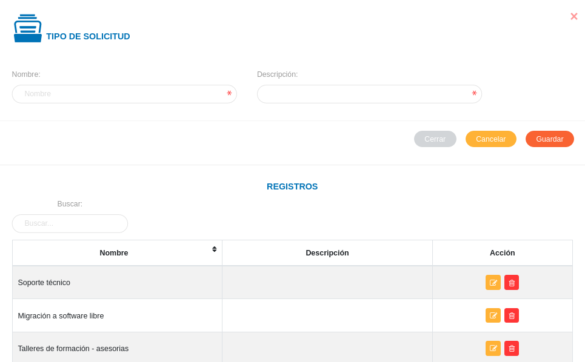
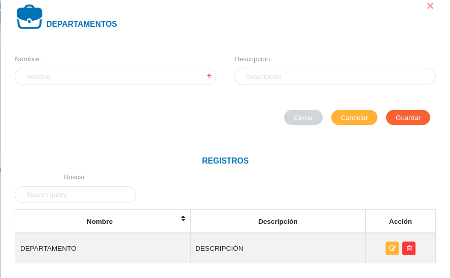

# Configuración Módulo de Oficina de Atención al Ciudadano
*************************************************************

El usuario selecciona el módulo de Compras en el menú lateral de los módulos del sistema, ahí visualizara las opciones **Configuración**, **Solicitudes**,  **Reportes** y **Ingresar cronograma**, debiendo pulsar **Configuración** 

Figura 3: Menú del Módulo de OAC

## Registros comunes

La sección de registros comunes es una herramienta de la **Configuración del Módulo de OAC** que permite al administrador o un usuario con permisos especiales sobre el módulo de OAC, ajustar el módulo a la organización usuaria a través de parámetros configurables.   Los datos registrados en esta sección serán considerados en todas las funcionalidades del módulo.

El usuario ingresará a **Registros Comunes**, visualizando 2 iconos **Departamentos** y  **Tipos de Solicitud**

Figura 4: 
Registros comunes del Módulo de OAC

### Tipo de solicitud

A través de esta funcionalidad se gestiona información sobre los diferentes tipos de solicitudes según los servicios que ofrece la organización. Los registros realizados en esta sección corresponden a datos a incluir en la información en la gestión de solicitudes del módulo de OAC.   

El usuario selecciona el icono de **Tipo de solicitud**

#### Registro de tipo de solicitud

   - Complete el formulario **Tipo de Solicitud** (ver Figura 5).   Asigne un nombre y una descripción para el tipo de solicitud a través de los campos **Nombre** y **Descripción** 
   -   Presione el botón  **Guardar** para registrar los cambios efectuados.
   -   Presione el botón  **Cancelar** para limpiar datos del formulario.
   -   Presione el botón  **Cerrar** para cerrar el formulario.

Figura 5: Tipo de Solicitud
  

***Gestión de registros de tipo de solicitud***

-   Para editar un registro de **Tipo de solicitud** presione el botón **Editar**  del registro seleccionado de la tabla **Registros**.  A continuación complete el formulario **Tipo de solicitud** y presione el botón **Guardar** para almacenar los cambios efectuados.
-   Para eliminar un registro de **Tipo de solicitud** presione el botón **Eliminar**  del registro seleccionado de la tabla **Registros**. 

### Departamentos

Desde esta sección se registran los departamentos o las diferentes direcciones en la que se distribuye la organización.  Los registros realizados en esta sección corresponden a datos a incluir en la información en la gestión de solicitudes del módulo de OAC.

#### Registro de un departamento

   - Complete el formulario **Departamento** (ver Figura 6).   Asigne un nombre y una descripción del departamento a través de los campos **Nombre** y **Descripción**.
   -   Presione el botón  **Guardar** para registrar los cambios efectuados.
   -   Presione el botón  **Cancelar** para limpiar datos del formulario.
   -   Presione el botón  **Cerrar** para cerrar el formulario.

Figura 6: Tipo de Solicitud
  

***Gestión de registros de departamentos***

-   Para editar un registro de **Departamentos** presione el botón **Editar**  del registro seleccionado de la tabla **Registros**.  A continuación complete el formulario **Departamentos** y presione el botón **Guardar** para almacenar los cambios efectuados.
-   Para eliminar un registro de **Departamentos** presione el botón **Eliminar**  del registro seleccionado de la tabla **Registros**. 

