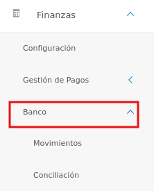
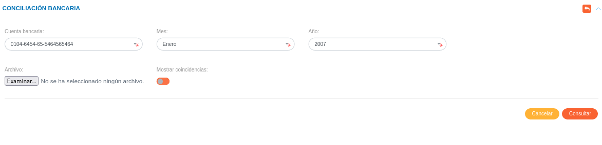
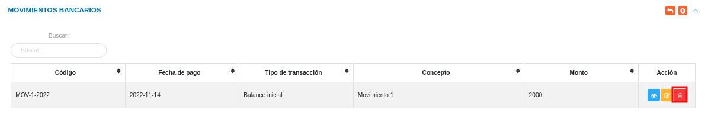

# Gestión de Bancos
************************

El usuario selecciona el módulo de Finanzas en el menú lateral de los módulos del sistema, ahí visualizara las opciones **Configuración**, **Gestión de Pagos** y **Bancos**, debiendo pulsar **Bancos** 

Figura 50: Menú del Módulo de Compras

*******************
# Gestión de conciliación bancaria
***************************
A través de esta sección se lleva a cabo la gestión de conciliación bancaria en el módulo de Finanzas. Mediante esta funcionalidad se realizan las comparaciones de la conciliación bancaria.  

### Registrar conciliación bancaria

-   El usuario ingresará a la opción **Bancos** > **Conciliación bancaria** 
-   Haciendo uso del botón **Crear**  ubicado en la esquina superior derecha de esta sección, se procede a realizar un nuevo registro de conciliación bancaria.
- Complete el formulario del apartado **Conciliación bancaria**. Tenga en consideración completar los campos obligatorios que son requeridos para el registro de conciliación bancaria

Para agregar registros comunes del módulo de Finanzas acceda a **Finanzas** > **Configuración** > **Registros Comunes**. 

   

   -   ***Cuenta bancaria***: Para crear un nuevo registro de cuenta bancaria acceda a **Finanzas** > **Configuración** > **Registros Comunes** > **Cuentas bancarias**. 

- Presione el botón **Consultar**   para generar la tabla de registros.
- Presione el botón **Cancelar**   para cancelar registro y regresar a la ruta anterior.
- Si desea recibir ayuda guiada presione el botón .
- Para retornar a la ruta anterior presione el botón .

Figura 51: Datos de la conciliación bancaria

## Gestionar conciliación bancaria

La gestión de conciliación bancaria se lleva a cabo a través del apartado **Conciliación bancaria**. 

-   Para acceder a esta sección debe dirigirse a **Finanzas** y ubicarse en la sección **Bancos** apartado **Conciliació bancaria** (ver Figura 52).

A través del apartado **Conciliación bancaria** se listan los registros de **Conciliación bancaria** en una tabla.   

Desde este apartado se pueden llevar a cabo las siguientes acciones: 

-   ***Registrar conciliación bancaria***.   
-   ***Consultar registros***.
-   ***Editar registros***. 
-   ***Eliminar registros***. 

### Registrar conciliación bancaria

-   Presione el botón **Crear registro**  ubicado en la parte superior derecha del apartado **Conciliación Bancaria**
-   A continuación complete el formulario siguiendo los pasos descritos en el apartado [Registrar conciliación bancaria](##Registrar-conciliación-bancaria).
-   Presione el botón **Guardar**   para registrar los cambios efectuados.

### Consultar registros

-   Presione el botón **Consultar registro**  ubicado en la columna titulada **Acción** de un registro de conciliación bancaria que se prefiere consultar. 

### Editar registros

-   Presione el botón **Editar registro**   ubicado en la columna titulada **Acción** del registro de movimiento bancario que se desee seleccionar para actualizar datos. 
-   Actualice los datos del formulario siguiendo los pasos descritos en el apartado [Registrar mconciliación bancaria](#Registrar-conciliación-bancaria).
-   Presione el botón **Guardar**   para registrar los cambios efectuados.

### Eliminar registros

-   Presione el botón **Eliminar registro**   ubicado en la columna titulada **Acción** del registro de conciliación bancaria que se desee seleccionar para eliminar del sistema. 

Figura 49: Eliminar Registros de movimiento bancario

 