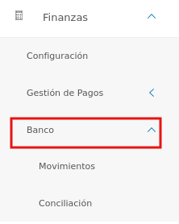
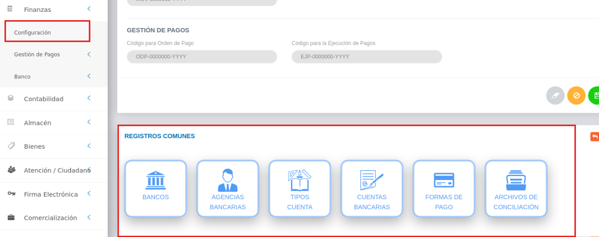

# Gestión de Bancos
************************

El usuario selecciona el módulo de Finanzas en el menú lateral de los módulos del sistema, ahí visualizara las opciones **Configuración**, **Gestión de Pagos** y **Bancos**, debiendo pulsar **Bancos** 

Figura 40: Menú del Módulo de Compras

*******************
# Gestión de Movimientos bancarios
***************************
A través de esta sección se lleva a cabo la gestión de movimientos bancarios en el módulo de Finanzas. Esta sección lista los registros de movimientos bancarios con información relevante sobre cada uno de ellos, desde la tabla de registros es posible crear un nuevo registro o gestionar cualquier registro de movimientos bancarios.  

Figura 41: Tabla de registros de movimientos bancarios

### Registrar movimiento bancario 

-   El usuario ingresará a la opción **Bancos** > **Movimientos Bancarios** 
-   Haciendo uso del botón **Crear**  ubicado en la esquina superior derecha de esta sección(Figura 41 Tabla de registros de movimientos bancarios), se procede a realizar un nuevo registro de movimientos bancarios.

####  Datos del movimiento bancario

- Complete el formulario del apartado **Datos del movimiento bancario**. Tenga en consideración completar los campos obligatorios que son requeridos para el registro de un movimiento bancario

Para agregar monedas al sistema, acceda a **Configuración** > **General** > **Registros Comunes** > **Monedas**. 

   

Para agregar registros comunes del módulo de Finanzas acceda a **Finanzas** > **Configuración** > **Registros Comunes**. 

   

   -   ***Bancos***: Para crear un nuevo registro de banco acceda a **Finanzas** > **Configuración** > **Registros Comunes** > **Bancos**. 
   -   ***Nro de Cuenta***: Para crear un nuevo registro de cuenta bancaria acceda a **Finanzas** > **Configuración** > **Registros Comunes** > **Cuentas bancarias**. 

Figura 42: Datos del movimiento bancario

####  Datos contables

- Complete el formulario del apartado **Datos contables**.  Mediante este apartado se cargan las cuentas patrimoniales asociadas al movimiento bancario. esta sección no es obligatoria. Se formula el registro, ingresando la cuenta patrimonial y los datos numéricos de la partida doble (Debe y Haber). Cabe mencionar, que el sistema no permitirá guardar el asiento contable sin haber registrado en ambas partidas.

Para agregar cuentas contables del módulo de Contabilidad acceda a **Contabilidad** > **Configuración** > **Catalogo de cuentas**. 

   

Figura 43: Datos del movimiento bancario

#### Compromisos 

Si se desea agregar un compromiso en el movimiento bancario, se puede realizar a través de este apartado. Los campos de selección que se muestran en esta sección corresponden a registros previos realizados en el sistema (Institución que genera). Estos datos se adjuntan al nuevo registro de **Compromiso**. 

**Cuentas presupuestarias**

Una vez se formula el registro del compromiso, es posible agregar las cuentas y los datos numéricos que influyen en el compromiso a través de la opción **Agregar** ubicada en la sección **Cuentas Presupuestarias**.	Los campos de selección que se muestran en esta sección corresponden a registros previos realizados en el sistema (Acción Específica, Cuenta e Impuesto). Estos datos se adjuntan al nuevo registro de **Compromiso**.

!!! info "Botón Agregar"
    

!!! info ""
	Las **cuentas presupuestarias de egresos** representan la salida monetaria de la organización que puede ser desde Gastos de Personal hasta la Disminución del Presupuesto.

!!! info ""
	Las **cuentas presupuestarias de impuestos** son las partidas de presupuesto que se pagan, por ejemplo, al valor agregado o IVA, impuesto sobre la renta, entre otros.

Figura 44: Datos del compromiso del movimiento bancario

   
- Presione el botón **Guardar**   para registrar los cambios efectuados.
- Presione el botón **Cancelar**   para cancelar registro y regresar a la ruta anterior.
- Presione el botón **Borrar**  para eliminar datos del formulario.
- Si desea recibir ayuda guiada presione el botón .
- Para retornar a la ruta anterior presione el botón .

## Gestionar movimiento bancario

La gestión de movimientos bancarios se lleva a cabo a través del apartado **Movimientos Bancarios**. 

-   Para acceder a esta sección debe dirigirse a **Finanzas** y ubicarse en la sección **Bancos** apartado **Movimientos bancarios** (ver Figura 41).

A través del apartado **Movimientos bancarios** se listan los registros de **Movimientos bancarios** en una tabla.   

Desde este apartado se pueden llevar a cabo las siguientes acciones: 

-   ***Registrar movimiento bancario***.   
-   ***Consultar registros***.
-   ***Editar registros***. 
-   ***Eliminar registros***. 

Figura 45: Movimientos Bancarios Registrados

### Registrar movimiento bancario

-   Presione el botón **Crear registro**  ubicado en la parte superior derecha del apartado **Movimientos bancarios** (ver Figura 46)
-   A continuación complete el formulario siguiendo los pasos descritos en el apartado [Registrar movimiento bancario](##datos-del-movimiento-bancario).
-   Presione el botón **Guardar**   para registrar los cambios efectuados.

Figura 46: Registrar emisión de pago

### Consultar registros

-   Presione el botón **Consultar registro**  ubicado en la columna titulada **Acción** de un registro de movimiento bancario que se prefiere consultar. 

Figura 46: Consultar Registros de movimiento bancario 

-   A continuación el sistema despliega una sección donde se describen los datos de la emisión de pago seleccionada. 

Figura 47: Datos de la orden de pago

### Editar registros

-   Presione el botón **Editar registro**   ubicado en la columna titulada **Acción** del registro de movimiento bancario que se desee seleccionar para actualizar datos. 

Figura 48: Editar Registros de movimiento bancario

-   Actualice los datos del formulario siguiendo los pasos descritos en el apartado [Registrar movimiento bancario](#datos-de-movimiento-bancario).
-   Presione el botón **Guardar**   para registrar los cambios efectuados.

### Eliminar registros

-   Presione el botón **Eliminar registro**   ubicado en la columna titulada **Acción** del registro de movimiento bancario que se desee seleccionar para eliminar del sistema. 

Figura 49: Eliminar Registros de movimiento bancario

-   Confirme que esta seguro de eliminar el registro seleccionado a través de la ventana emergente, mediante el botón **Confirmar** y efectue los cambios. 