# Gestión de Pagos
************************

El usuario selecciona el módulo de Finanzas en el menú lateral de los módulos del sistema, ahí visualizara las opciones **Configuración**, **Gestión de Pagos** y **Bancos**, debiendo pulsar **Gestión de Pagos** 

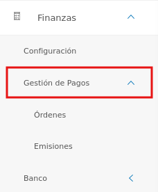
Figura 11: Menú del Módulo de Compras

*******************
# Gestión de Orden de Pago
***************************
A través de esta sección se lleva a cabo la gestión de orden de pagos en el módulo de Finanzas. Esta sección lista los registros de ordenes de pago con información relevante sobre cada uno de ellos, desde la tabla de registros es posible crear un nuevo registro o gestionar cualquier registro de orden de pago.  

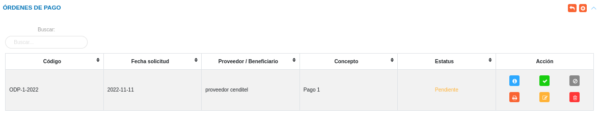
Figura 12: Tabla de registros de ordenes de pago

Mediante el sistema KAVAC se pueden generar de dos formas una orden de pago: La primera es que la información asociada a la orden de pago provenga de otro módulo, por ejemplo, Presupuesto o Compras. Y la segunda forma de cargar una orden de pago, es de forma manual. 

### Registrar orden de Pago 

-   El usuario ingresará a la opción **Gestión de Pagos** > **Ordenes** > **Orden de pago**
-   Haciendo uso del botón **Crear**  ubicado en la esquina superior derecha de esta sección(Figura 12 Tabla de registros de orden de pago), se procede a realizar un nuevo registro de orden de pago.
-   El sistema despliega un formulario de orden de pago(Actualmente se pueden registrar dos ordenes de pago, una por pago directo y otra proveniente de otro módulo)

### Orden de pago proveniente de otro módulo

Mediante el módulo de Finanzas se pueden generar pagos con información proveniente de otro módulo, como por ejemplo una Orden de Compras, o un Compromiso. 

####  Datos de la orden

- Complete el formulario del apartado **Datos de la Orden**. Tenga en consideración completar los campos obligatorios que son requeridos para el registro de una orden de pago.

!!! note "Nota" 
    Los campos de selección del apartado **Datos de la orden** incluyen información  cargada en diferentes módulos, ya que la orden proviene de un módulo externo. Para agregar un documento proveniente de otro módulo, en los campos ***Tipo de documento***, ***Nro Documento de Origen***, ***Nombre o Razón Social*** se seleccionan los datos previamente cargados. Al realizar esta carga el sistema presenta los datos asociados al documento seleccionado. 

El selector ¿Pago parcial?  permite generar un pago parcial de esa orden de pago seleccionada. Al seleccionarlo el sistema habilita el campo Monto a Pagar. Al ingresar un monto parcial el sistema calcula el monto total de la orden y permite gestionar ordenes de pagos asociadas a ese pago. 
    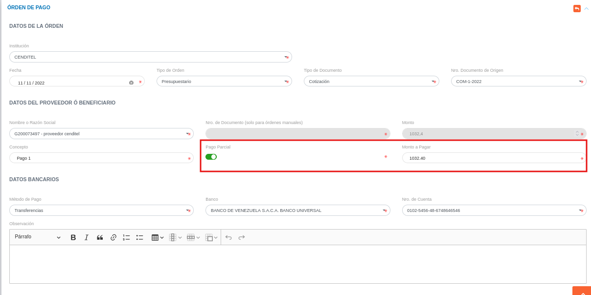

 
 Para agregar registros comunes del módulo de Finanzas acceda a **Finanzas** > **Configuración** > **Registros Comunes**. 

   

   -   ***Métodos de Pago***: Para crear un nuevo registro de método de pago acceda a **Finanzas** > **Configuración** > **Registros Comunes** > **Métodos de Pago**. 
   -   ***Bancos***: Para crear un nuevo registro de banco acceda a **Finanzas** > **Configuración** > **Registros Comunes** > **Bancos**. 
   -   ***Nro de Cuenta***: Para crear un nuevo registro de cuenta bancaria acceda a **Finanzas** > **Configuración** > **Registros Comunes** > **Cuentas bancarias**. 

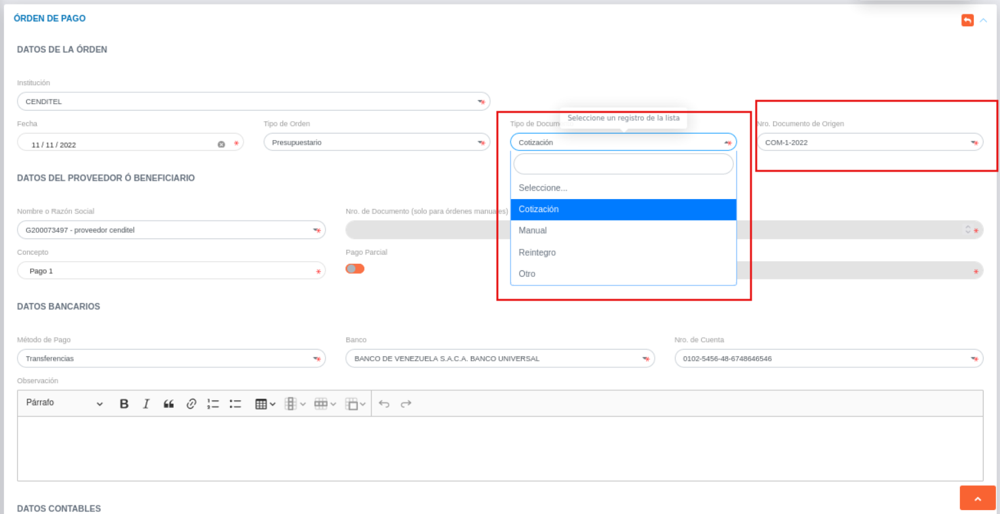
Figura 13: Datos de la Orden proveniente de otro módulo 

### Orden de Pago Manual o Directa

Mediante el módulo de Finanzas se pueden generar pagos directos o orden de pago manual. 

- Complete el formulario del apartado **Datos de la Orden**. Tenga en consideración completar los campos obligatorios que son requeridos para el registro de una orden de pago.

!!! note "Nota" 
    Para agregar una orden de pago manual o directa, en el campo ***Tipo de documento*** se selecciona la opción **Manual**. Al realizar esta sección se cargan los datos para generar la orden de pago. 

Para agregar monedas al  sistema, acceda a **Configuración** > **General** > **Registros Comunes** > **Monedas**. 

   

Para agregar registros comunes del módulo de Finanzas acceda a **Finanzas** > **Configuración** > **Registros Comunes**. 

   

   -   ***Métodos de Pago***: Para crear un nuevo registro de método de pago acceda a **Finanzas** > **Configuración** > **Registros Comunes** > **Métodos de Pago**. 
   -   ***Bancos***: Para crear un nuevo registro de banco acceda a **Finanzas** > **Configuración** > **Registros Comunes** > **Bancos**. 
   -   ***Nro de Cuenta***: Para crear un nuevo registro de cuenta bancaria acceda a **Finanzas** > **Configuración** > **Registros Comunes** > **Cuentas bancarias**. 
  

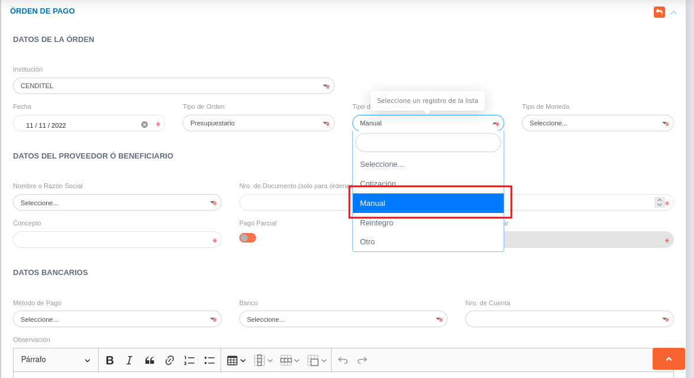
Figura 14: Datos de la Orden de forma manual 

####  Datos contables

- Complete el formulario del apartado **Datos contables**.  Mediante este apartado se cargan las cuentas patrimoniales asociadas a la orden de pago.  Se formula el registro, ingresando la cuenta patrimonial y los datos numéricos de la partida doble (Debe y Haber). Cabe mencionar, que el sistema no permitirá guardar el asiento contable sin haber registrado en ambas partidas.

!!! note "Nota" 
    Si la orden proviene de un documento previamente cargado, por ejemplo una orden de compras: el sistema presenta de forma automatica las cuentas contables asociadas a la orden de pago con los montos correspondientes a cada cuenta contable.  

Para agregar cuentas contables del módulo de Contabilidad acceda a **Contabilidad** > **Configuración** > **Catalogo de cuentas**. 

   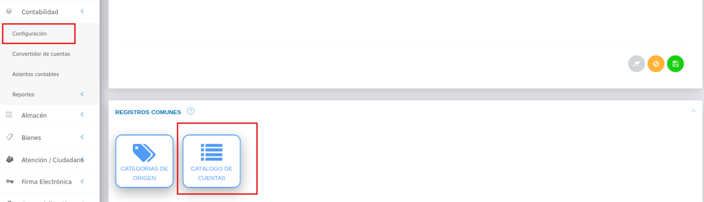

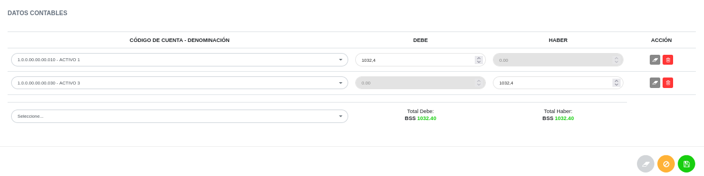
Figura 15: Datos del asiento contable 

   
- Presione el botón **Guardar**   para registrar los cambios efectuados.
- Presione el botón **Cancelar**   para cancelar registro y regresar a la ruta anterior.
- Presione el botón **Borrar**  para eliminar datos del formulario.
- Si desea recibir ayuda guiada presione el botón .
- Para retornar a la ruta anterior presione el botón .

## Gestionar orden de pago

La gestión de orden de pago se lleva a cabo a través del apartado **Orden de Pago**. 

-   Para acceder a esta sección debe dirigirse a **Finanzas** y ubicarse en la sección **Orden de Pago** apartado **Orden de Pago** (ver Figura 12).

A través del apartado **Orden de pago** se listan los registros de **Orden de Pago** en una tabla.   

Desde este apartado se pueden llevar a cabo las siguientes acciones: 

-   ***Registrar orden de pago***.   
-   ***Consultar registros***.
-   ***Aprobar orden de pago***
-   ***Negar orden de pago***
-   ***Imprimir orden de pago***
-   ***Editar registros***. 
-   ***Eliminar registros***. 

Figura 16: Ordenes de Pago Registradas

### Registrar orden de pago

-   Presione el botón **Crear registro**  ubicado en la parte superior derecha del apartado **Orden de Pago** (ver Figura 17)
-   A continuación complete el formulario siguiendo los pasos descritos en el apartado [Registrar orden de pago](##datos-de-la-orden).
-   Presione el botón **Guardar**   para registrar los cambios efectuados.

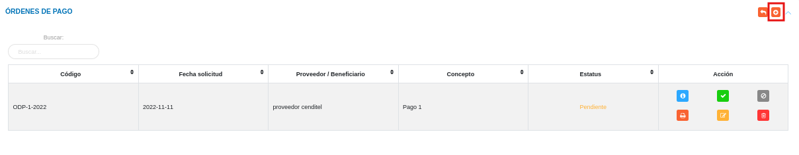
Figura 17: Registrar orden de pago

### Consultar registros

-   Presione el botón **Consultar registro**  ubicado en la columna titulada **Acción** de un registro de orden de pago que se prefiere consultar. 

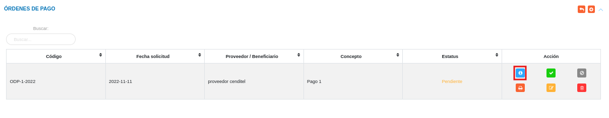
Figura 18: Consultar Registros de orden de pago 

-   A continuación el sistema despliega una sección donde se describen los datos de la orden de pago seleccionada. 

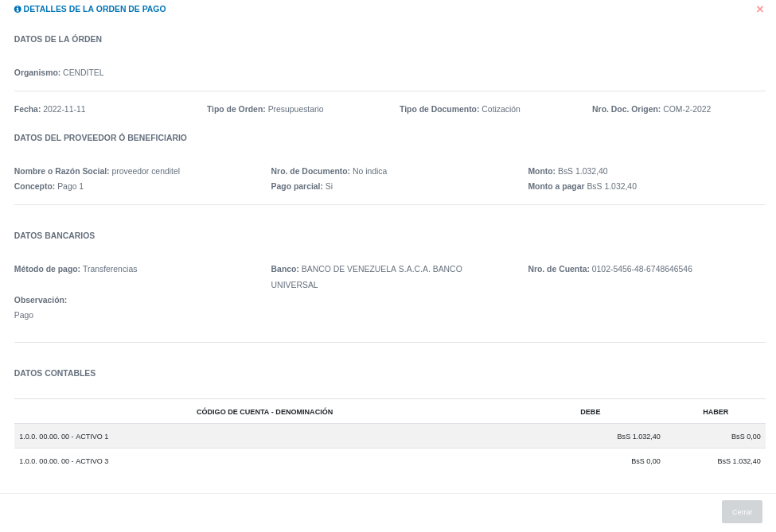
Figura 19: Datos de la orden de pago

### Aprobar orden de pago 

- Dirigirse al **Módulo de Finanzas**, **Gestión de Pagos** y ubicarse en la sección **Orden de Pagos** (Figura 12).
- Identifique el registro de orden de pago que desea aprobar y presione el botón **Aprobar**  ubicado en la columna titulada **Acción**. 
- Presione el botón **Confirmar** en la ventana emergente para aprobar la orden de pago.
- Al aprobar una orden de pago, el sistema cambia el estatus de la orden y  permite que la orden de pago se mantenga en el siguiente proceso: ***Ejecución de pago***.

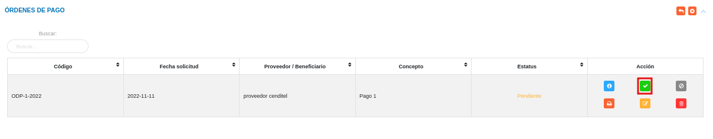
Figura 20: Aprobar orden de pago

### Negar orden de pago 

- Dirigirse al **Módulo de Finanzas**, **Gestión de Pagos** y ubicarse en la sección **Orden de Pagos** (Figura 12).
- Identifique el registro de orden de pago que desea aprobar y presione el botón **Negar**  ubicado en la columna titulada **Acción**. 
- Presione el botón **Confirmar** en la ventana emergente para negar la orden de pago.
- Al negar una orden de pago, el elimina la orden de pago.

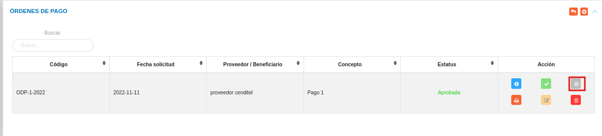
Figura 21: Negar orden de pago

### Imprimir registro

-   Presione el botón **Imprimir regristro**   ubicado en la columna titulada **Acción** del registro de orden de pago que se desee seleccionar para imprimir el reporte. 

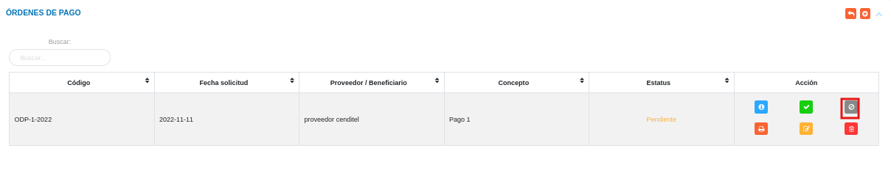
Figura 22: Imprimir orden de pago

- El sistema presenta en un documento PDF, el archivo generado con la orden de pago. 

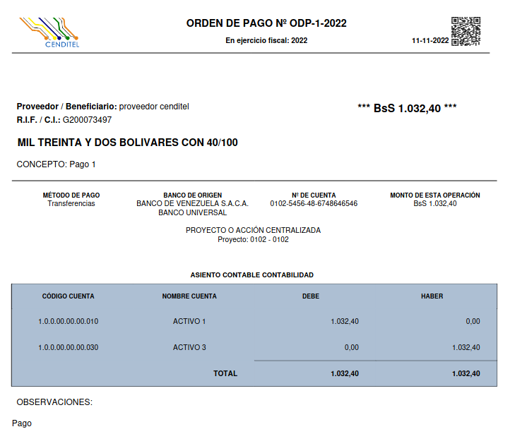
Figura 23: PDF de la  orden de pago

### Editar registros

-   Presione el botón **Editar registro**   ubicado en la columna titulada **Acción** del registro de orden de pago que se desee seleccionar para actualizar datos. 

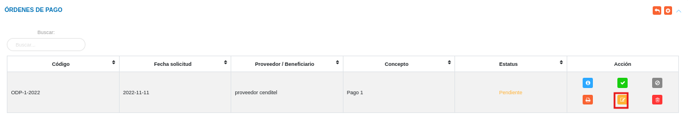
Figura 24: Editar Registros de orden de pago

-   Actualice los datos del formulario siguiendo los pasos descritos en el apartado [Registrar orden de pago](#datos-de-la-orden).
-   Presione el botón **Guardar**   para registrar los cambios efectuados.

### Eliminar registros

-   Presione el botón **Eliminar registro**   ubicado en la columna titulada **Acción** del registro de orden de pago que se desee seleccionar para eliminar del sistema. 

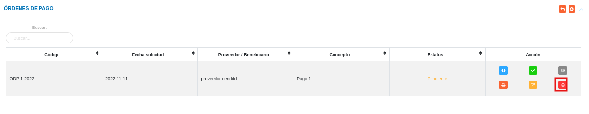
Figura 25: Eliminar Registros de orden de pago

-   Confirme que esta seguro de eliminar el registro seleccionado a través de la ventana emergente, mediante el botón **Confirmar** y efectue los cambios. 