# Gestión de Pagos
************************

El usuario selecciona el módulo de Finanzas en el menú lateral de los módulos del sistema, ahí visualizara las opciones **Configuración**, **Gestión de Pagos** y **Bancos**, debiendo pulsar **Gestión de Pagos** 

Figura 26: Menú del Módulo de Compras

*******************
# Gestión de Emisión de Pago
***************************
A través de esta sección se lleva a cabo la gestión de emisión de pagos en el módulo de Finanzas. Esta sección lista los registros de emisión de pago con información relevante sobre cada uno de ellos, desde la tabla de registros es posible crear un nuevo registro o gestionar cualquier registro de emisión de pago.  

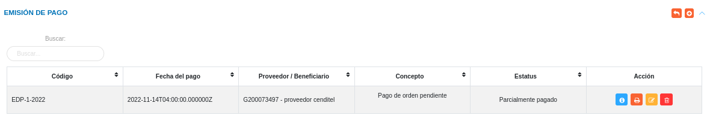
Figura 27: Tabla de registros de emisiones de pago

### Registrar emisión de pago 

-   El usuario ingresará a la opción **Gestión de Pagos** > **Emisiones** 
-   Haciendo uso del botón **Crear**  ubicado en la esquina superior derecha de esta sección(Figura 27 Tabla de registros de emisión de pago), se procede a realizar un nuevo registro de emisión de pago.

####  Datos del pago

- Complete el formulario del apartado **Datos del pago**. Tenga en consideración completar los campos obligatorios que son requeridos para el registro de una emisión de pago.

**Nota:** Los campos de selección del apartado **Datos del pago** incluyen información cargada en la sección de Ordenes de Pago, ya que la emisión de pago depende de una orden de pago. Para agregar información correspondiente de una orden de pago, en los campos ***Proveedor o Beneficiario***, ***Tipo de moneda*** y ***Nro de referencia*** se seleccionan los datos previamente cargados. Al realizar esta carga el sistema presenta los datos asociados al documento seleccionado. 

El selector ¿Pago parcial?  permite generar un pago parcial de esa emisión de pago seleccionada. Al seleccionarlo el sistema habilita el campo Monto a Pagar. Al ingresar un monto parcial el sistema calcula el monto total de la emisión y permite gestionar emisiones de pagos asociadas a ese registro. 

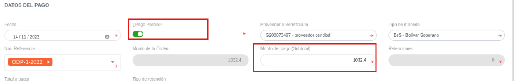
Figura 28: Pago Parcial 

 
Para agregar retenciones al sistema, acceda a **Configuración** > **General** > **Registros Comunes** > **Deducciones**. 

   

Al seleccionar **Tipo de retención**, el sistema despliega las retenciones previamente cargadas. Si se pulsa la opción **Agregar** el sistema presenta una ventana donde se debe cargar el monto a retener. En este caso, la ***Base imponible*** es el monto utilizado para calcular los impuestos a pagar de acuerdo con el tipo de gravamen.

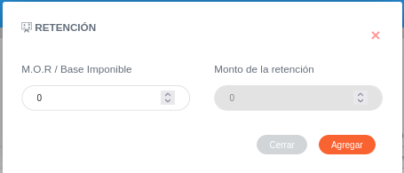
Figura 29: Agregar retenciones 

 

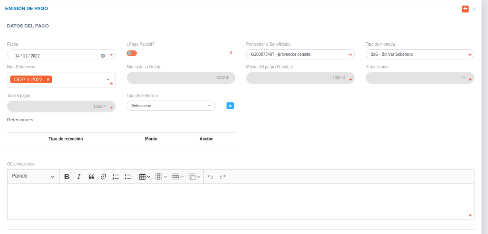
Figura 30: Datos de la emisión de pago 

####  Datos contables

- Complete el formulario del apartado **Datos contables**.  Mediante este apartado se cargan las cuentas patrimoniales asociadas a la emisión de pago.  Se formula el registro, ingresando la cuenta patrimonial y los datos numéricos de la partida doble (Debe y Haber). Cabe mencionar, que el sistema no permitirá guardar el asiento contable sin haber registrado en ambas partidas.

**Nota:** El sistema presenta de forma automatica las cuentas contables asociadas a la emisión de pago con los montos correspondientes a cada cuenta contable.  Si se agrega la retención y esta tiene una cuenta contable asociada, el sistema automatica calcula el monto del asiento contable. 

Para agregar cuentas contables del módulo de Contabilidad acceda a **Contabilidad** > **Configuración** > **Catalogo de cuentas**. 

   

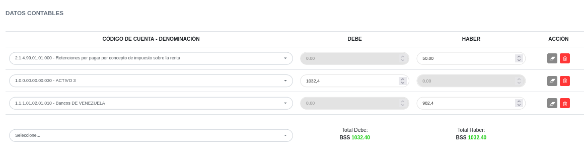
Figura 31: Datos del asiento contable 

 
   
- Presione el botón **Guardar**   para registrar los cambios efectuados.
- Presione el botón **Cancelar**   para cancelar registro y regresar a la ruta anterior.
- Presione el botón **Borrar**  para eliminar datos del formulario.
- Si desea recibir ayuda guiada presione el botón .
- Para retornar a la ruta anterior presione el botón .

## Gestionar emisión de pago

La gestión de emisión de pago se lleva a cabo a través del apartado **Emisiones**. 

-   Para acceder a esta sección debe dirigirse a **Finanzas** y ubicarse en la sección **Emisiones** apartado **Emisión de Pago** (ver Figura 27).

A través del apartado **Emisión de Pago** se listan los registros de **Emisión de Pago** en una tabla.   

Desde este apartado se pueden llevar a cabo las siguientes acciones: 

-   ***Registrar emisión de pago***.   
-   ***Consultar registros***.
-   ***Imprimir orden de pago***
-   ***Editar registros***. 
-   ***Eliminar registros***. 

Figura 32: Emisión de Pagos Registradas

### Registrar emisión de pago

-   Presione el botón **Crear registro**  ubicado en la parte superior derecha del apartado **Emisión de Pago** (ver Figura 33)
-   A continuación complete el formulario siguiendo los pasos descritos en el apartado [Registrar emisión de pago](##datos-del-pago).
-   Presione el botón **Guardar**   para registrar los cambios efectuados.

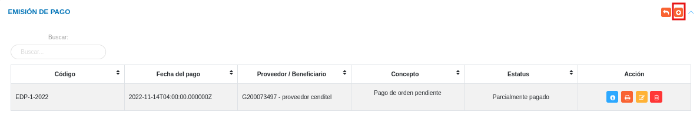
Figura 33: Registrar emisión de pago

### Consultar registros

-   Presione el botón **Consultar registro**  ubicado en la columna titulada **Acción** de un registro de emisión de pago que se prefiere consultar. 

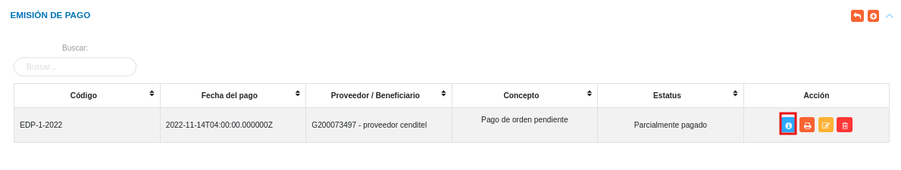
Figura 34: Consultar Registros de emisión de pago 

 

-   A continuación el sistema despliega una sección donde se describen los datos de la emisión de pago seleccionada. 

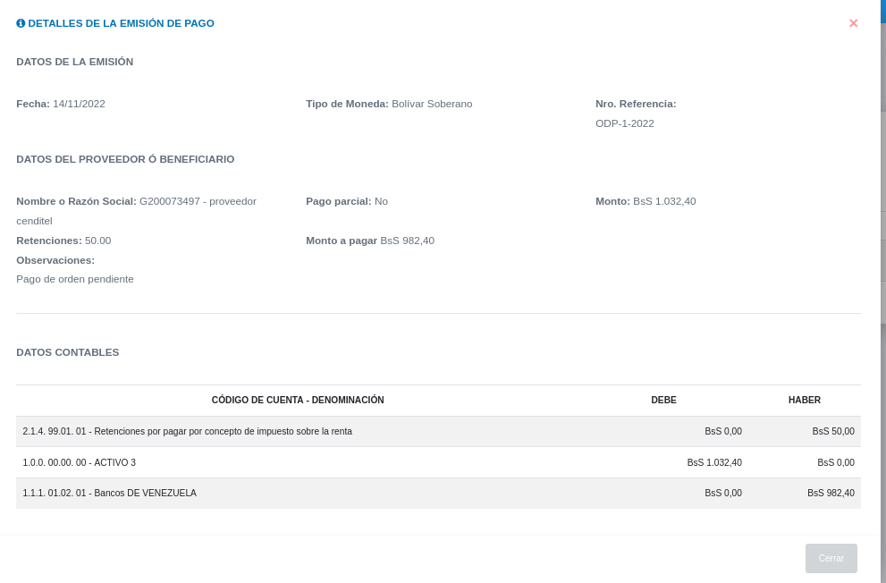
Figura 35: Datos de la orden de pago

### Imprimir registro

-   Presione el botón **Imprimir regristro**   ubicado en la columna titulada **Acción** del registro de emisión de pago que se desee seleccionar para imprimir el reporte. 

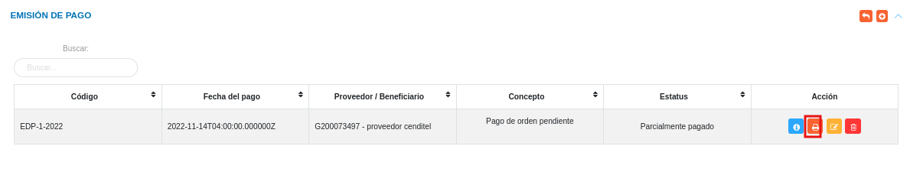
Figura 36: Imprimir emisión de pago

 

- El sistema presenta en un documento PDF, el archivo generado con la emisión de pago.

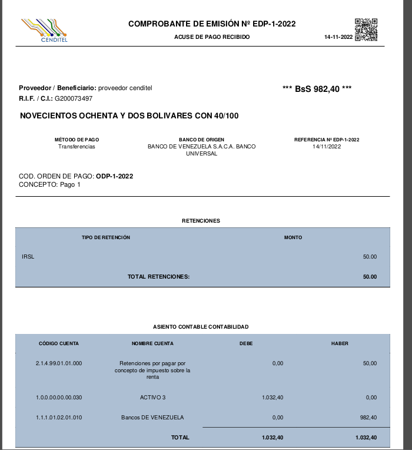
Figura 37: PDF de la emisión de pago

### Editar registros

-   Presione el botón **Editar registro**   ubicado en la columna titulada **Acción** del registro de orden de pago que se desee seleccionar para actualizar datos. 

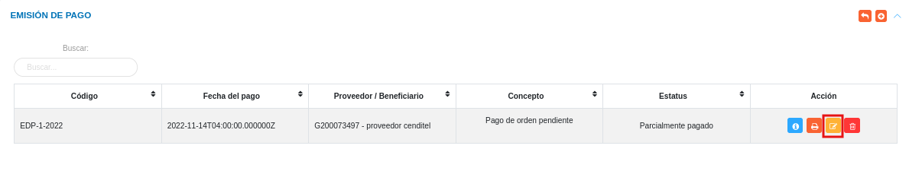
Figura 38: Editar Registros de emisión de pago

 

-   Actualice los datos del formulario siguiendo los pasos descritos en el apartado [Registrar emisión de pago](#datos-del-pago).
-   Presione el botón **Guardar**  para registrar los cambios efectuados.

### Eliminar registros

-   Presione el botón **Eliminar registro**   ubicado en la columna titulada **Acción** del registro de emisión de pago que se desee seleccionar para eliminar del sistema. 

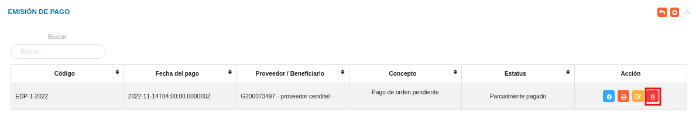
Figura 39: Eliminar Registros de emisión de pago

 

-   Confirme que esta seguro de eliminar el registro seleccionado a través de la ventana emergente, mediante el botón **Confirmar** y efectue los cambios. 

### Anular registros

-   Presione el botón **Anular registro**  ubicado en la columna titulada **Acción**, correspondiente al registro de emisión de pago que se desee anular.

-   Complete el formulario con los datos del **Tipo de anulación**, **Fecha** y **Descripción del motivo**. 

-   Presione el botón **Guardar**  para registrar los cambios efectuados.

**Nota:** cuando el usuario seleccione el tipo de anulación se mostrará un mensaje de confirmación. 

-   Si selecciona **Sin Remisión** se anulará todo el proceso hasta el compromiso. 

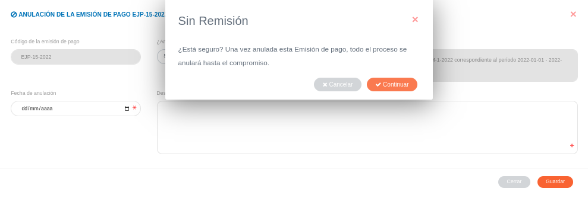
Figura 40: Anular Registro de emisión de pago sin remisión

 

****
-   Si selecciona **Con Remisión** el estado del registro cambiará a "Anulado" y se podrá generar una nueva emisión de pago.

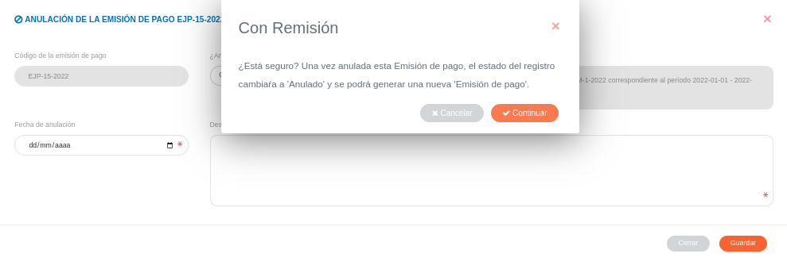
Figura 41: Anular Registro de emisión de pago con remisión

 

Una vez anulada la orden de pago, puede verificarse la anulación en la sección **Movimientos bancarios** del módulo de **Finanzas**, utilizando la opción **Bancos** y luego **Movimientos**. Si una orden fue anulada, se visualizará la leyenda **Anulado(a)** en la columna **Estatus** y en la fila respectiva del listado de movimientos bancarios.
