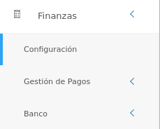

# Configuración Módulo de Finanzas
**********************************

El usuario selecciona el módulo de Finanzas en el menú lateral de los módulos del sistema, ahí visualizara las opciones **Configuración**, **Gestión de Pagos** y  **Bancos**, debiendo pulsar **Configuración** 

Figura 1: Menú del Módulo de Finanzas

## Formatos de códigos

La sección de **Formatos de Códigos** permite establecer un código de referencia para los registros posteriores que corresponden a: Movimientos Bancarios, Orden de pago y ejecución de pago.

Cada código debe establecerse de acuerdo a un formato específico el cual se divide en tres (3) secciones: prefijo-dígitos-año.

- **Prefijo:** debe contener entre 1 a 3 caracteres y debe ser único.
- **Dígitos:** Establece el número del registro y comprende una longitud de entre 4 a 8 caracteres como máximo. Para establecer la longitud de la numeración se debe indicar con ceros (0) de acuerdo a la cantidad de dígitos máximos que se desea registrar.
- **Año:** Indica el formato del año para el código el cual se debe indicar con la letra "**Y**" de acuerdo al formato deseado. Los valores posibles son: **YY** para formato de año corto y **YYYY** para el formato de año largo.

Ejemplos de códigos:

Figura 2: Ejemplo de formato de código

Una vez se establezca el formato de códigos deseado se puede ejecutar cualquier cambio haciendo uso de los **Botones de Acciones de Formulario**: 

-   Presione el botón **Guardar**   para registrar los cambios efectuados.
-   Presione el botón **Cancelar**   para cancelar registro y regresar a la ruta anterior.
-   Presione el botón **Borrar**  para eliminar datos del formulario.
-   Si desea recibir ayuda guiada, presione el botón .
-   Para retornar a la ruta anterior, presione el botón .
