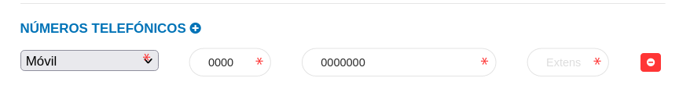
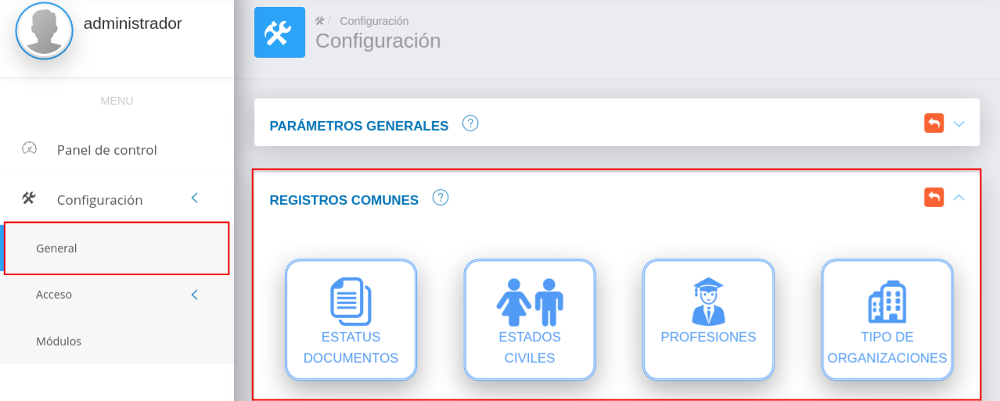

# Configuración General Módulo de Finanzas
******************************************

El usuario selecciona el módulo de Finanzas en el menú lateral de los módulos del sistema, ahí visualizara las opciones **Configuración**, **Gestión de Pagos** y  **Bancos**, debiendo pulsar **Configuración** 

Figura 3: Menú del Módulo de Finanzas

## Registros comunes

La sección de registros comunes es una herramienta de la **Configuración del Módulo de Finanzas** que permite al administrador o un usuario con permisos especiales sobre el módulo de Finanzas, ajustar el módulo a la organización usuaria a través de parámetros configurables.   Los datos registrados en esta sección serán considerados en todas las funcionalidades del módulo.

El usuario ingresará a **Registros Comunes**, visualizando 6 iconos **Bancos**, **Agencias Bancarias**, **Tipos de cuenta**, **Cuentas Bancarias**, **Formas de pago** y **Archivos de conciliación**.  

Figura 4: Configuración General del módulo de Finanzas

## Bancos

A través de esta sección se gestionan los diferentes registros de entidades bancarias. El sistema KAVAC incorpora por defecto una serie de entidades bancarias registradas en Venezuela.   

El usuario selecciona el icono de **Bancos**

#### Registro de bancos

   - Complete el formulario **Bancos** (ver Figura 5).   Asigne un logo, un código, nombre abreviado, nombre y sitio web para el banco a través de los campos **Logotipo**, **Código**, **Nombre aberviado**, **Nombre** y **Sitio web** 
   -   Presione el botón  **Guardar** para registrar los cambios efectuados.
   -   Presione el botón  **Cancelar** para limpiar datos del formulario.
   -   Presione el botón  **Cerrar** para cerrar el formulario.

Figura 5: Formulario para registrar entidades bancarias 
  

***Gestión de registros de bancos***

-   Para editar un registro de **Bancos** presione el botón **Editar**  del registro seleccionado de la tabla **Registros**.  A continuación complete el formulario **Bancos** y presione el botón **Guardar** para almacenar los cambios efectuados.
-   Para eliminar un registro de **Bancos** presione el botón **Eliminar**  del registro seleccionado de la tabla **Registros**. 

## Agencias bancarias 

A través de esta sección se gestionan agencias bancarias asociadas a una entidad bancaria previamente registrada.    

El usuario selecciona el icono de **Agencias Bancarias**

#### Registro de Agencias Bancarias

   - Complete el formulario **Agencias Bancarias** (ver Figura 6).
   

!!! note "Números Telefónicos"
    Presionar el botón **Agregar números telefónicos** para añadir un nuevo registro de contacto.
    
    
    
    
   

 Para agregar registros comunes del sistema acceda a **Configuración** > **General** > **Registros Comunes**. 

   

   -   ***País***: Para crear un nuevo registro de país acceda a **Configuración** > **General** > **Registros Comunes** > **Países**. 
   -   ***Estado***: Para crear un nuevo registro de estado acceda a **Configuración** > **General** > **Registros Comunes** > **Estados**. 
   -   ***Ciudad***: Para crear un nuevo registro de ciudad acceda a **Configuración** > **General** > **Registros Comunes** > **Ciudades**.

   -   Presione el botón  **Guardar** para registrar los cambios efectuados.
   -   Presione el botón  **Cancelar** para limpiar datos del formulario.
   -   Presione el botón  **Cerrar** para cerrar el formulario.

 Figura 6: Formulario de Agencias Bancarias 

***Gestión de registros de agencias bancarias***

-   Para editar un registro de **Agencias Bancarias** presione el botón **Editar**  del registro seleccionado de la tabla **Registros**.  A continuación complete el formulario **Bancos** y presione el botón **Guardar** para almacenar los cambios efectuados.
-   Para eliminar un registro de **Agencias Bancarias** presione el botón **Eliminar**  del registro seleccionado de la tabla **Registros**. 

## Tipos de cuenta

A través de esta sección se gestionan los diferentes tipos de cuentas que administra la organización usuaria.   

El usuario selecciona el icono de **Tipo de cuentas**

#### Registro de Tipo de cuentas

   - Complete el formulario **Tipo de cuentas** (ver Figura 7).   Asigne un nombre para el tipo de cuenta a través del campo **Nombre**. 
   -   Presione el botón  **Guardar** para registrar los cambios efectuados.
   -   Presione el botón  **Cancelar** para limpiar datos del formulario.
   -   Presione el botón  **Cerrar** para cerrar el formulario.

Figura 7: Formulario Tipo de Cuenta

 

***Gestión de registros de tipos de cuentas***

-   Para editar un registro de **Tipo de cuentas** presione el botón **Editar**  del registro seleccionado de la tabla **Registros**.  A continuación complete el formulario **Bancos** y presione el botón **Guardar** para almacenar los cambios efectuados.
-   Para eliminar un registro de **Tipo de cuentas** presione el botón **Eliminar**  del registro seleccionado de la tabla **Registros**. 

## Cuentas bancarias 

A través de esta sección se gestionan cuentas bancarias que administra la organización usuaria.   

El usuario selecciona el icono de **Cuentas bancarias**

#### Registro de Cuentas bancarias

   - Complete el formulario **Cuentas bancarias** (ver Figura 8).   

 Para agregar registros comunes del módulo de Finanzas acceda a **Finanzas** > **Configuración** > **Registros Comunes**. 

   

   -   ***Banco***: Para crear un nuevo registro de banco acceda a **Finanzas** > **Configuración** > **Registros Comunes** > **Bancos**. 
   -   ***Agencia Bancaria***: Para crear un nuevo registro de agencias bancarias acceda a **Finanzas** > **Configuración** > **Registros Comunes** > **Agencia Bancaria**. 
   -   ***Tipo de cuenta***: Para crear un nuevo registro de tipo de cuentas acceda a **Finanzas** > **Configuración** > **Registros Comunes** > **Tipo de cuenta**.

   -   Presione el botón  **Guardar** para registrar los cambios efectuados.
   -   Presione el botón  **Cancelar** para limpiar datos del formulario.
   -   Presione el botón  **Cerrar** para cerrar el formulario.

Figura 8: Formulario Cuenta Bancaria

***Gestión de registros de Cuentas bancarias***

-   Para editar un registro de **Cuentas bancarias** presione el botón **Editar**  del registro seleccionado de la tabla **Registros**.  A continuación complete el formulario **Bancos** y presione el botón **Guardar** para almacenar los cambios efectuados.
-   Para eliminar un registro de **Cuentas bancarias** presione el botón **Eliminar**  del registro seleccionado de la tabla **Registros**. 

## Formas de pago

A través de esta funcionalidad se gestionan las formas de pago a emplear en los procesos financieros por parte de la organización usuaria.   

El usuario selecciona el icono de **Formas de pago**

#### Registro de formas de pago

   - Complete el formulario **Formas de pago** (ver Figura 9).  Asigne un nombre y una descripción para la forma de pago a través de los campos **Nombre** y **Descripción**. 
   -   Presione el botón  **Guardar** para registrar los cambios efectuados.
   -   Presione el botón  **Cancelar** para limpiar datos del formulario.
   -   Presione el botón  **Cerrar** para cerrar el formulario.

Figura 9: Formulario formas de pago 

***Gestión de registros de formas de pago***

-   Para editar un registro de **Formas de pago** presione el botón **Editar**  del registro seleccionado de la tabla **Registros**.  A continuación complete el formulario **Bancos** y presione el botón **Guardar** para almacenar los cambios efectuados.
-   Para eliminar un registro de **Formas de pago** presione el botón **Eliminar**  del registro seleccionado de la tabla **Registros**. 

## Archivos de conciliación

A través de esta funcionalidad se gestionan los formatos para los archivos de conciliación bancaria a emplear en los procesos financieros por parte de la organización usuaria.   

El usuario selecciona el icono de **Archivos de conciliación**

#### Registro de archivos de conciliación 

   - Complete el formulario **Archivos de conciliación** (ver Figura 10).   
   -   Presione el botón  **Guardar** para registrar los cambios efectuados.
   -   Presione el botón  **Cancelar** para limpiar datos del formulario.
   -   Presione el botón  **Cerrar** para cerrar el formulario.

Figura 10: Formulario de configuración de archivos de conciliación bancaria 

***Gestión de registros de archivos de conciliación***

-   Para editar un registro de **Archivos de conciliación** presione el botón **Editar**  del registro seleccionado de la tabla **Registros**.  A continuación complete el formulario **Bancos** y presione el botón **Guardar** para almacenar los cambios efectuados.
-   Para eliminar un registro de **Archivos de conciliación** presione el botón **Eliminar**  del registro seleccionado de la tabla **Registros**. 