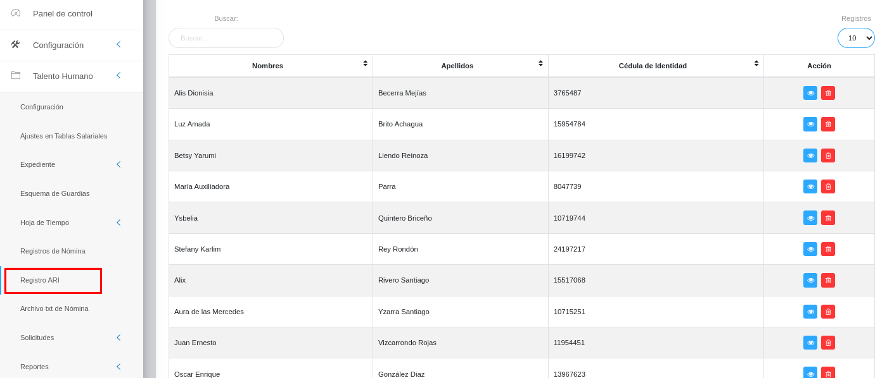

# Registro ARI
*******************

## Pasos iniciales del Registros de ARI

El usuario selecciona el módulo de Talento Humano en el menú lateral de los módulos del sistema, ahí visualizará las opciones **Configuración, Ajustes en Tablas Salariales, Expediente, Esquema de Guardias, Hojas de Tiempo, Registros de Nómina, Registro ARI, Archivo txt de Nómina, Solicitudes y Reportes**. Luego pulsa la opción **Registro ARI** y el sistema muestra las secciones correspondientes a la **Gestión de registro de planilla ARI**.
###

Figura 1:  Ingreso al Registro ARI
 
###

## Parámetros iniciales del Registros de ARI

En la **Gestión de registro de planilla ARI** se observará una vista general denominada **REGISTROS DE PLANILLA ARI**. En la esquina superior derecha las funcionalidades  para “Ir atrás”, “Crear nuevo registro”, “Importar Registros”, y “Descargar la Información”. En caso que el usuario pulse el botón **Importar/Exportar** el sistema generará un archivo de hoja de cálculo con las columnas: Cédula de identidad, Porcentaje, Desde y Hasta. 

Si el usuario pulsa el botón **Importar** el sistema solicita seleccionar el archivo para realizar la carga. Si el archivo se cargo de forma correcta, el sistema muestra el siguiente mensaje: **Registro almacenado con éxito**. Una vez guardado con éxito el registro, el sistema muestra una tabla que contiene las siguientes columnas **Cédula de Identidad, Fecha de inicio, Fecha Fin, Porcentaje ARI y Acción (Modificar registro y Eliminar registro)**. Si el usuario pulsa el botón **Exportar** el sistema descarga un archivo con las cuentas contables que han sido previamente cargadas.

Más abajo la opción **Buscar** para encontrar rápidamente alguna información, pudiendo escogerse el número de registros a visualizar (10, 20, 50). Luego en el registro se detallan: **Nombres, Apellidos, Cédula de Identidad y Acción**. Quedando en el extremo derecho la opción para **visualizar o eliminar el registro**. 

Figura 2:  Registro ARI
 
###
### Crear Registro ARI
Si el usuario pulsa el botón **Crear nuevo registro**  el sistema muestra una pantalla llamada “Porcentaje de cálculo de ARI” que contiene los siguientes campos: “Cédula de Identidad”, “Nombres”, “Apellidos”, “Ficha”, “Porcentaje, “Desde y Hasta”. Cargados los datos se presiona el botón **Guardar**  para registrar los cambios y poder observarlos. Pudiendo igualmente **Cancelar**  o **Borrar**  para eliminar datos del formulario. Como se ejemplifica a continuación así quedaría la ficha cargada, pudiendo ser editada si se requiere. 
###

Figura 3: Edición de Registro ARI
 
###

Figura 4: Visualización de Registro ARI
 
###
### Gestión de registros

Para información detallada: **Ver registro** o **borrar un registro** se debe hacer uso de los botones ubicados en la columna titulada **Acción** de la tabla de registros en la sección de **Registro ARI**.
###

###
#### Ver registros

**-** Presione el botón **Ver registro**  para detallar un registro de interés.
###
**-** Luego, el sistema muestra información asociada al Registro ARI.
###
**-** Presione el botón **Cerrar** identificado como una "X" de color rojo en la aprte superior derecha para salir de la interfaz.

#### Editar registros

**-** Presione el botón **Editar registro**  para modificar un registro.
###
**-** Luego, el sistema muestra el formulario en forma de edición.
###
**-** Modifique la información que requiera.
###
**-** Presione el botón **Guardar**  para registrar los cambios efectuados.

## En casos de error 

**-** **Si el usuario introduce un dato de mensaje de manera incorrecta:** el sistema muestra por pantalla un mensaje de notificación indicando los campos donde se ingresó información incorrecta.

**-** **Si el usuario omite llenar un campo solicitado:** el sistema muestra por pantalla un mensaje de notificación indicando los campos donde se ignoró la información solicitada.

## Campos obligatorios

**-** Los campos **“Cédula de Identidad”, “Porcentaje”, “Desde”** son campos obligatorios.

**-** Los campos **“Nombres” y “Apellidos”** se **cargan automáticamente** al ingresar la cédula de identidad del trabajador.

**-** Los campos **“cédula de identidad” y “porcentaje”** son campos de **tipo numérico**.

**-** Los campos **“Desde” y “Hasta”**, son campos de **tipo fecha**.

