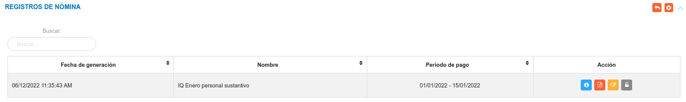

# Gestión de Nómina
*******************

## Registros de Nómina

  En esta sección se listan todos los registros de nómina que han sido realizados, de igual forma es posible realizar gestión de registros mediante la edición de los registros existentes.

  Para acceder a esta sección, el usuario debe dirigirse al módulo de **Talento Humano** e ingresar en la opción **Registros de Nómina**.

Figura 1: Generar Nómina
 

 Luego el sistema muestra una tabla de registro, donde lista todas las nóminas que han sido procesadas.

Figura 2: Lista de registros de nómina
 

### Crear registro de nómina 

-   Haciendo uso del botón **Crear**  ubicado en la esquina superior derecha de esta sección, se procede a realizar un nuevo registro de nómina.
-   Complete el formulario de la sección **Generar Nómina**.
-   Presione el botón **Guardar**  para registrar los cambios una vez se complete el formulario.
-   Presione el botón **Cancelar**   para cancelar registro y regresar a la ruta anterior.
-   Presione el botón **Borrar**  para eliminar datos del formulario.
-   Si desea recibir ayuda guiada, presione el botón .
-   Para retornar a la ruta anterior, presione el botón .

**Nota:**
    -   Para la generación de nómina se requiere un registro previo de **tipo de pago** y **concepto** que serán asociados al nuevo registro de nómina (los tipos de pagos y conceptos son gestionados en la configuración del módulo).  
         

Figura 3: Generar Nómina
 

### Gestión de registros

Para **Ver información detallada**, **Editar**,  **Descargar reporte** y **Cerrar** de un registro de interés se debe hacer uso de los botones ubicados en la columna titulada **Acción** de la tabla de registros en la sección de **Registros de Nómina**.

#### Ver registros

- Presione el botón **Ver registro**  para un registro de interés.
- Luego, el sistema muestra información asociada al registro de nómina.
- Presione el botón **Cerrar** para salir de la interfaz.

#### Editar registros

- Presione el botón **Editar registro**  para un registro de interés.
- Luego, el sistema muestra el formulario en forma de edición.
- Modifique la información que requiera.
- Presione el botón **Guardar**   para registrar los cambios efectuados.

#### Generar reporte de nómina

- Presione el botón **Generar reporte**  para un registro de interés.
- Luego, el sistema genera el reporte en formato xlsx.

#### Cerrar registro de nómina

- Presione el botón **Cerrar registro**  para un registro de interés.
- Luego, el sistema cierra el registro de nómina, deshabilita el botón editar y aperturta el próximo periodo de nómina.
#### 
**Enviar registros**
#### 
Para enviar recibos al correo de cada trabajador asociado al registro de nómina, previamente debe existir el registro de nómina. 
#### 
**-** El usuario pulsa la opción **Enviar recibos**.
#### 
**-** El sistema muestra el mensaje **Los recibos de pago se están enviando**, y envía el recibo al correo de cada trabajador.
#### 
El recibo de pago debe ser enviado al correo institucional, de no existir correo institucional asociado al trabajador el sistema debe enviar el recibo de pago al coreo personal.
#### 
 Figura 4: Enviar recibo
#### 
**El recibo de pago**
#### 
Contiene un conjunto de especificaciones para que cumpla con los requerimientos legales:
#### 
**-** Cintillo institucional 
#### 
**-** Fecha
#### 
**-** Periodo
#### 
**-** QR
#### 
**-** Denominación del ente
#### 
**-** RIF
#### 
**-** Nombres y apellidos del trabajador
#### 
**-** Cédula
#### 
**-** Cargo
#### 
**-** Fecha de ingreso
#### 
**-** Descripción del pago 
#### 
**-** Conceptos 
#### 
**-** Montos (Bs)
#### 

####
Figura 5: Recibo de Pago
