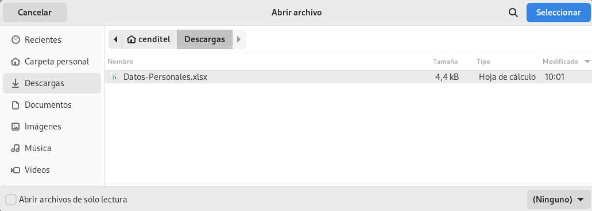

# Gestión de Datos Laborales
****************************

El usuario selecciona el módulo de Talento Humano en el menú lateral de los módulos del sistema, ahí visualizará las opciones **Configuración**, **Ajustes en Tablas salariales**, **Expediente**, **Registros de nómina**, **Solicitudes** y  **Reportes**, debiendo pulsar **Expediente** > **Datos laborales**

Figura 1: Menú del Módulo de Talento Humano para datos laborales

## Datos laborales

En esta sección se listan los registros de datos laborales de los trabajadores de la organización, con una tabla de registro que muestra columnas como: nombre del trabajador, correo electrónico institucional y estatus laboral. Desde esta sección es posible realizar un nuevo registro de datos laborales de usuarios registrados previamente en la sección de datos personales.

Figura 2: Datos Laborales
 

### Registro de datos laborales

-   Dirigirse al módulo de **Talento Humano**, ingresar en **Expediente** y seleccionar la opción **Datos laborales**.
-   Haciendo uso del botón **Crear**  ubicado en la esquina superior derecha de esta sección, se procede a realizar un nuevo registro de datos laborales.
-   El sistema despliega un formulario de datos laborales, en el cual se deberá completar los datos del mismo.
- Complete el apartado **Registrar los datos laborales**. Tenga en consideración completar los campos obligatorios que son requeridos para el registro de datos laborales.

Figura 3: Formulario de Datos Laborales
 
###
**Nota:** Los campos de selección del apartado **Registrar los datos laborales** incluyen información configurada previamente a través de los registros comunes del módulo de Talento Humano y el sistema. Si se requiere incluir información diferente a la que se encuentra por defecto, se recomienda agregar estos registros en la configuración de registros comunes. 

Para agregar registros comunes del sistema acceda a **Configuración** > **General** > **Registros Comunes**. 

   

   -   ***Institución***: Para crear un nuevo registro de institución acceda a **Configuración** > **General** > **Registros Comunes** > **Institución**. 
   -   ***Departamento***: Para crear un nuevo registro de país acceda a **Configuración** > **General** > **Registros Comunes** > **Unidades/Dependencias**. 
   -   ***Tipo de sector***: Para crear un nuevo registro de tipo de sector acceda a **Configuración** > **General** > **Registros Comunes** > **Tipo de sector**. 
   

Para agregar registros comunes del módulo de Talento Humano acceda a **Talento Humano** > **Configuración** > **Registros Comunes**. 

   

   -   ***Tipo de cargo***: Para crear un nuevo registro de tipo de cargo acceda a **Configuración** > **General** > **Registros Comunes** > **Tipo de cargo**.
   -   ***Cargos***: Para crear un nuevo registro de cargo acceda a **Configuración** > **General** > **Registros Comunes** > **Cargo**. 
   -   ***Tipo de personal***: Para crear un nuevo registro de tipo de personal acceda a **Configuración** > **General** > **Registros Comunes** > **Tipo de personal**. 
   -   ***Tipo de contrato***: Para crear un nuevo registro de tipo de contrato acceda a **Configuración** > **General** > **Registros Comunes** > **Tipo de contrato**
   -   ***Tipo de inactividad***: Para crear un nuevo registro de tipo de inactividad acceda a **Configuración** > **General** > **Registros Comunes** > **Tipo de inactividad**
   
   
**Nota:** El selector "¿Está Activo?" permite activar a un trabajador. Este dato incluye información configurada previamente a través de los registros comunes del módulo de Talento Humano. Al seleccionar SI, el sistema mantiene al trabajador activo dentro del sistema. Si selecciona NO, el sistema presenta una lista para agregar el tipo de inactividad, y desactiva al personal. 

### Trabajos Anteriores

- Complete el apartado **Trabajos anteriores**. Tenga en consideración completar los campos obligatorios que son requeridos para el registro de trabajos anteriores.
- Haciendo uso del botón "Más", ubicado en al lado derecho del titulo , el sistema despliega el formulario para cargar la información de los trabajos anteriores. 
- Si se desea eliminar un trabajo registrado, se pulsa la opción , y el sistema elimina el registro. 

Figura 4: Trabajos anteriores 

### Antigüedad del trabajador

Mediante esta sección el sistema realiza el cálculo del tiempo o antigüedad laboral del trabajador. Si se completa la sección ***Trabajos anteriores*** el sistema suma los años en esta instituciones con los años de tiempo laborando. 

-   Presione el botón **Guardar**   para registrar los cambios efectuados.
-   Presione el botón **Cancelar**   para cancelar registro y regresar a la ruta anterior.
-   Presione el botón **Borrar**  para eliminar datos del formulario.
-   Si desea recibir ayuda guiada, presione el botón .
-   Para retornar a la ruta anterior, presione el botón .

## Gestionar datos laborales

La gestión de ajustes en datos laborales se lleva a cabo a través del apartado **Datos laborales**. 

-   Para acceder a esta sección debe dirigirse a **Talento Humano** y ubicarse en la sección **Datos laborales**.
-   A través del apartado **Datos laborales** se listan los registros de **Datos laborales** en una tabla.   

Desde este apartado se pueden llevar a cabo las siguientes acciones: 

-   ***Registrar datos laborales***.
-   ***Importar/Exportar datos laborales***. 
-   ***Consultar datos laborales***.
-   ***Editar registros***. 
-   ***Eliminar registros***. 

### Registrar datos laborales 

-   Presione el botón **Crear registro**  ubicado en la parte superior derecha del apartado **Datos laborales** 
-   A continuación complete el formulario siguiendo los pasos descritos en el apartado [Registrar los datos laborales](##Registrar-los-datos-laborales).
-   Presione el botón **Guardar**   para registrar los cambios efectuados.

Figura 5: Registrar datos laborales

### Importar/Exportar datos laborales 

#### Importar datos laborales

-   Presione el botón **Importar**  ubicado en la parte superior derecha del apartado **Datos laborales** 
-   Seleccione un archivo desde su directorio local.  
 
Figura 6: Seleccionar archivo para importar datos socioeconomicos
 

#### Exportar datos laborales

-   Presione el botón **exportar**  ubicado en la parte superior derecha del apartado **Datos laborales** 
-  El sistema genera el archivo en formato xls con los dtos cargados en el expediente. 

### Consultar registros

-   Presione el botón **Consultar registro**  ubicado en la columna titulada **Acción** de un registro de datos laborales que se prefiere consultar. 

Figura 7: Consultar registros de datos laborales 

###
-   A continuación el sistema despliega una sección donde se describen los datos laborales seleccionados. 

Figura 8: Ver datos laborales

### Editar registros

-   Presione el botón **Editar registro**   ubicado en la columna titulada **Acción** del registro de ajustes en datos laborales que se desee seleccionar para actualizar datos. 

Figura 9: Editar Registros de datos laborales

###
-   Actualice los datos del formulario siguiendo los pasos descritos en el apartado [Registrar los datos laborales](#registrar-los-datos-laborales).
-   Presione el botón **Guardar**   para registrar los cambios efectuados.

### Eliminar registros

-   Presione el botón **Eliminar registro**   ubicado en la columna titulada **Acción** del registro de ajustes en datos laborales que se desee seleccionar para eliminar del sistema. 

Figura 10: Eliminar Registros de datos laborales

###
-   Confirme que esta seguro de eliminar el registro seleccionado a través de la ventana emergente, mediante el botón **Confirmar** y efectúe los cambios. 

