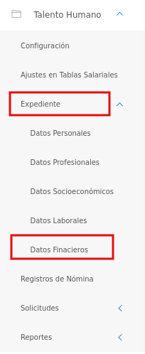
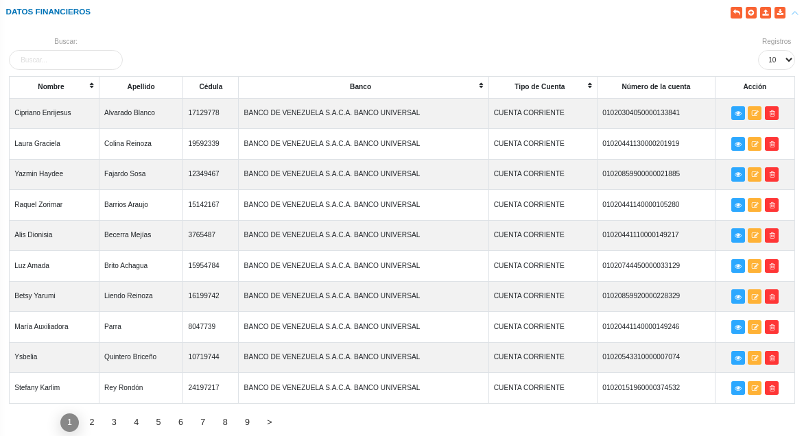
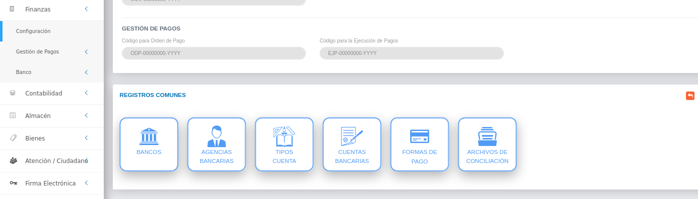
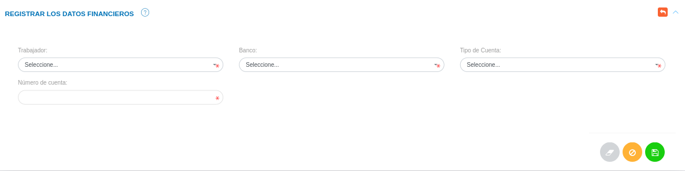
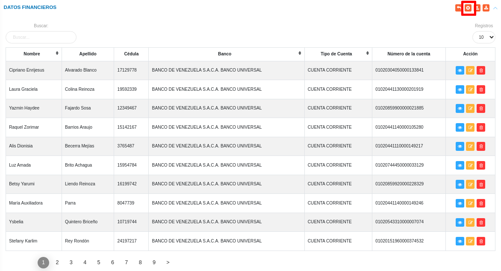
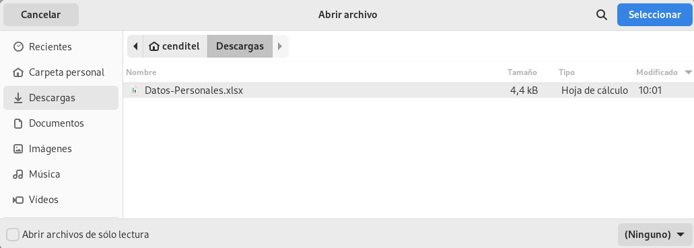
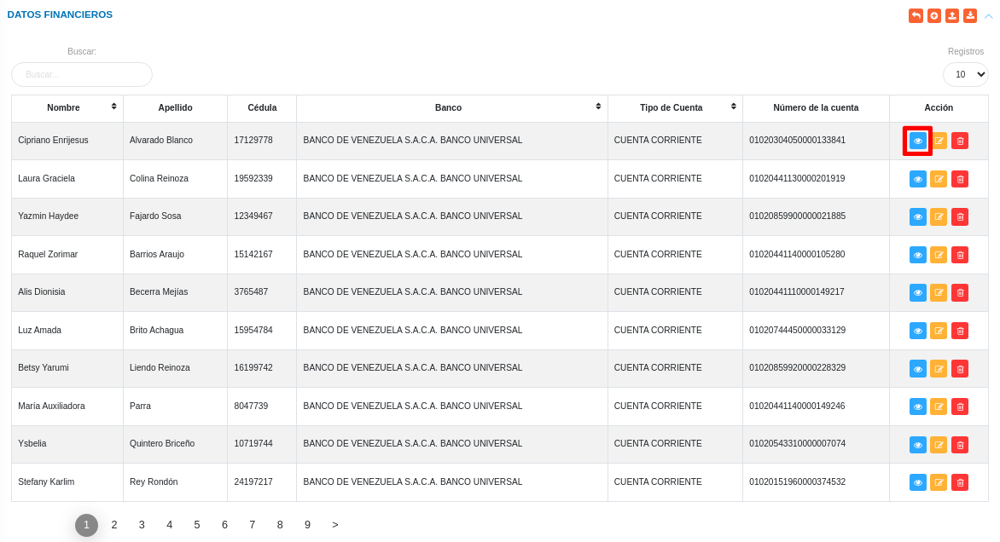
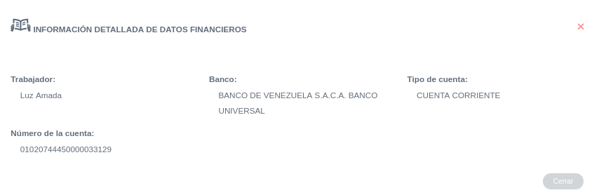
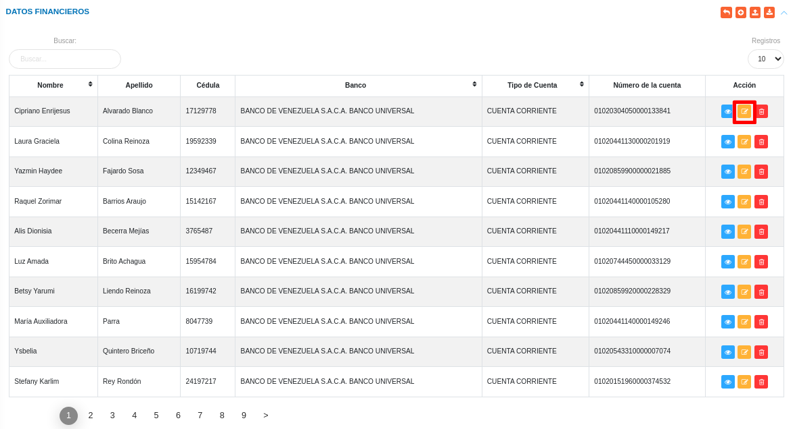
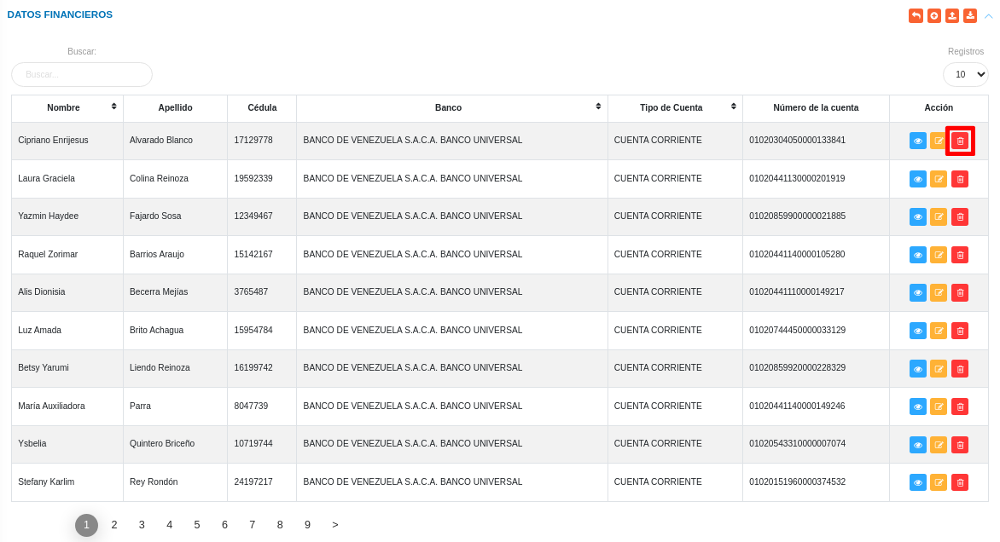

# Gestión de Datos Financieros
********************************

El usuario selecciona el módulo de Talento Humano en el menú lateral de los módulos del sistema, ahí visualizara las opciones **Configuración**, **Ajustes en Tablas salariales**, **Expediente**, **Registros de nómina**, **Solicitudes** y  **Reportes**, debiendo pulsar **Expediente** > **Datos Financieros**

Figura 1: Menú del Módulo de Talento Humano para datos financieros

## Datos financieros

En esta sección se listan registros de datos financieros de los usuarios asociados al expediente de la organización. Desde esta sección es posible realizar un nuevo registro de datos financieros de usuarios registrados previamente en la sección de datos personales.

Figura 2: Datos financieros
 

### Registro de datos financieros

-   Dirigirse al módulo de **Talento Humano**, ingresar en **Expediente** y seleccionar la opción **Datos financieros**.
-   Haciendo uso del botón **Crear**  ubicado en la esquina superior derecha de esta sección, se procede a realizar un nuevo registro de datos financieros.
-   El sistema despliega un formulario de datos financieros, en el cual se debera completar los datos del mismo.
- Complete el apartado **Registrar los datos financieros**. Tenga en consideración completar los campos obligatorios que son requeridos para el registro de datos financieros.

!!! note "Nota" 
    Los campos de selección del apartado **Registrar los datos financieros** incluyen información configurada previamente a través de los registros comunes del módulo de  Finanzas. Si se requiere incluir información diferente a la que se encuentra por defecto, se recomienda agregar estos registros en la configuración de registros comunes. 

 Para agregar registros comunes del módulo de Finanzas acceda a **Configuración** > **General** > **Registros Comunes**. 

   

   -   ***Bancos***: Para crear un nuevo registro de banco acceda a **Configuración** > **General** > **Registros Comunes** > **Bancos**. 
   -   ***Tipo de cuenta***: Para crear un nuevo registro de tipo de cuenta acceda a **Configuración** > **General** > **Registros Comunes** > **Tipo de cuenta**. 

   
-    Presione el botón **Guardar**   para registrar los cambios efectuados.
-   Presione el botón **Cancelar**   para cancelar registro y regresar a la ruta anterior.
-   Presione el botón **Borrar**  para eliminar datos del formulario.
-   Si desea recibir ayuda guiada, presione el botón .
-   Para retornar a la ruta anterior, presione el botón .

Figura 3: Formulario para registrar datos financieros

## Gestionar datos financieros

La gestión de ajustes en datos financieros se lleva a cabo a través del apartado **Datos financieros**. 

-   Para acceder a esta sección debe dirigirse a **Talento Humano** y ubicarse en la sección **Datos financieros**.
-   A través del apartado **Datos financieros** se listan los registros de **Datos financieros** en una tabla.   

Desde este apartado se pueden llevar a cabo las siguientes acciones: 

-   ***Registrar datos financieros***.
-   ***Importar/Exportar datos financieros***. 
-   ***Consultar datos financieros***.
-   ***Editar registros***. 
-   ***Eliminar registros***. 

### Registrar datos financieros 

-   Presione el botón **Crear registro**  ubicado en la parte superior derecha del apartado **Datos financieros** 
-   A continuación complete el formulario siguiendo los pasos descritos en el apartado [Registrar los datos financieros](##Registrar-los-datos-financieros).
-   Presione el botón **Guardar**   para registrar los cambios efectuados.

Figura 4: Registrar datos financieros

### Importar/Exportar datos financieros 

#### Importar datos financieros

-   Presione el botón **Importar**  ubicado en la parte superior derecha del apartado **Datos financieros** 
-   Seleccione un archivo desde su directorio local.  
 
Figura 5: Seleccionar archivo para importar datos financieros
 

#### Exportar datos financieros

-   Presione el botón **exportar**  ubicado en la parte superior derecha del apartado **Datos financieros** 
-  El sistema genera el archivo en formato xls con los dtos cargados en el expediente. 

### Consultar registros

-   Presione el botón **Consultar registro**  ubicado en la columna titulada **Acción** de un registro de datos financieros que se prefiere consultar. 

Figura 6: Consultar registros de datos profesionales 

-   A continuación el sistema despliega una sección donde se describen los datos de los datos financieros seleccionado. 

Figura 7: Ver datos financieros

### Editar registros

-   Presione el botón **Editar registro**   ubicado en la columna titulada **Acción** del registro de ajustes en datos financieros que se desee seleccionar para actualizar datos. 

Figura 8: Editar Registros de datos financieros

-   Actualice los datos del formulario siguiendo los pasos descritos en el apartado [Registrar los datos financieros](#registrar-los-datos-financieros).
-   Presione el botón **Guardar**   para registrar los cambios efectuados.

### Eliminar registros

-   Presione el botón **Eliminar registro**   ubicado en la columna titulada **Acción** del registro de ajustes en datos financieros que se desee seleccionar para eliminar del sistema. 

Figura 9: Eliminar Registros de datos financieros

-   Confirme que esta seguro de eliminar el registro seleccionado a través de la ventana emergente, mediante el botón **Confirmar** y efectue los cambios.  

   
