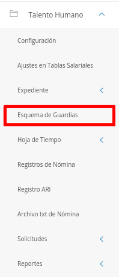
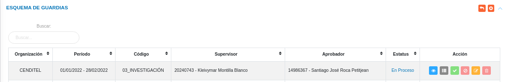
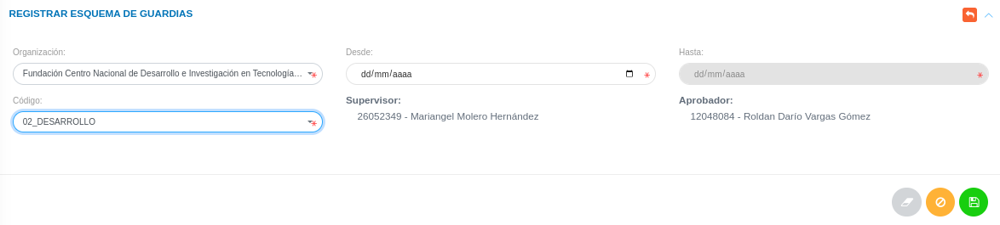
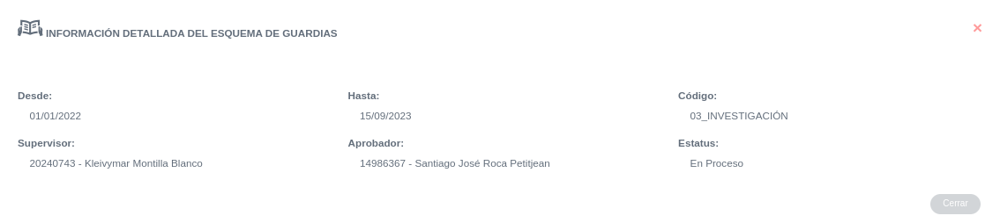
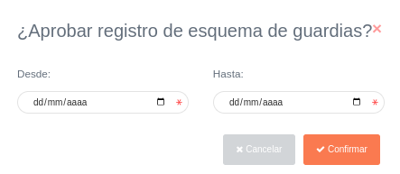
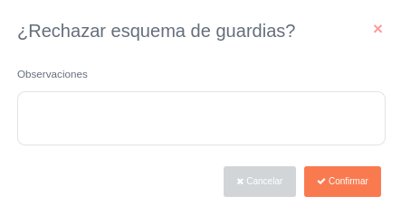
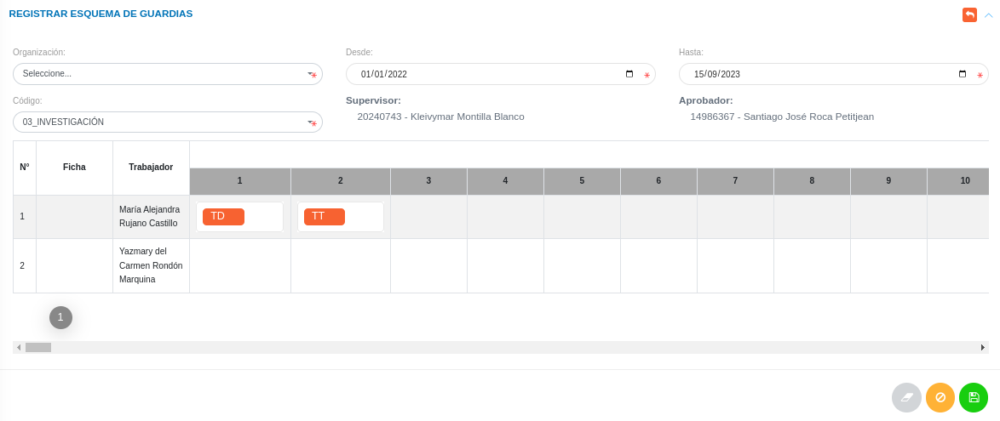

# Esquema de Guardias
****************************

Este módulo permite gestionar el esquema de guardias de la institución. Para entrar, el usuario debe seleccionar el módulo de **Talento Humano** en el menú lateral del sistema, y pulsar **Esquema de Guardias**.

Figura 1: Menú del módulo de Talento Humano para Esquema de Guardias

## Esquema de Guardias

En esta sección se listan los registros de esquema de guardias, con una tabla que muestra las columnas: **Organización**, **Período**, **Código**, **Supervisor**, **Aprobador**, **Estatus** y **Acción**.

Desde esta sección es posible **Crear** un nuevo registro de guardia, así como también **Ver**, **ver registros de periodos**, **Aprobar**, **Rechazar**, **Modificar** y **Eliminar** los registros existentes.

Figura 2: Listado de Esquema de Guardias
 

#### Registrar Esquema de Guardias

-   Usar el botón **Crear**  ubicado en la esquina superior derecha.
-   El sistema despliega un formulario con los campos requeridos para el registro del esquema de guardias.
-   Para registrar los cambios efectuados, presione el botón **Guardar** .

Figura 3: Registro de Esquema de Guardias
 

### Ver Esquema de Guardias

-   Usar el botón **Ver**  ubicado en sección **Acción** de la Tabla.
-   El sistema despliega un cuadro con información sobre el esquema de guardia seleccionado.

Figura 4: Ver Esquema de Guardias
 

#### Aprobar Esquema de Guardias

-   Usar el botón **Aprobar**  ubicado en sección **Acción** de la tabla.
-   El sistema despliega un formulario con los campos requeridos para aprobar el esquema de guardias.
-   Seleccionar las fechas correspondientes y pulsar el botón **Confirmar** .

Figura 5: Aprobar Esquema de Guardias
 

#### Rechazar Esquema de Guardias

-   Usar el botón **Rechazar**  ubicado en sección **Acción** de la tabla.
-   El sistema despliega un formulario con los campos requeridos para rechazar el esquema de guardias.
-   Redactar las observaciones correspondientes y pulsar el botón **Confirmar** .

Figura 6: Rechazar Esquema de Guardias
 

#### Modificar Esquema de Guardias

-   Hacer uso del botón **Modificar**  ubicado en sección **Acción** de la tabla.
-   El sistema despliega un formulario con los campos requeridos para modificar el esquema de guardias.
-   Presione el botón **Guardar**   para registrar los cambios efectuados.

Figura 7: Modificar Esquema de Guardias
 

#### Eliminar Esquema de Guardias

-   Hacer uso del botón **Eliminar**  ubicado en sección **Acción** de la Tabla.
-   El sistema despliega un formulario con los campos requeridos para eliminar el esquema de guardias.
-   Pulsar el botón **Confirmar** .

Figura 8: Eliminar Esquema de Guardias
 
