# Gestión de Datos Profesionales
********************************

El usuario selecciona el módulo de Talento Humano en el menú lateral de los módulos del sistema, ahí visualizara las opciones **Configuración**, **Ajustes en Tablas salariales**, **Expediente**, **Registros de nómina**, **Solicitudes** y  **Reportes**, debiendo pulsar **Expediente** > **Datos profesionales**

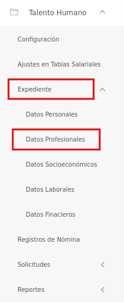
Figura 1: Menú del Módulo de Talento Humano para datos profesionales

## Datos profesionales

En esta sección se listan registros de datos profesionales de los usuarios asociados al expediente de la organización y se muestra información asociada a cada registro como: nombre del trabajador, grado de instrucción, profesión y estatus académico (¿es estudiante?). Desde esta sección es posible realizar un nuevo registro de datos profesionales de usuarios registrados previamente en la sección de datos personales.

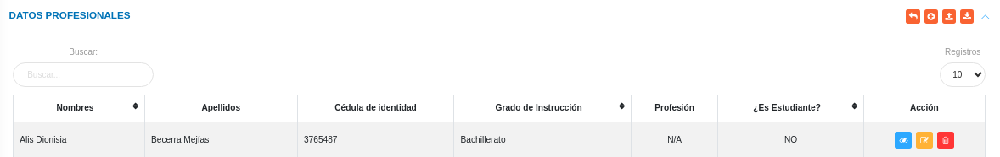
Figura 2: Datos Profesionales
 

### Registro de datos profesionales

-   Dirigirse al módulo de **Talento Humano**, ingresar en **Expediente** y seleccionar la opción **Datos profesionales**.
-   Haciendo uso del botón **Crear**  ubicado en la esquina superior derecha de esta sección, se procede a realizar un nuevo registro de datos profesionales.
-   El sistema despliega un formulario de datos profesionales, en el cual se debera completar los datos del mismo.
- Complete el apartado **Registrar los datos profesionales**. Tenga en consideración completar los campos obligatorios que son requeridos para el registro de datos profesionales.

!!! note "Nota" 
    Los campos de selección del apartado **Registrar los datos profesionales** incluyen información configurada previamente a través de los registros comunes del módulo de Talento Humano y el sistema. Si se requiere incluir información diferente a la que se encuentra por defecto, se recomienda agregar estos registros en la configuración de registros comunes. 

 Para agregar registros comunes del sistema acceda a **Configuración** > **General** > **Registros Comunes**. 

   

   -   ***Profesiones***: Para crear un nuevo registro de institución acceda a **Configuración** > **General** > **Registros Comunes** > **Profesiones**. 

Para agregar registros comunes del módulo de Talento Humano acceda a **Talento Humano** > **Configuración** > **Registros Comunes**. 

   

   -   ***Grado de instrucción***: Para crear un nuevo registro de grado de instrucción acceda a **Configuración** > **General** > **Registros Comunes** > **Grado de instrucción**.
   -   ***Tipo de estudio***: Para crear un nuevo registro de tipo de estudio acceda a **Configuración** > **General** > **Registros Comunes** > **tipos de estudios**. 
   -   ***Idioma***: Para crear un nuevo registro de idioma acceda a **Configuración** > **General** > **Registros Comunes** > **Idioma**. 
   -   ***Nivel de idioma***: Para crear un nuevo registro de nivel de idioma acceda a **Configuración** > **General** > **Registros Comunes** > **Nivel de Idioma**

### Estudios universitarios

- Complete el apartado **Estudios universitarios**. Tenga en consideración completar los campos obligatorios que son requeridos para el registro de estudios del trabajador.
- Haciendo uso del botón más, ubicado en al lado derecho del titulo , el sistema despliega el formulario para cargar la información de los estudios universitarios. 
- Si se desea eliminar un estudio universitario, se pulsa la opción , y el sistema elimina el registro. 

!!! note "Nota" 
    El selector "¿Es estudiante?"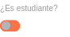 permite indicar, este dato incluye información configurada previamente a través de los registros comunes del módulo de Talento Humano. Al seleccionar SI, el sistema presenta una lista de información que permite ingresar la información. 

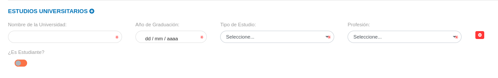
Figura 3: Estudios universitarios

### Detalles de Idiomas

- Complete el apartado **Detalles de Idiomas**. Tenga en consideración completar los campos obligatorios que son requeridos para el registro de idiomas.
- Haciendo uso del botón más, ubicado en al lado derecho del titulo , el sistema despliega el formulario para cargar la información de los idiomas que maneja el trabajador. 
- Si se desea eliminar un idioma, se pulsa la opción , y el sistema elimina el registro. 

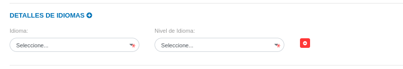
Figura 4: Detalles de Idiomas

### Capacitación y reconocimientos

- Complete el apartado **Capacitación y reconocimientos**. Tenga en consideración completar los campos obligatorios que son requeridos para el registro de capacitación y reconocimientos del trabajador.
- Haciendo uso del botón más, ubicado en al lado derecho del titulo , el sistema despliega el formulario para cargar la información de los cursos y reconocimientos del trabajador. 
- Si se desea eliminar uncurso y reconocimiento del trabajador, se pulsa la opción , y el sistema elimina el registro. 

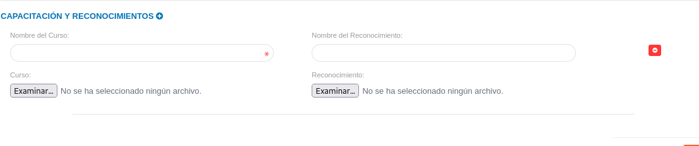
Figura 5: Capacitación y Reconocimientos

###
-   Presione el botón **Guardar**   para registrar los cambios efectuados.
-   Presione el botón **Cancelar**   para cancelar registro y regresar a la ruta anterior.
-   Presione el botón **Borrar**  para eliminar datos del formulario.
-   Si desea recibir ayuda guiada, presione el botón .
-   Para retornar a la ruta anterior, presione el botón .

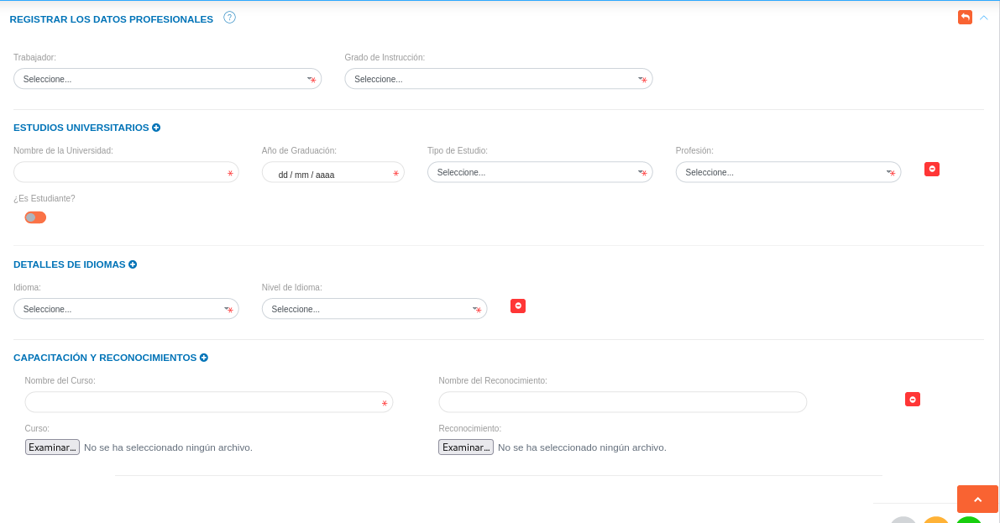
Figura 6: Formulario para registrar datos profesionales

###

## Gestionar datos profesionales

La gestión de ajustes en datos profesionales se lleva a cabo a través del apartado **Datos profesionales**. 

-   Para acceder a esta sección debe dirigirse a **Talento Humano** y ubicarse en la sección **Datos profesionales**.
-   A través del apartado **Datos profesionales** se listan los registros de **Datos profesionales** en una tabla.   

Desde este apartado se pueden llevar a cabo las siguientes acciones: 

-   ***Registrar datos profesionales***.
-   ***Importar/Exportar datos profesionales***. 
-   ***Consultar datos profesionales***.
-   ***Editar registros***. 
-   ***Eliminar registros***. 

### Registrar datos profesionales 

-   Presione el botón **Crear registro**  ubicado en la parte superior derecha del apartado **Datos profesionales** 
-   A continuación complete el formulario siguiendo los pasos descritos en el apartado [Registrar los datos profesionales](##Registrar-los-datos-profesionales).
-   Presione el botón **Guardar**   para registrar los cambios efectuados.

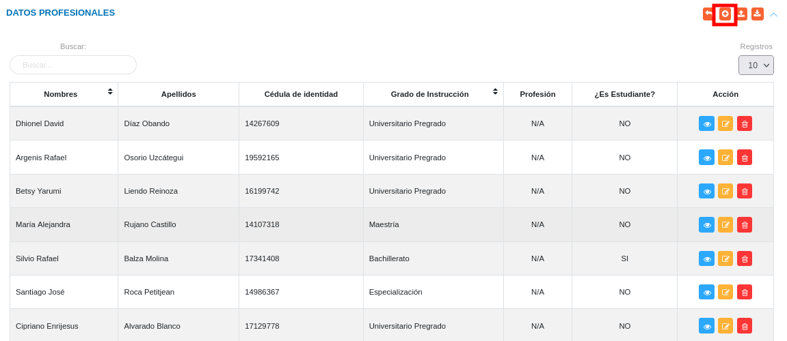
Figura 7: Registrar datos profesionales

### Importar/Exportar datos profesionales 

#### Importar datos profesionales

-   Presione el botón **Importar**  ubicado en la parte superior derecha del apartado **Datos profesionales** 
-   Seleccione un archivo desde su directorio local.  
 
Figura 8: Seleccionar archivo para importar datos profesionales
 

#### Exportar datos profesionales

-   Presione el botón **exportar**  ubicado en la parte superior derecha del apartado **Datos profesionales** 
-  El sistema genera el archivo en formato xls con los dtos cargados en el expediente. 

### Consultar registros

-   Presione el botón **Consultar registro**  ubicado en la columna titulada **Acción** de un registro de datos profesionales que se prefiere consultar. 

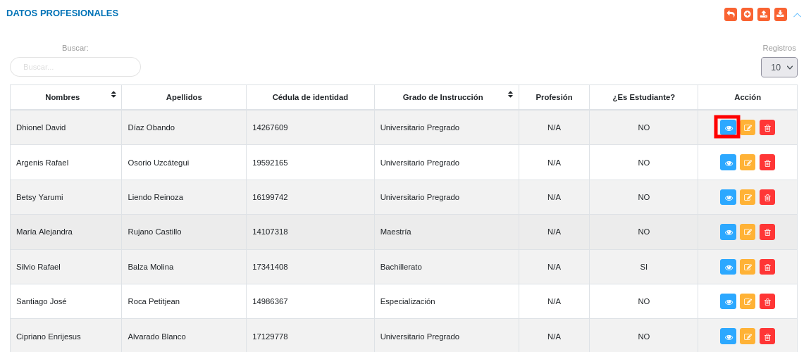
Figura 9: Consultar registros de datos profesionales 

###
-   A continuación el sistema despliega una sección donde se describen los datos de los datos profesionales seleccionado. 

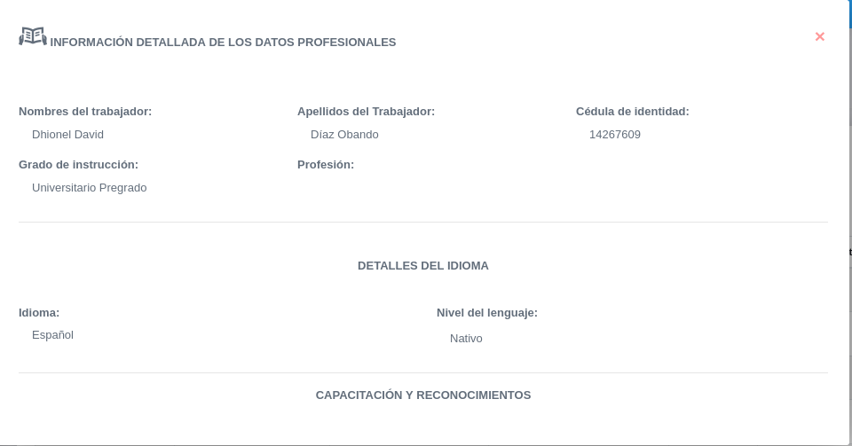
Figura 10: Ver datos profesionales

### Editar registros

-   Presione el botón **Editar registro**   ubicado en la columna titulada **Acción** del registro de ajustes en datos profesionales que se desee seleccionar para actualizar datos. 

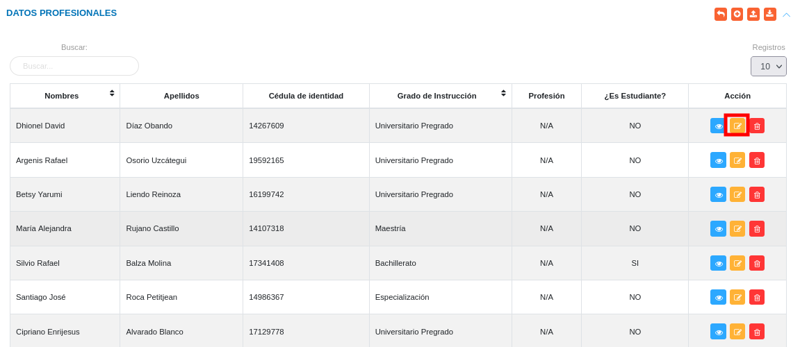
Figura 11: Editar Registros de datos profesionales

###
-   Actualice los datos del formulario siguiendo los pasos descritos en el apartado [Registrar los datos profesionales](#registrar-los-datos-profesionales).
-   Presione el botón **Guardar**   para registrar los cambios efectuados.

### Eliminar registros

-   Presione el botón **Eliminar registro**   ubicado en la columna titulada **Acción** del registro de ajustes en datos profesionales que se desee seleccionar para eliminar del sistema. 

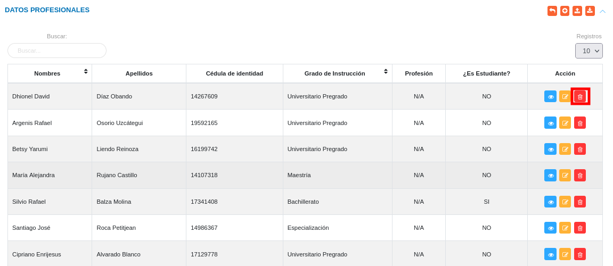
Figura 12: Eliminar Registros de datos profesionales

###
-   Confirme que esta seguro de eliminar el registro seleccionado a través de la ventana emergente, mediante el botón **Confirmar** y efectue los cambios.  

   
