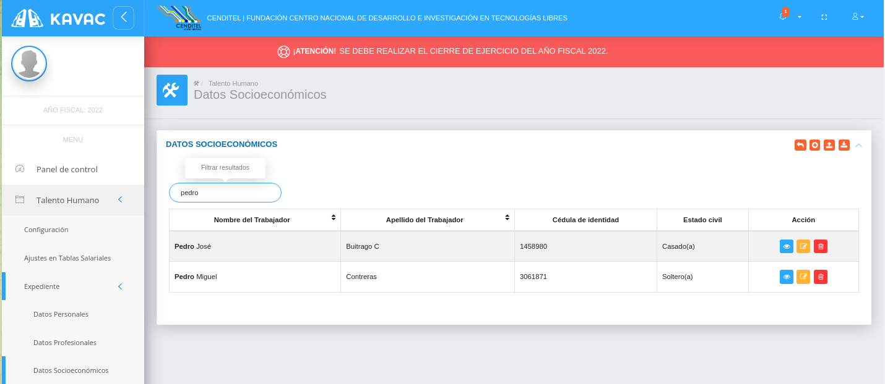
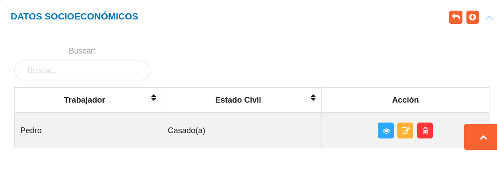
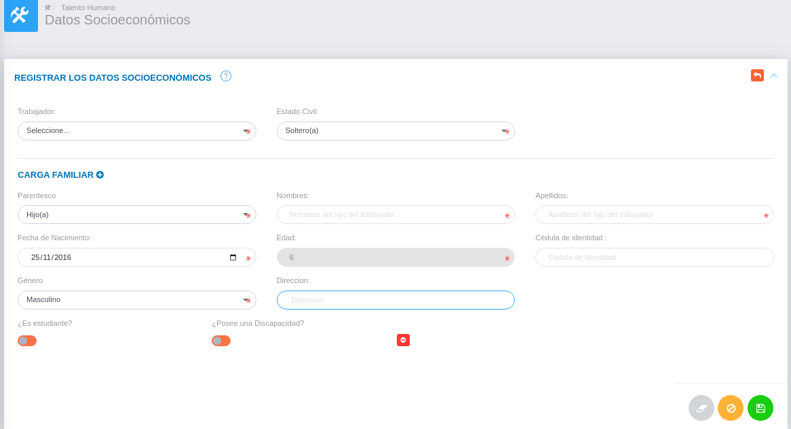
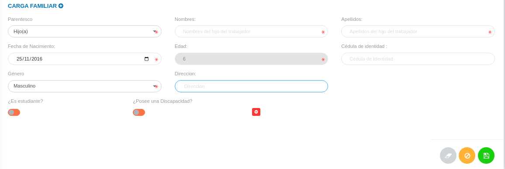
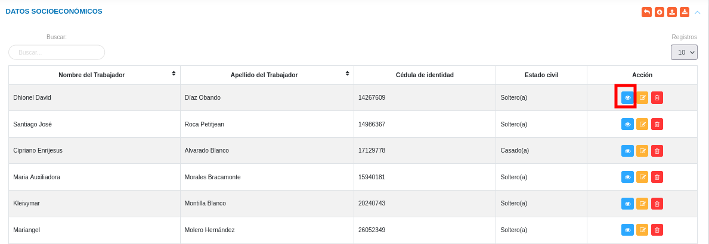
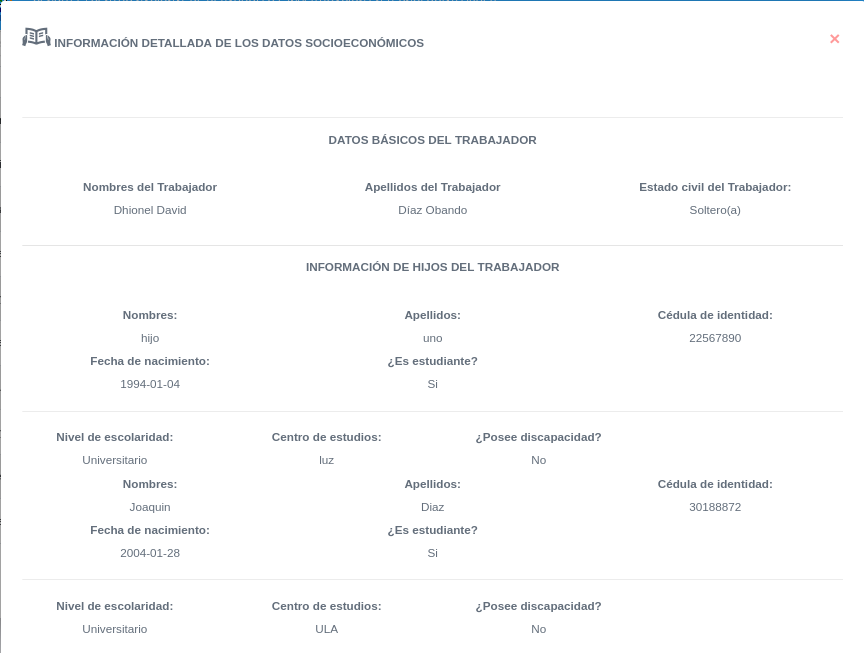
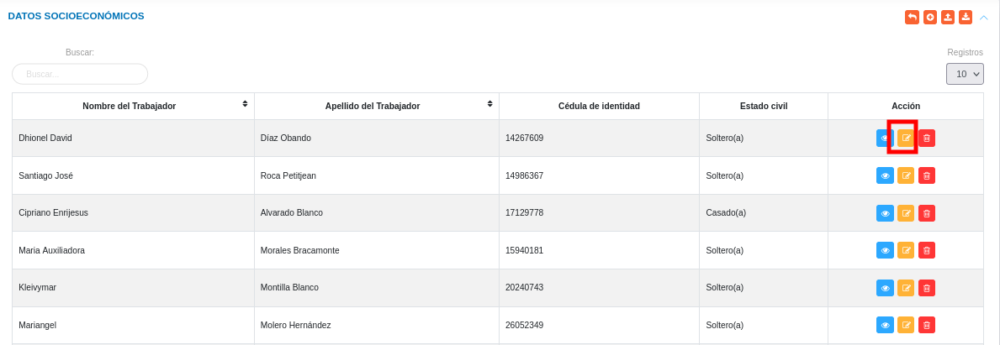
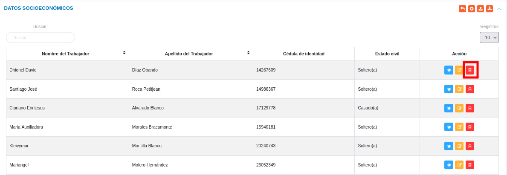

# Gestión de Datos Socioeconómicos
**********************************

El usuario selecciona el módulo de Talento Humano en el menú lateral (ubicado a la izquierda) de los módulos del sistema, ahí visualizará las opciones **Configuración**, **Ajustes en Tablas salariales**, **Expediente**, **Registros de nómina**, **Archivo txt de nómina**, **Solicitudes** y  **Reportes**, debiendo pulsar **Expediente** > **Datos socioeconómicos**

Figura 1: Menú del Módulo de Talento Humano para datos socioeconómicos

## Datos socioeconómicos

En esta sección se listan registros de datos socioeconómicos de los usuarios asociados al expediente de la organización y se muestra información asociada a cada registro como: nombre del trabajador y estado civil.   Desde esta sección es posible realizar un nuevo registro de datos socioeconómicos de usuarios registrados previamente en la sección de datos personales.

Figura 2: Datos Socioeconómicos
 

      
## Gestionar datos socioeconómicos

La gestión de ajustes en datos socioeconómicos se lleva a cabo a través del apartado **Datos socioeconómicos**. 

-   Para acceder a esta sección debe dirigirse a **Talento Humano** y ubicarse en la sección **Datos socioeconómicos**.
-   A través del apartado **Datos socioeconómicos** se listan los registros de **Datos socioeconómicos** en una tabla.   

Desde este apartado se pueden llevar a cabo las siguientes acciones: 

-   ***Registrar datos socioeconómicos***.
-   ***Importar/Exportar datos socioeconómicos***. 
-   ***Consultar datos socioeconómicos***.
-   ***Editar registros***. 
-   ***Eliminar registros***. 
###
**Nota**: Los campos de selección del apartado **Registrar los datos socioeconómicos** incluyen información configurada previamente a través de los registros comunes del módulo de Talento Humano. Si se requiere incluir información diferente a la que se encuentra por defecto, **se recomienda agregar estos registros en la configuración de registros comunes.** 

### Registrar datos socioeconómicos 

### Creación de registros

-   Presione el botón **Crear registro**  ubicado en la parte superior derecha del apartado **Datos socioeconómicos** 

El sistema muestra en la parte superior del formulario los siguientes campos: **Trabajador** (selector que contiene los trabajadores registrados previamente en la funcionalidad de Datos Personales), **Estado Civil** (lista las opciones: Soltero(a), Casado(a), Divorciado(a),Viudo(a) y Concubino(a)). 
###

Figura 3: Registrar datos socioeconómicos

###

### Efectuar la carga familiar en datos socioeconómicos

El sistema muestra en la parte inferior del formulario la sección **Carga Familiar** al pulsar el botón , el sistema solicita los campos: **Parentesco** (Selector que contiene los parentescos previamente registrados en los registros comunes), **Nombres, Apellidos, Cédula de Identidad, Fecha de Nacimiento, Edad** (Este campo se genera automáticamente, de acuerdo a la fecha de nacimiento ingresada), **Sexo** (Selector que contiene los sexos registrados en los registros comunes del sistema), **Dirección, ¿Posee una discapacidad?** (al activar este botón el sistema solicita el campo: Discapacidad, selector que contiene las Discapacidades registradas previamente en los registros comunes). (ver Figura 4)

Si en el campo **Parentesco** selecciona Hijo(a) el sistema solicita la siguiente información: **¿Es Estudiante?** (al activar este botón el sistema solicita información en los campos: **¿Nivel de Escolaridad?** (selector que contiene los Niveles de escolaridad registrados previamente en los registros comunes) y Centro de Estudio), **¿Posee una beca?**(Al activar este botón el sistema solicita información en el campo: Tipo de becas, selector que contiene los Tipos de becas registrados previamente en los registros comunes). (ver Figura 4)

-   A continuación complete el formulario siguiendo los pasos descritos:

-   Presione el botón **Guardar**   para registrar los cambios efectuados.
-   Presione el botón **Cancelar y regresar**   para cancelar registro y regresar a la ruta anterior.
-   Presione el botón **Borrar**  para eliminar datos del formulario.
-   Si desea recibir ayuda guiada, presione el botón .
-   Para retornar a la ruta anterior, presione el botón .

Figura 4: Creación de registros de datos socioeconómicos

### Importar/Exportar datos socioeconómicos

#### Importar datos socioeconómicos

-   Presione el botón **Importar**  ubicado en la parte superior derecha del apartado **Datos socioeconómicos** (Ver Figura 1 y 6).
-   Seleccione un archivo desde su directorio local.  
 
Figura 5: Seleccionar archivo para importar datos socioeconomicos
 

#### Exportar datos socioeconómicos

-   Presione el botón **exportar**  ubicado en la parte superior derecha del apartado **Datos socioeconómicos** (Ver Figura 1 y 6).
-  El sistema genera el archivo en formato xls con los dtos cargados en el expediente. 

### Consultar registros

-   Presione el botón **Consultar registro**  ubicado en la columna titulada **Acción** de un registro de datos socioeconómicos que se prefiere consultar. 

Figura 6: Consultar registros de datos socioeconómicos 

###
-   A continuación el sistema despliega una sección donde se describen los datos de los datos socioeconómicos seleccionado. 

Figura 7: Ver datos socioeconómicos

### Editar registros

-   Presione el botón **Editar registro**   ubicado en la columna titulada **Acción** del registro de ajustes en datos socioeconómicos que se desee seleccionar para actualizar datos. 

Figura 8: Editar Registros de datos socioeconómicos

###
-   Actualice los datos del formulario siguiendo los pasos descritos en el apartado [Registrar los datos socioeconómicos](#registrar-los-datos-socioeconomicos).
-   Presione el botón **Guardar**   para registrar los cambios efectuados.

### Eliminar registros

-   Presione el botón **Eliminar registro**   ubicado en la columna titulada **Acción** del registro de ajustes en datos socioeconómicos que se desee seleccionar para eliminar del sistema. 

Figura 9: Eliminar Registros de datos socioeconómicos

###
-   Confirme que esta seguro de eliminar el registro seleccionado a través de la ventana emergente, mediante el botón **Confirmar** y efectue los cambios.  
   

   
