# Gestión de Datos Personales
*****************************

El usuario selecciona el módulo de Talento Humano en el menú lateral de los módulos del sistema, ahí visualizara las opciones **Configuración**, **Ajustes en Tablas salariales**, **Expediente**, **Registros de nómina**, **Solicitudes** y  **Reportes**, debiendo pulsar **Expediente** > **Datos personales**

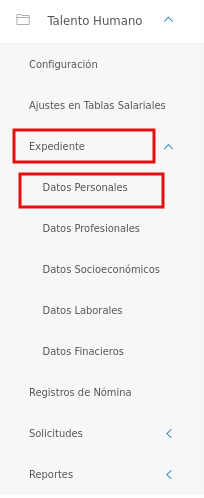
Figura 1: Menú del Módulo de Talento Humano para datos personales

## Datos personales

En esta sección se listan registros de datos personales de los usuarios asociados al expediente de la organización y se muestra información asociada a cada registro como: nombres, apellidos, cédula de identidad y correo electrónico. Desde esta sección es posible realizar un nuevo registro de datos personales de usuario.

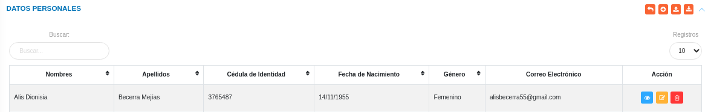
Figura 2: Datos Personales
 

#### Registrar los datos personales

-   Dirigirse al módulo de **Talento Humano**, ingresar en **Expediente** y seleccionar la opción **Datos Personales**.
-   Haciendo uso del botón **Crear**  ubicado en la esquina superior derecha de esta sección, se procede a realizar un nuevo registro de datos personales.
-   El sistema despliega un formulario de datos personales, en el cual se debera completar los datos del mismo.
- Complete el apartado **Registrar los datos personales**. Tenga en consideración completar los campos obligatorios que son requeridos para el registro de datos personales.

"Nota" 
    Los campos de selección del apartado **Registrar los datos personales** incluyen información configurada previamente a través de los registros comunes del módulo de Talento Humano y del sistema. Si se requiere incluir información diferente a la que se encuentra por defecto, se recomienda agregar estos registros en la configuración de registros comunes. 

 Para agregar registros comunes del sistema acceda a **Configuración** > **General** > **Registros Comunes**. 

   

   -   ***País***: Para crear un nuevo registro de país acceda a **Configuración** > **General** > **Registros Comunes** > **Países**. 
   -   ***País***: Para crear un nuevo registro de país acceda a **Configuración** > **General** > **Registros Comunes** > **Países**. 
   -   ***Estado***: Para crear un nuevo registro de estado acceda a **Configuración** > **General** > **Registros Comunes** > **Estados**. 
   -   ***Municipio***: Para crear un nuevo registro de municipio acceda a **Configuración** > **General** > **Registros Comunes** > **Municipios**. 
   -   ***Parroquía***: Para crear un nuevo registro de parroquias acceda a **Configuración** > **General** > **Registros Comunes** > **Parroquías**.
   

Para agregar registros comunes del módulo de Talento Humano acceda a **Talento Humano** > **Configuración** > **Registros Comunes**. 

   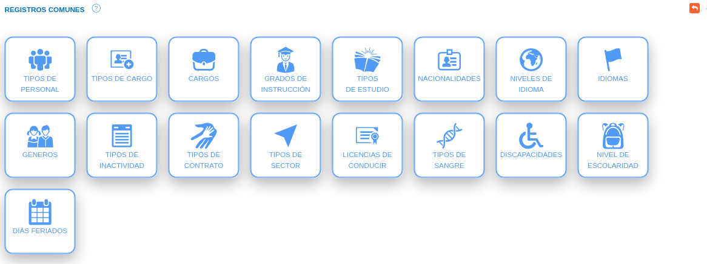

   -   ***Género***: Para crear un nuevo registro de género acceda a **Configuración** > **General** > **Registros Comunes** > **Géneros**. 
   -   ***Tipo de Sangre***: Para crear un nuevo registro de tipo de sangre acceda a **Configuración** > **General** > **Registros Comunes** > **Tipo de sangre**. 
   -   ***Discapacidad***: Para crear un nuevo registro de discapacidad acceda a **Configuración** > **General** > **Registros Comunes** > **Discapacidades**. 
   -   ***Licencia de conducir***: Para crear un nuevo registro de grado de licencia de conducir acceda a **Configuración** > **General** > **Registros Comunes** > **Licencia de conducir**.

"Nota" 
    El selector "¿Posee una discapacidad?"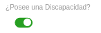 permite registrar una discapacidad, este dato incluye información configurada previamente a través de los registros comunes del módulo de Talento Humano. Al seleccionar SI, el sistema presenta una lista de información que permite ingresar la información. 

!!! note "Nota" 
    El selector "¿Posee licencia de conducir?"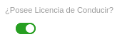 permite registrar un grado de licencia de conducir, este dato incluye información configurada previamente a través de los registros comunes del módulo de Talento Humano. Al seleccionar SI, el sistema presenta una lista de información que permite ingresar la información. 

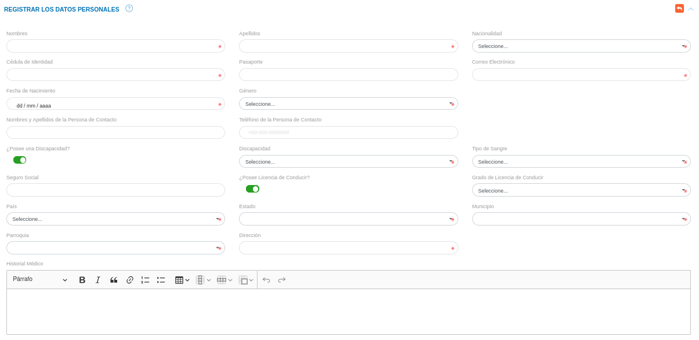
Figura 3: Datos personales 

#### Talla de uniforme

- Complete el apartado **Talla de uniforme**. Tenga en consideración completar los campos obligatorios que son requeridos para el registro de datos de uniforme.
- Haciendo uso del botón más, ubicado en al lado derecho del titulo , el sistema despliega el formulario para cargar la información de los uniformes. 
- Si se desea eliminar un tipo de uniforme, se pulsa la opción , y el sistema elimina el registro. 

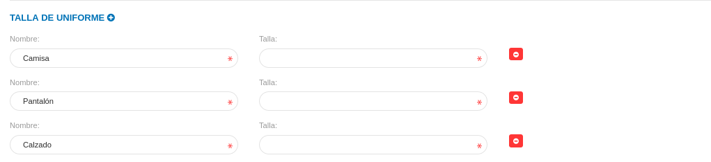
Figura 4: Talla de uniforme 

#### Números telefónicos 

- Complete el apartado **Números telefónicos**. Tenga en consideración completar los campos obligatorios que son requeridos para el registro de números telefónicos.
- Haciendo uso del botón más, ubicado en al lado derecho del titulo , el sistema despliega el formulario para cargar la información de los números telefónicos. 
- Si se desea eliminar un número telefónico, se pulsa la opción , y el sistema elimina el registro. 

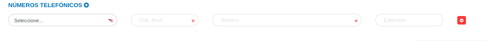
Figura 5: Números Telefónicos 

-   Presione el botón **Guardar**   para registrar los cambios efectuados.
-   Presione el botón **Cancelar**   para cancelar registro y regresar a la ruta anterior.
-   Presione el botón **Borrar**  para eliminar datos del formulario.
-   Si desea recibir ayuda guiada, presione el botón .
-   Para retornar a la ruta anterior, presione el botón .

## Gestionar datos personales

La gestión de ajustes en datos personales se lleva a cabo a través del apartado **Datos personales**. 

-   Para acceder a esta sección debe dirigirse a **Talento Humano** y ubicarse en la sección **Datos personales**.
-   A través del apartado **Datos personales** se listan los registros de **Datos personales** en una tabla.   

Desde este apartado se pueden llevar a cabo las siguientes acciones: 

-   ***Registrar datos personales***.
-   ***Importar/Exportar datos personales***. 
-   ***Consultar datos personales***.
-   ***Editar registros***. 
-   ***Eliminar registros***. 

### Registrar datos personales 

-   Presione el botón **Crear registro**  ubicado en la parte superior derecha del apartado **Datos personales** 
-   A continuación complete el formulario siguiendo los pasos descritos en el apartado [Registrar los datos personales](##Registrar-los-datos-personales).
-   Presione el botón **Guardar**   para registrar los cambios efectuados.

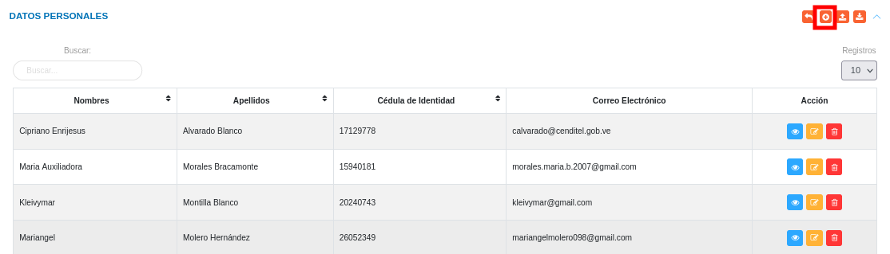
Figura 6: Registrar datos personales

### Importar/Exportar datos personales 

#### Importar datos personales

-   Presione el botón **Importar**  ubicado en la parte superior derecha del apartado **Datos personales** 
-   Seleccione un archivo desde su directorio local.  
 
Figura 7: Seleccionar archivo para importar datos personales
 

#### Exportar datos personales

-   Presione el botón **exportar**  ubicado en la parte superior derecha del apartado **Datos personales** 
-  El sistema genera el archivo en formato xls con los dtos cargados en el expediente. 

### Consultar registros

-   Presione el botón **Consultar registro**  ubicado en la columna titulada **Acción** de un registro de datos personales que se prefiere consultar. 

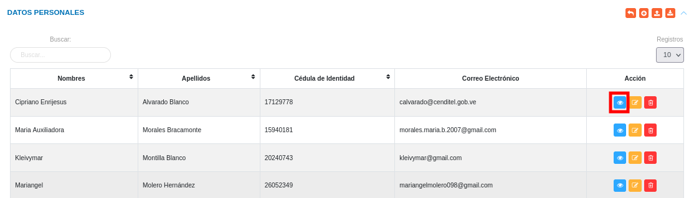
Figura 8: Consultar registros de datos personales 

-   A continuación el sistema despliega una sección donde se describen los datos de los datos personales seleccionado. 

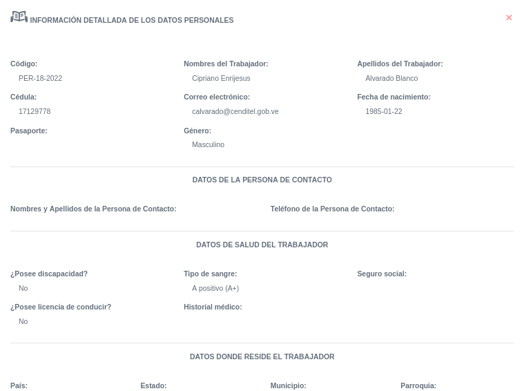
Figura 9: Ver datos personales

### Editar registros

-   Presione el botón **Editar registro**   ubicado en la columna titulada **Acción** del registro de ajustes en datos personales que se desee seleccionar para actualizar datos. 

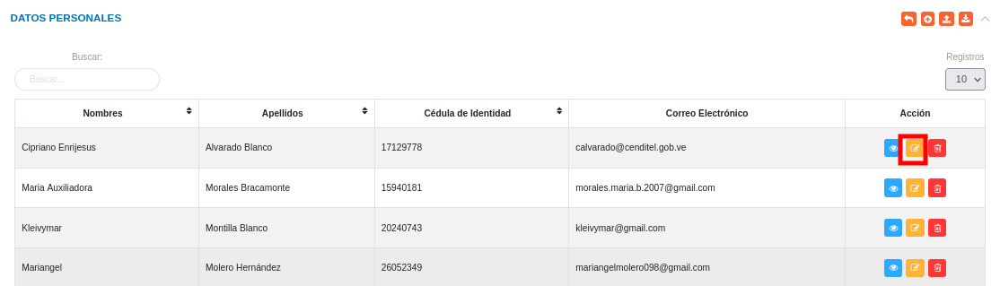
Figura 10: Editar Registros de datos personales

-   Actualice los datos del formulario siguiendo los pasos descritos en el apartado [Registrar los datos personales](#registrar-los-datos-personales).
-   Presione el botón **Guardar**   para registrar los cambios efectuados.

### Eliminar registros

-   Presione el botón **Eliminar registro**   ubicado en la columna titulada **Acción** del registro de ajustes en datos personales que se desee seleccionar para eliminar del sistema. 

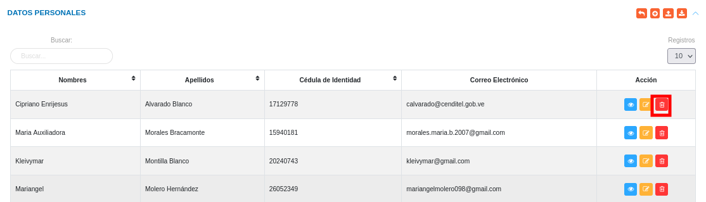
Figura 11: Eliminar Registros de datos personales

-   Confirme que esta seguro de eliminar el registro seleccionado a través de la ventana emergente, mediante el botón **Confirmar** y efectue los cambios.  

   
