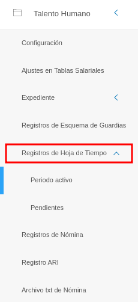
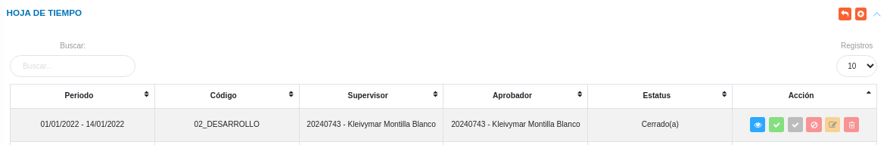
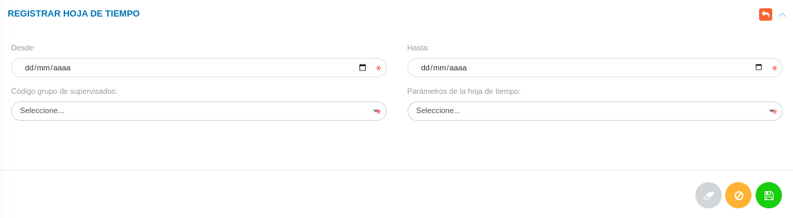
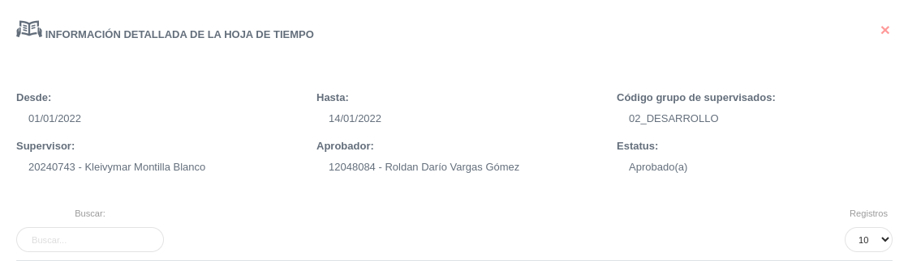
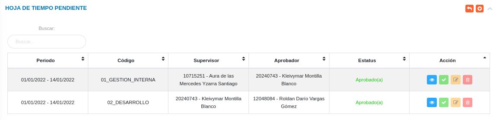

# Registros de Hoja de Tiempo
****************************

Esta sección permite gestionar el registro de hojas de tiempo de los trabajadores. Para entrar, el usuario debe seleccionar el módulo de **Talento Humano** en el menú lateral y pulsar **Registros de Hoja de Tiempo**

Figura 1: Menú del Módulo de Talento Humano para Registros de Hoja de Tiempo

### Registro de Período Activo

En esta sección se listan los registros de hoja de tiempo pendientes, con una tabla que muestra las columnas: **Período**, **Código**, **Supervisor**, **Aprobador**, **Estatus** y **Acción**.

Desde esta sección es posible **Crear** un nuevo registro de período de tiempo activo, así como también **Ver**, **Aprobar**, **Desaprobar**, **Modificar** y **Eliminar** los registros existentes.

Figura 2: Listado de Registro de Período Activo
 

#### Registrar Hoja de Tiempo

-   Para hacer un nuevo registro, usar el botón **Crear**  ubicado en la esquina superior derecha.
-   El sistema despliega un formulario con los campos requeridos para completar el registro.
-   Para registrar los cambios efectuados, presione el botón **Guardar** .

Figura 3: Registro de Período Activo
 

#### Ver Registro de Hoja de Tiempo Activa

-   Usar el botón **Ver**  en la columna **Acción** de la tabla de registros.
-   El sistema muestra una tabla con los datos del registro correspondiente.

Figura 4: Ver Registro de Período Activo
 

#### Aprobar Registro de Hoja de Tiempo Activa

-   Usar el botón **Aprobar**  en la columna **Acción** de la tabla de registros.
-   El sistema muestra una tabla con los datos del registro correspondiente.
-   Para aprobar el registro, usar el botón **Confirmar** .

#### Modificar Registro de Hoja de Tiempo Activa

-   Usar el botón **Modificar**  en la columna **Acción** de la tabla de registros.
-   El sistema muestra el formulario de edición de la información registrada.
-   Para registrar los cambios efectuados, presione el botón **Guardar** .

#### Eliminar Registro de Hoja de Tiempo Activa

-   Usar el botón **Eliminar**  en la columna **Acción** de la tabla de registros.
-   El sistema muestra un mensaje de confirmación.
-   Para eliminar el registro, usar el botón **Confirmar** .

### Registro de Hoja de Tiempo Pendiente

En esta sección se listan los registros de hoja de tiempo pendientes, con una tabla que muestra las columnas: **Período**, **Código**, **Supervisor**, **Aprobador**, **Estatus** y **Acción**.

Desde esta sección es posible **Crear** un nuevo registro de período de tiempo pendiente, así como también **Ver**, **Aprobar**, **Modificar** y **Eliminar** los registros existentes.

Figura 5: Listado de Registro de Hoja de Tiempo Pendiente
 

#### Registrar Hoja de Tiempo Pendiente

-   Para hacer un nuevo registro, usar el botón **Crear**  ubicado en la esquina superior derecha.
-   El sistema despliega un formulario con los campos requeridos para completar el registro.
-   Para registrar los cambios efectuados, presione el botón **Guardar** .

Figura 6: Registro de Período Pendiente

#### Ver Registro de Hoja de Tiempo Pendiente

-   Usar el botón **Ver**  en la columna **Acción** de la tabla de registros.
-   El sistema muestra una tabla con los datos del registro correspondiente.

Figura 7: Ver Registro de Período Pendiente
 

#### Aprobar Registro de Hoja de Tiempo Pendiente

-   Usar el botón **Aprobar**  en la columna **Acción** de la tabla de registros.
-   El sistema muestra una tabla con los datos del registro correspondiente.
-   Para aprobar el registro, usar el botón **Confirmar** .

#### Modificar Registro de Hoja de Tiempo Pendiente

-   Usar el botón **Modificar**  en la columna **Acción** de la tabla de registros.
-   El sistema muestra el formulario de edición de la información registrada.
-   Para registrar los cambios efectuados, presione el botón **Guardar** .

#### Eliminar Registro de Hoja de Tiempo Pendiente

-   Usar el botón **Eliminar**  en la columna **Acción** de la tabla de registros.
-   El sistema muestra un mensaje de confirmación.
-   Para eliminar el registro, usar el botón **Confirmar** .
