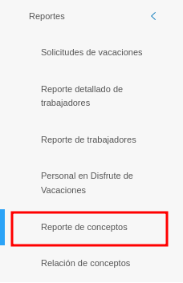
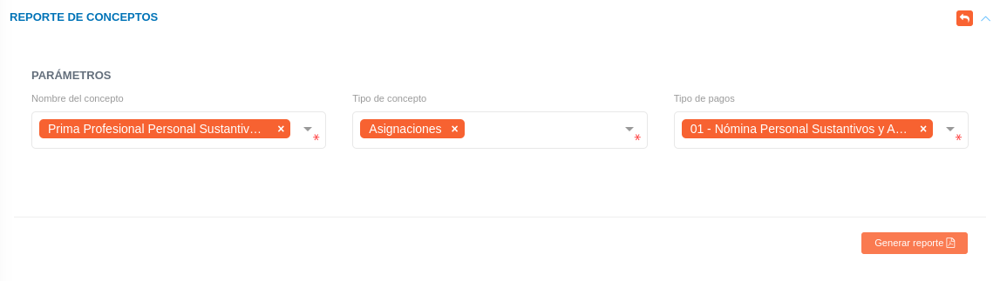

# Gestión de Reporte de Conceptos
************************************************

Esta funcionalidad permite generar reportes en diferentes categorías vinculadas con el área de **Talento humano**, tales como pagos y deducciones a los trabajadores. 

Para generar un reporte, el usuario debe dirigirse al módulo de **Talento Humano**, ingresar en **Reportes** y seleccionar la opción **Reporte de Conceptos**.

Figura 1: Opción de Reporte de Conceptos
 
 

## Generar Reporte de Conceptos. 

Una vez en esta sección, el sistema mostrará un formulario con los campos requeridos para la generación del reporte:

Figura 2: Formulario del Reporte de Conceptos

 

A continuación, utilice el formulario para filtrar los datos requeridos a través de los campos de selección:

-   **Nombre del concepto:** seleccionar el tipo de pago, como "Nómina del Personal Sustantivo y Administrativo".

-   **Tipo de concepto:** seleccionar el tipo de concepto, como "Asignaciones" y "Deducciones".

-   **Tipo de pagos:** seleccionar el concepto de pago, como "Prima profesional".

**Nota:** cada campo del formulario permite seleccionar una o varias opciones simultáneamente.

Una vez seleccionados todos los campos, utilice el botón **Generar reporte**  para visualizar el reporte con los datos requeridos. 
