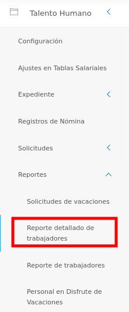
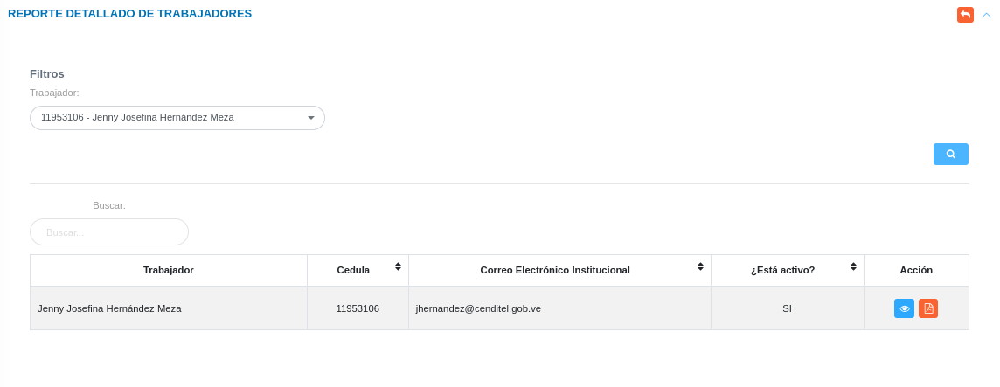
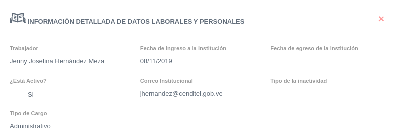

# Gestión de Reportes Detallados de Trabajadores
************************************************

Esta sección permite generar un informe con información detallada sobre cada trabajador que ha sido registrado en la sección **Expediente** del módulo de **Talento Humano**.  

Para acceder a este reporte, el usuario debe dirigirse al módulo de **Talento Humano**, ingresar en **Reportes** y seleccionar la opción **Reporte detallado de trabajadores**.

Figura 1: Opción Reporte detallado de trabajadores
 

## Generar reporte detallado de un trabajador 
 
-   Filtre la información mediante el campo de selección **Trabajador** que permite elegir un empleado asociado.  
-   Presione el botón **Buscar**  para filtrar los registros.
-   Presione el botón **generar reporte**  ubicado en la columna titulada **Acción**, según el registro que se desea consultar. 

Figura 2: Formulario de Reporte de Trabajadores
 
 

-   Para obtener información detallada del trabajador, pulse el botón **Ver registro** . 
-   Para exportar la información del trabajador, pulse el botón **Generar reporte** 

Figura 3: Registro del trabajador
 
