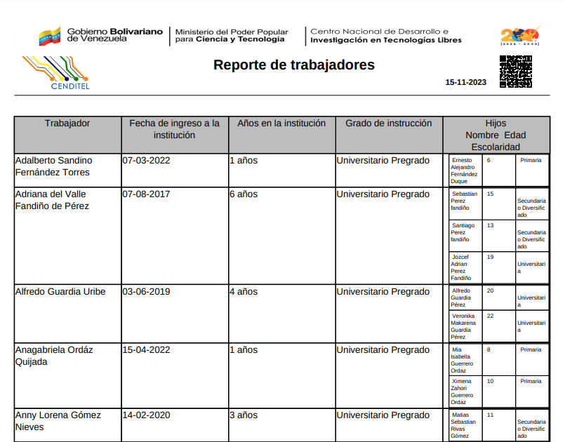

# Reporte de Trabajadores
*******************

El reporte detallado de trabajadores permite consultar la lista de trabajadores que existe para determinada característica del expediente del trabajador. Por ejemplo el usuario puede consultar la lista de trabajadores: de sexo femenino, con discapacidad, casados, que tienen hijos, que cursan estudios, inactivos, por tipo de personal, por cargo, entre otros. 

Para acceder a este reporte, el usuario debe dirigirse al módulo de **Talento Humano**, ingresar en **Reportes** y seleccionar la opción **Reporte de trabajadores**.

Figura 1: Opción Reporte de Trabajadores
 

## Para generar el reporte de trabajadores
 
-   Ingrese los parámetros de consulta.  
-   Presione el botón **Buscar**  para filtrar los registros.
-   Presione el botón **generar reporte** para generar un archivo PDF. 

Figura 2: Formulario Reporte de Trabajadores
 

Figura 3: Reporte de Trabajadores
 

