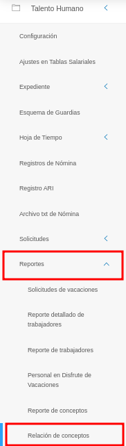
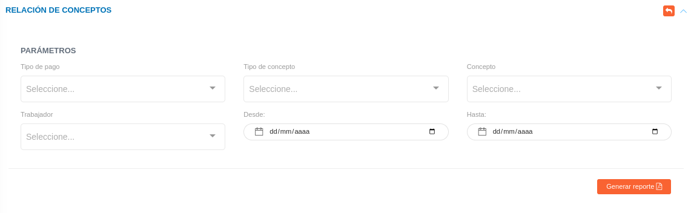

# Gestión de Relación de Conceptos
************************************************

Esta funcionalidad permite generar reportes en diferentes categorías vinculadas con el área de **Talento humano**, tales como pagos y deducciones a los trabajadores. 

Para generar un reporte, el usuario debe dirigirse al módulo de **Talento Humano**, ingresar en **Reportes** y seleccionar la opción **Relación de Conceptos**.

Figura 1: Opción de Relación de Conceptos
 
 

## Generar reporte de Relación de Conceptos. 

Una vez en esta sección, el sistema mostrará un formulario con los campos requeridos para la generación del reporte:

Figura 2: Formulario del reporte de Relación de Conceptos

 

A continuación, utilice el formulario para filtrar los datos requeridos a través de los campos de selección:

-   **Tipo de pago:** seleccionar el tipo de pago, como "Nómina del Personal Sustantivo y Administrativo".

-   **Tipo de concepto:** seleccionar el tipo de concepto, como "Asignaciones" y "Deducciones".

-   **Concepto:** seleccionar el concepto de pago, como "Prima profesional".

-   **Trabajador:** seleccionar los trabajadores a incluir.

-   **Desde/Hasta:** seleccionar las fecha de inicio y cierre del reporte.

**Nota:** cada campo del formulario permite seleccionar una o varias opciones simultáneamente.

Una vez seleccionados todos los campos, utilice el botón **Generar reporte**  para visualizar el reporte con los datos requeridos. 
