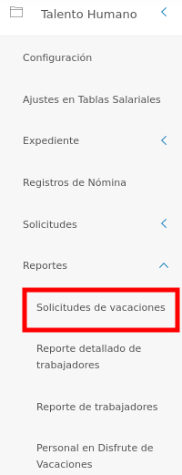
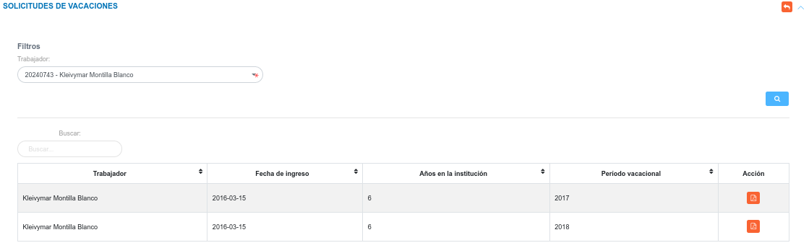
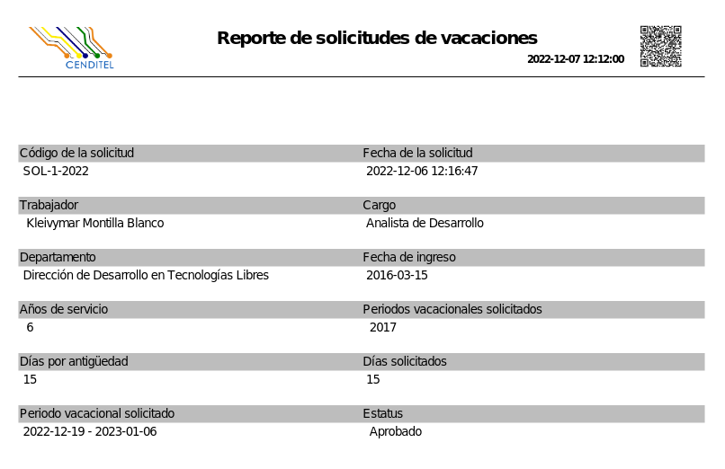

# Reporte Solicitudes de Vacaciones 
********************************************

En esta sección es posible generar informes en tiempo real sobre las solicitudes de vacaciones generadas por cada trabajador. 

Para acceder a esta funcionalidad, el usuario debe dirigirse al módulo de **Talento Humano**, ingresar en **Reportes** y seleccionar la opción **Solicitudes de vacaciones**.

Figura 1: Opción de Solicitudes de vacaciones
 

### Generar el reporte

-   Filtrar el trabajador para el cual se requiere ver las solicitudes de vacaciones realizadas.  
-   Presionar el botón **Buscar**  para filtrar los registros.
-   Presionar el botón **Generar reporte**  ubicado en la columna titulada **Acción**, según el registro que se desea consultar. 

Figura 2: Formulario Reporte de Solicitudes de Vacaciones
 

Figura 3: Reporte de Solicitudes de Vacaciones
 

