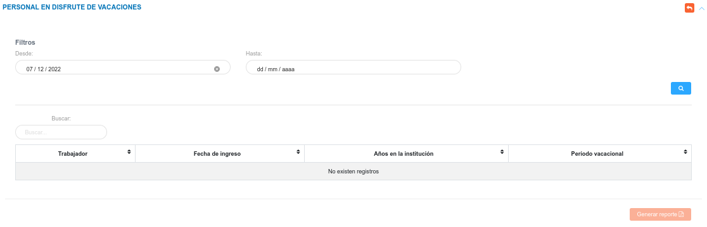

# Reporte Personal de Disfrute de Vacaciones 
*******************************************

En esta sección es posible consultar el personal que se encuentra en disfrute de vacaciones.

Para acceder a este reporte, el usuario debe dirigirse al módulo de **Talento Humano**, ingresar en **Reportes** y seleccionar la opción **Personal en Disfrute de Vacaciones**.

Figura 1: Opción Personal en Disfrute de Vacaciones
 

### Generar reporte

-   Ingresar información en los campos **Desde** y **Hasta**.
-   Presionar el botón **Buscar**  para filtrar los registros.
-   Presionar el botón **generar reporte**  ubicado en la columna titulada **Acción**, según el registro que se desea consultar. 

Figura 2: Formulario Reporte Personal de Disfrute de Vacaciones
 

Figura 3: Reporte Personal de Disfrute de Vacaciones
 
