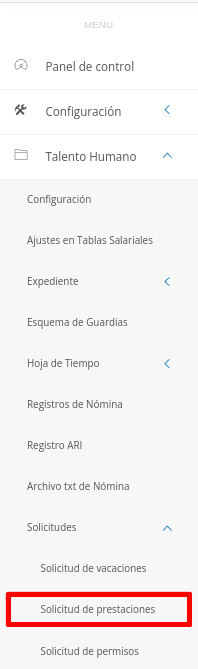
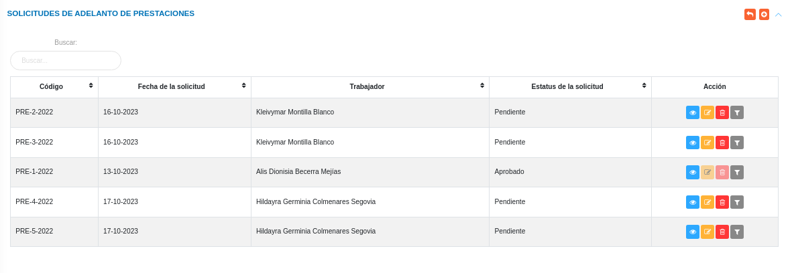
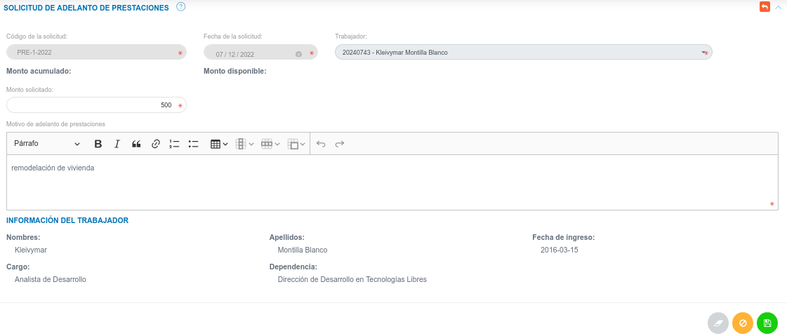
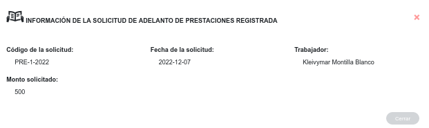
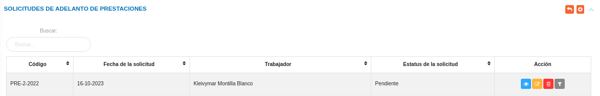
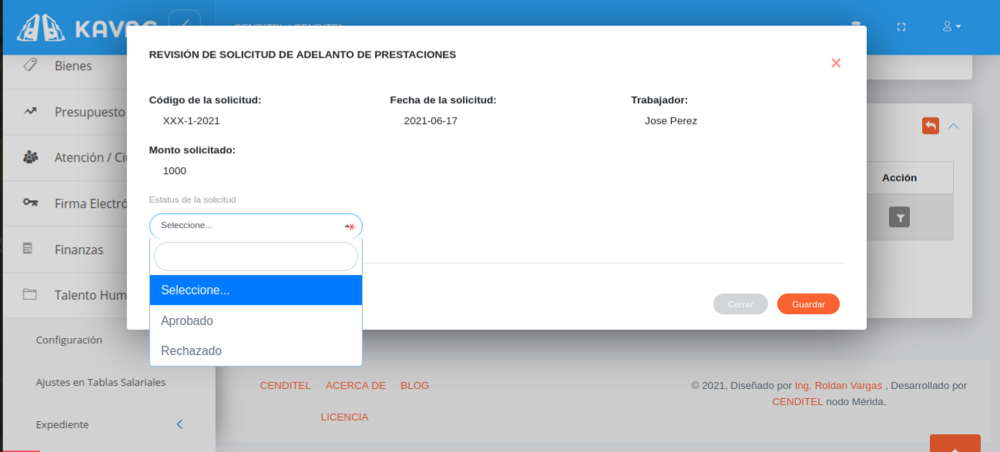

# Gestión de Solicitudes de Prestaciones
****************************************

## Solicitudes de adelanto de prestaciones

En esta sección se gestiona las solicitudes de prestaciones o beneficios del personal de la organización.  En esta sección se listan las solicitudes para adelanto de prestaciones formuladas, de igual forma es posible generar una nueva solicitud de prestaciones por trabajador, consultar, editar o eliminar cualquier registro.  

Para acceder a esta funcionalidad el usuario debe dirigirse al módulo de **Talento Humano**, ingresar en **Solicitudes** y seleccionar la opción **Solicitud de prestaciones**.

Figura 1: Opción Solicitudes de Adelanto de Prestaciones

##
Luego el sistema presenta la interfaz de Adelanto de Prestaciones compuesta por las secciones: **Solicitud de adelanto de prestaciones** y **Solicitud de adelanto de prestaciones pendientes**

Figura 2: Interfaz de Adelanto de Prestaciones

### Crear una nueva solicitud

-   Haciendo uso del botón **Crear**  ubicado en la esquina superior derecha de la sección **Solicitudes de Adelanto de Prestaciones**, se procede a realizar una nueva solicitud.
-   Complete el formulario de la sección **Solicitud de Adelanto de Prestaciones**.
-   Presione el botón **Guardar**  para registrar los cambios una vez se complete el formulario.
-   Presione el botón **Cancelar**   para cancelar registro y regresar a la ruta anterior.
-   Presione el botón **Borrar**  para eliminar datos del formulario.
-   Si desea recibir ayuda guiada, presione el botón .
-   Para retornar a la ruta anterior, presione el botón .

Figura 3: Formulario Solicitud de Adelanto de Prestaciones

### Gestión de registros

Para **Ver información detallada**, **Editar** o **Eliminar** un registro se debe hacer uso de los botones ubicados en la columna titulada **Acción** de la tabla de registros en la sección de **Solicitudes de Adelanto de Prestaciones**.

#### Ver registros

- Presione el botón **Ver registro**  para un registro de interés.
- Luego, el sistema muestra información asociada a la solicitud prestaciones sociales.

Figura 4: Ver solicitud de prestaciones

##
- Presione el botón **Cerrar** para salir de la interfaz.

#### Editar registros

- Presione el botón **Editar registro**  para un registro de interés.
- Luego, el sistema muestra el formulario en forma de edición.
- Modifique la información que requiera.
- Presione el botón **Guardar**   para registrar los cambios efectuados.

#### Eliminar registros

- Presione el botón **Eliminar**   para un registro de interés.
- Seguidamente, el sistema presenta un modal con un mensaje de confirmación de si está seguro de eliminar el ingreso de almacén, y muestra los botones Confirmar y Cancelar.
- Pulse el botón **Confirmar** si está seguro de eliminar el registro seleccionado.
- El sistema elimina el registro.
- Si pulsa el botón **Cancelar**, el sistema no ejecuta ninguna acción. 

## Solicitudes de adelanto de prestaciones pendientes

Una vez se genera una nueva solicitud, además de añadirse a la tabla **Solicitudes de Adelanto de Prestaciones**, el registro se almacena en la tabla de **Solicitudes de Adelanto de Prestaciones Pendientes**, desde esta sección se gestiona la aprobación o rechazo de solicitud.

Figura 5: Solicitudes de Adelanto de Prestaciones Pendientes

### Aprobar o rechazar solicitud

Para **aprobar** o **rechazar** una solicitud el usuario encargado de talento humano o usuario con permisos especiales, hace uso del botón **revisar solicitud** ubicado en la columna titulada **Acción** de la tabla de **Solicitudes de Adelanto de Prestaciones Pendientes**.

!!! info "Botón revisar solicitud"
    

A continuación se muestra una ventana emergente con información asociada al registro y un botón de selección que permite ajustar el **Estatus de la solicitud** (aprobar o rechazar), luego de realizar la revisión correspondiente y seleccionar la opción de estatus, se registran los cambios presionando el botón **Guardar** ubicado en la parte inferior derecha de la ventana emergente.   

Figura 6: Revisión de Solicitud de Adelanto de Prestaciones 

El trabajador es notificado sobre la fecha de aprobación en el caso de ser aprobada o motivo de rechazo en el caso de ser rechazada.
