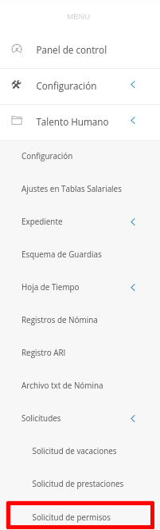
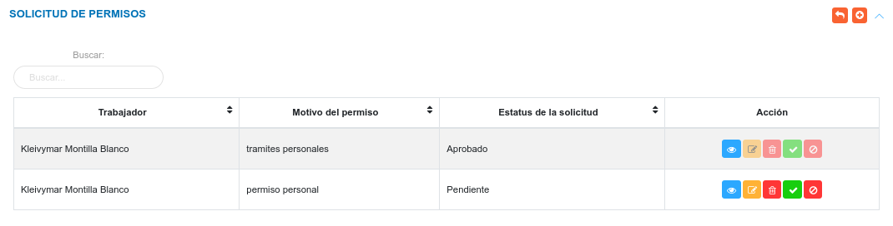
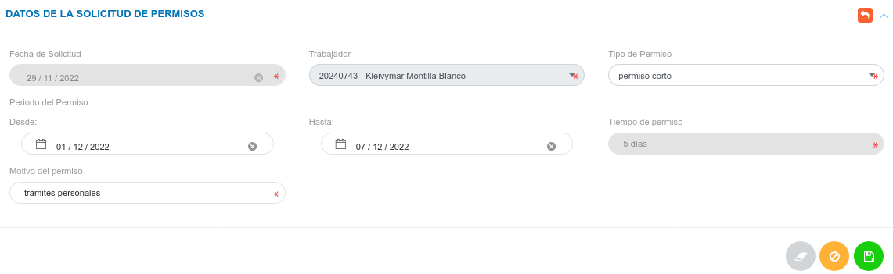
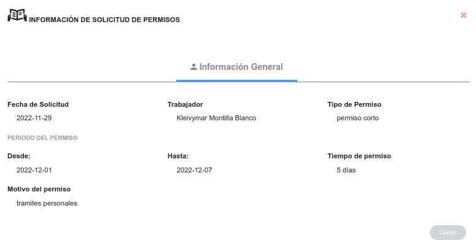
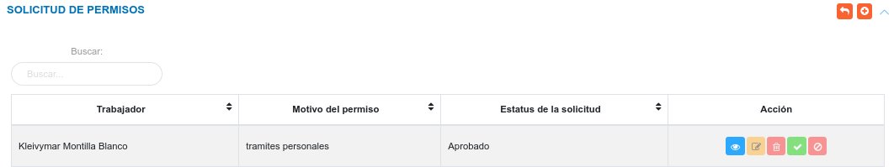

# Gestión de Solicitudes de Permisos 
************************************

## Solicitudes de Permisos

Mediante la sección **Solicitudes de Permisos** se lleva a cabo la gestión de permisos laborales del personal de la organización. En esta sección se listan las solicitudes de permisos que han sido formuladas, de igual forma es posible generar una nueva solicitud, consultar, editar o eliminar cualquier registro. 

Para acceder a esta sección debe dirigirse al módulo de **Talento Humano**, ingresar en la opción **Solicitudes** y seleccionar **Solicitud de permisos**.

Figura 1: Opción Solicitud de Permiso

###

Luego, el sistema muestra la interfaz de Permisos, que muestra la tabla de registros de los permisos solicitados por los trabajadores.

Figura 2: Solicitudes de Vacaciones

### Crear una nueva solicitud de permiso

-   Dirigirse al módulo de **Talento Humano**, ingresar en la opción **Solicitudes** y seleccionar **Solicitud de permisos**.
-   Ubicarse en la sección **Solicitudes de Permisos** y presionar el botón **Crear**  ubicado en la esquina superior derecha de esta sección para realizar una nueva solicitud.
-   Complete el formulario de la sección **Solicitud de Permiso**.
-   Presione el botón **Guardar**  para registrar los cambios una vez se complete el formulario.
-   Presione el botón **Cancelar**   para cancelar registro y regresar a la ruta anterior.
-   Presione el botón **Borrar**  para eliminar datos del formulario.
-   Si desea recibir ayuda guiada, presione el botón .
-   Para retornar a la ruta anterior, presione el botón .

    Nota: Los tipos de permisos son gestionados  en la configuración del módulo de **Talento Humano**, desde el apartado **Políticas de Permisos** de la sección **Parámetros Generales de Nómina**.

Figura 3: Formulario Solicitud de Permiso

### Gestión de registros

Para **Ver información detallada**, **Editar** o **Eliminar** un registro se debe hacer uso de los botones ubicados en la columna titulada **Acción** de la tabla de registros en la sección de **Solicitudes de Permisos**.

#### Ver registros

- Presione el botón **Ver registro**  para un registro de interés.
- Luego, el sistema muestra información asociada a la solicitud vacaciones registrada.

Figura 4: Ver solicitud de permisos

###
- Presione el botón **Cerrar** para salir de la interfaz.

#### Editar registros

- Presione el botón **Editar registro**  para un registro de interés.
- Luego, el sistema muestra el formulario en forma de edición.
- Modifique la información que requiera.
- Presione el botón **Guardar**   para registrar los cambios efectuados.

#### Eliminar registros

- Presione el botón **Eliminar**   para un registro de interés.
- Seguidamente, el sistema presenta un modal con un mensaje de confirmación de si está seguro de eliminar el ingreso de almacén, y muestra los botones Confirmar y Cancelar.
- Pulse el botón **Confirmar** si está seguro de eliminar el registro seleccionado.
- El sistema elimina el registro.
- Si pulsa el botón **Cancelar**, el sistema no ejecuta ninguna acción. 

### Aprobar o rechazar solicitud

Para aprobar o rechazar una solicitud el usuario encargado de talento humano o usuario con permisos especiales, hace uso de los botones aprobar o rechazar ubicados en la columna titulada **Acción** de la tabla de Solicitudes de Permisos Pendientes.

"Botón aprobar"
    

"Botón rechazar"
    

Una vez la solicitud ha sido aprobada o rechazada cambia su estatus en el listado de solicitudes que han sido formuladas.
    

Figura 5: Solicitud Aprobada

"Nota"
    Una vez se apruebe o rechace una solicitud de permiso, el sistema no permite editar ni eliminar dicho registro, y a su vez deshabilita los botones de Aprobar y Rechazar.
