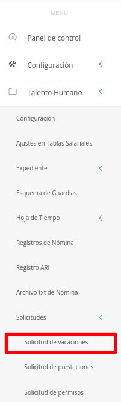
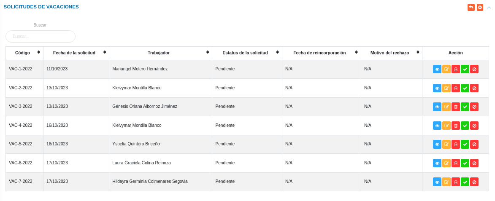
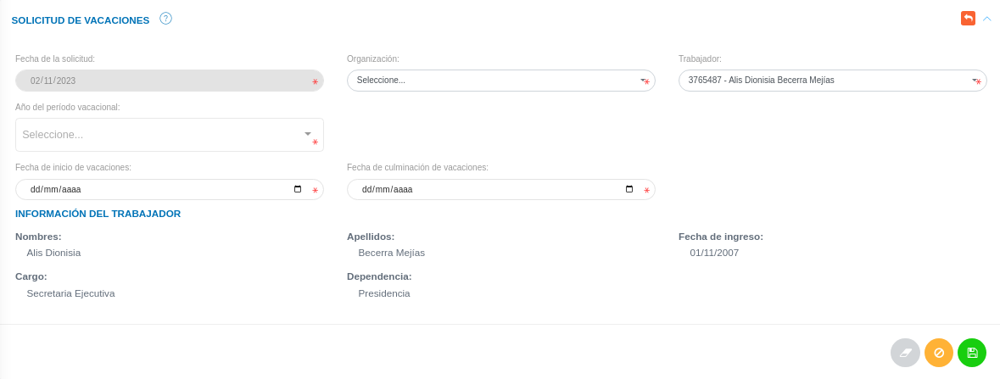
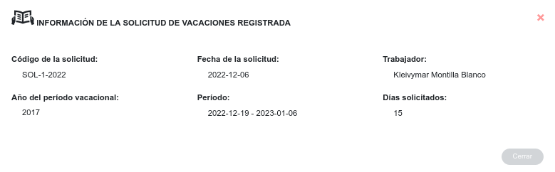
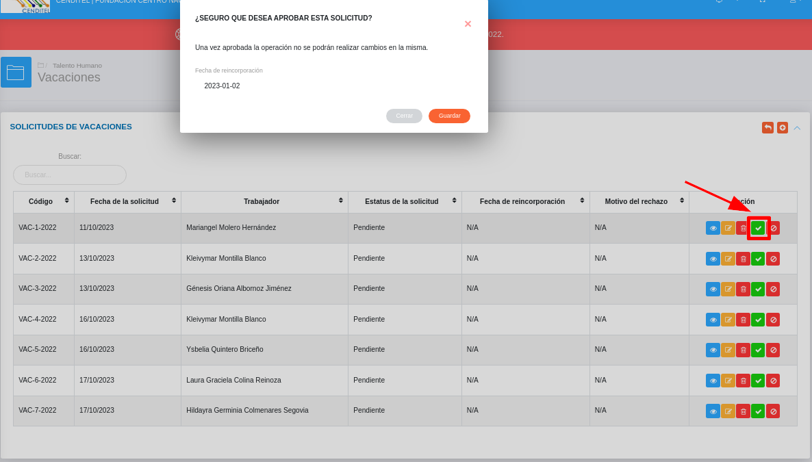
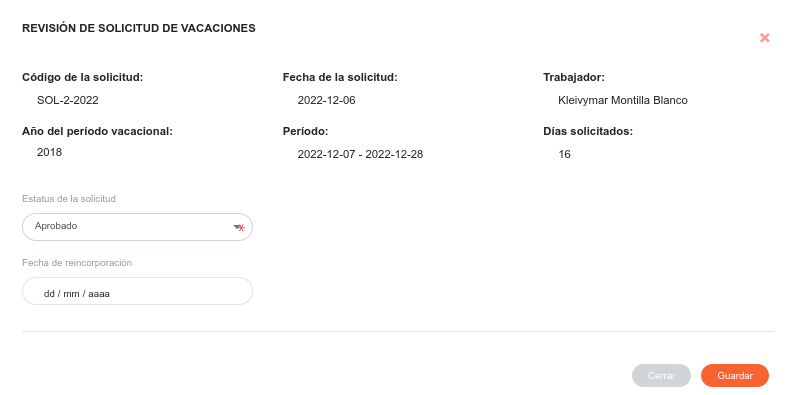
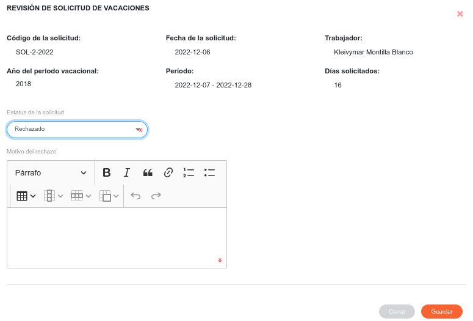

# Gestión de Solicitudes de Vacaciones
**************************************

## Solicitudes de vacaciones

En la sección **Solicitudes de Vacaciones** se lleva a cabo la gestión de vacaciones del personal de la organización.  En esta sección se listan las solicitudes de vacaciones registradas, de igual forma es posible generar una nueva solicitud de vacaciones, consultar, editar o eliminar cualquier registro.  

Para acceder a esta sección debe dirigirse al módulo de **Talento Humano**, ingresar en la opción **Solicitudes** y seleccionar **Solicitud de vacaciones**.

Figura 1: Opción Solicitudes de Vacaciones

##
Luego, el sistema muestra la interfaz de Vacaciones, compuesta por las secciones: Solicitudes de Vacaciones y Solicitudes de Vacaciones Pendientes.

Figura 2: Solicitudes de Vacaciones

##

### Crear una nueva solicitud de vacaciones

-   Ubicarse en la sección **Solicitudes de Vacaciones** y presionar el botón **Crear**  ubicado en la esquina superior derecha de esta sección para realizar una nueva solicitud.
-   Complete el formulario de la sección **Solicitud de Vacaciones**.
-   Presione el botón **Guardar**  para registrar los cambios una vez se complete el formulario.
-   Presione el botón **Cancelar**   para cancelar registro y regresar a la ruta anterior.
-   Presione el botón **Borrar**  para eliminar datos del formulario.
-   Presione el botón **Aprobar**  para dar el visto bueno a la solicitud.
-   Si desea recibir ayuda guiada, presione el botón .
-   Para retornar a la ruta anterior, presione el botón .

!!! info "Nota"
    Para realizar una solicitud de vacaciones el trabajador debe tener al menos un (1) año cumplido laborando en la organización. 

Figura 3: Formulario Solicitud de Vacaciones

##
### Gestión de registros

Para **Ver información detallada**, **Editar** o **Eliminar** un registro se debe hacer uso de los botones ubicados en la columna titulada **Acción** de la tabla de registros en la sección de **Solicitudes de Vacaciones Pendientes**.

#### Ver registros

- Presione el botón **Ver registro**  para un registro de interés.
- Luego, el sistema muestra información asociada a la solicitud vacaciones registrada.

Figura 4: Interfaz Ver registro

##

- Presione el botón **Cerrar** para salir de la interfaz.

#### Editar registros

- Presione el botón **Editar registro**  para un registro de interés.
- Luego, el sistema muestra el formulario en forma de edición.
- Modifique la información que requiera.
- Presione el botón **Guardar**   para registrar los cambios efectuados.

#### Eliminar registros

- Presione el botón **Eliminar**   para un registro de interés.
- Seguidamente, el sistema presenta un modal con un mensaje de confirmación de si está seguro de eliminar el ingreso de almacén, y muestra los botones Confirmar y Cancelar.
- Pulse el botón **Confirmar** si está seguro de eliminar el registro seleccionado.
- El sistema elimina el registro.
- Si pulsa el botón **Cancelar**, el sistema no ejecuta ninguna acción. 

## Solicitudes de vacaciones pendientes

Una vez se genera una nueva solicitud, además de añadirse a la tabla **Solicitudes de Vacaciones**, el registro se almacena en la tabla de **Solicitudes de Vacaciones Pendientes**, desde esta sección se gestiona la aprobación o rechazo de solicitud.

- Presione el botón **Aceptar solicitud** .
- Luego, el sistema muestra una interfaz con el mensaje ¿SEGURO QUE DESEA APROBAR ESTA SOLICITUD?.

Figura 5: Interfaz Aprobar o Rechazar Solicitud

##
Si el usuario selecciona el estado **Aprobado**, el sistema activa el campo Fecha de reincorporación.

Figura 6: Aprobar Vacaciones 

##
Si el usuario selecciona el estado **Rechazado**, el sistema activa el campo Motivo del Rechazo.

Figura 7: Rechazar Vacaciones 

##
Una vez se Apruebe o Rechace una solicitud de vacaciones, el estatus de dicho registro cambia según la acción que realice el usuario. Además, este registro ya no puede ser editado, ni eliminado.
