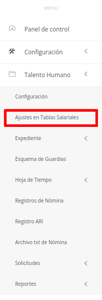
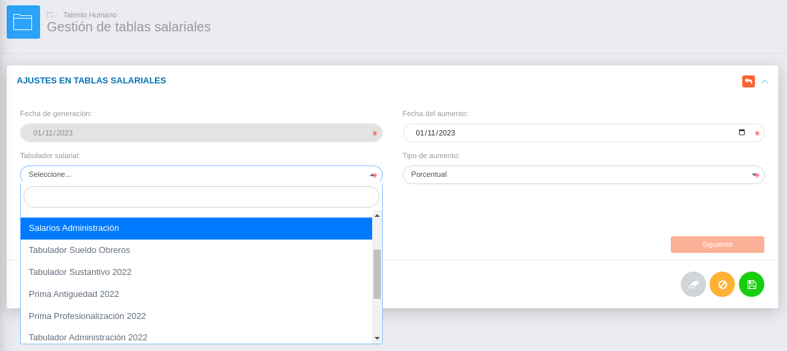
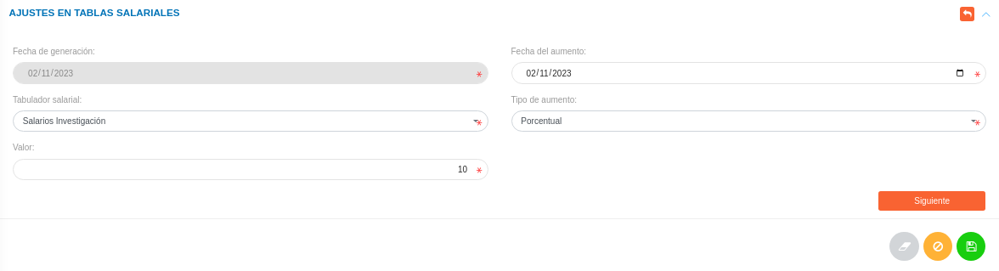
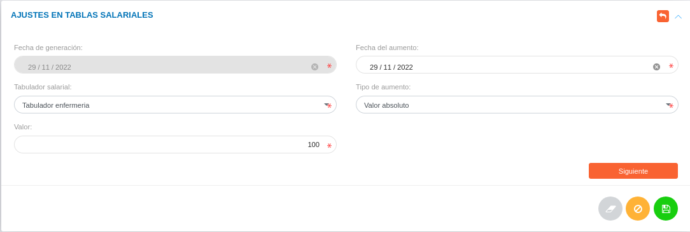
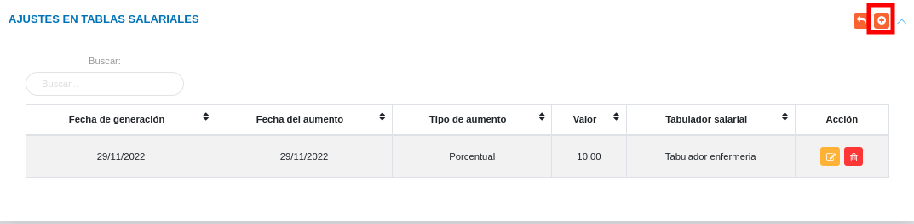
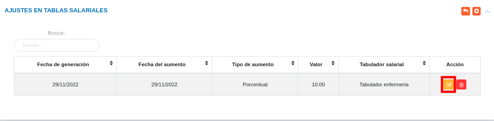
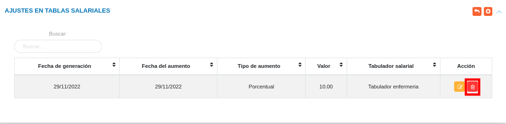

# Gestión de Tablas Salariales
******************************

El usuario selecciona el módulo de Talento Humano en el menú lateral de los módulos del sistema, ahí visualizara las opciones **Configuración**, **Ajustes en Tablas salariales**, **Expediente**, **Registros de nómina**, **Solicitudes** y  **Reportes**, debiendo pulsar **Ajustes en tablas salariales**

Figura 1: Menú del Módulo de Talento Humano para ajustes en tablas salariales

###

## Ajustes en tablas salariales

Desde esta sección es posible establecer un aumento sobre las tablas salariales.  Cabe destacar que es necesario contar con un **Tabulador** registrado previamente en la configuración del módulo para ajustar las incidencias sobre los diferentes escalafones salariales.

### Registrar ajuste en tablas salariales 

-	Dirigirse al módulo de **Talento Humano** e ingresar en **Ajustes en Tablas Salariales**.
-   Haciendo uso del botón **Crear**  ubicado en la esquina superior derecha de esta sección, se procede a registrar un nuevo ajuste de tabla salarial.

!!! info "Nota"
	-	La fecha de generación es establecida de forma automatica por el sistema, por lo que no es posible modificarla.
	-	Los tabuladores salariales corresponden a registros previos realizados en la configuración del módulo.
	-	Los aumentos salariales pueden ser expresados en porcentaje o valor absoluto, restringiendo el campo a un valor númerico. De igual forma, puede ser de tipo **Diferente** permitiendo al usuario especificar valores númericos con incidencias sobre cada escalafón salarial. 

Figura 2: Ajustes en Tablas Salariales

###

Figura 3: Ajustes en Tablas Salariales (tipo de aumento diferente)
 
##

-	Presionar el botón **Siguiente** para avanzar al siguiente formulario y verificar las incidencias sobre los escalafones salariales asociados al **Tabulador**.
-   Presione el botón **Guardar**   para registrar los cambios efectuados.
-   Presione el botón **Cancelar**   para cancelar registro y regresar a la ruta anterior.
-   Presione el botón **Borrar**  para eliminar datos del formulario.
-   Si desea recibir ayuda guiada, presione el botón .
-   Para retornar a la ruta anterior, presione el botón .

A continuación se muestra un registro de **Ajuste en tablas salariales** para un tabulador de enfermería. 

Figura 4: Registro de tabla salarial

v

## Gestionar ajustes de tablas salariales

La gestión de ajustes en tablas salariales se lleva a cabo a través del apartado **Ajustes en tablas salariales**. 

-   Para acceder a esta sección debe dirigirse a **Talento Humano** y ubicarse en la sección **Ajustes de tablas salariales** apartado **Ajustes en tablas salariales**.
-   A través del apartado **Ajustes en tablas salariales** se listan los registros de **Ajustes en tablas salariales** en una tabla.   

Desde este apartado se pueden llevar a cabo las siguientes acciones: 

-   ***Registrar ajustes de tablas salariales***.
-   ***Editar registros***. 
-   ***Eliminar registros***. 

### Registrar ajustes en tablas salariales

-   Presione el botón **Crear registro**  ubicado en la parte superior derecha del apartado **Ajustes en tablas salariales** 
-   A continuación complete el formulario siguiendo los pasos descritos en el apartado [Registrar ajustes en tablas salariales](##Registrar-ajustes-en-tablas-salariales).
-   Presione el botón **Guardar**   para registrar los cambios efectuados.

Figura 5: Registrar ajustes en tablas salariales

###

### Editar registros

-   Presione el botón **Editar registro**   ubicado en la columna titulada **Acción** del registro de ajustes en tablas salariales que se desee seleccionar para actualizar datos. 

Figura 7: Editar Registros de ajustes en tablas salariales

###
-   Actualice los datos del formulario siguiendo los pasos descritos en el apartado [Registrar ajustes en tablas salariales](#registrar-ajustes-en-tablas-salariales).
-   Presione el botón **Guardar**   para registrar los cambios efectuados.

### Eliminar registros

-   Presione el botón **Eliminar registro**   ubicado en la columna titulada **Acción** del registro de ajustes en tablas salariales que se desee seleccionar para eliminar del sistema. 

Figura 8: Eliminar Registros de ajustes en tablas salariales

###
-   Confirme que esta seguro de eliminar el registro seleccionado a través de la ventana emergente, mediante el botón **Confirmar** y efectue los cambios.  

   
