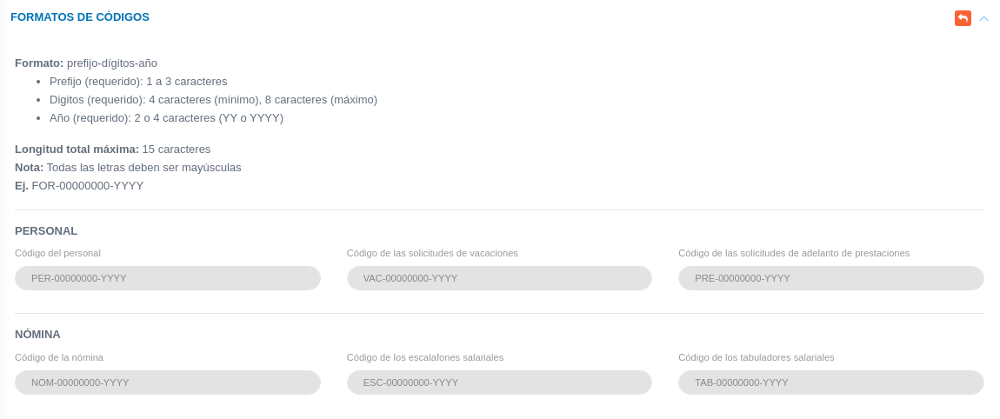

# Configuración Módulo de Talento Humano
***************************************

El usuario selecciona el módulo de Talento Humano en el menú lateral de los módulos del sistema, ahí visualizara las opciones **Configuración**, **Ajustes en Tablas salariales**, **Expediente**, **Esquemas de Gaurdia**, **Hoja de Tiempo**, **Registros de nómina**, **Registro de ARI**, **Archivo txt de Nómina**, **Solicitudes** y  **Reportes**, debiendo pulsar **Configuración**. 

Figura 1: Menú del Módulo de Talento Humano

## Formatos de códigos

La sección de **Formatos de Códigos** permite establecer un código de referencia para los registros posteriores (registro de personal, solicitudes de vacaciones, solicitudes de adelanto de prestaciones, escalafones salariales y tabuladores salariales), para completar esta configuración el usuario debe dirigirse al **Módulo de Talento Humano**, luego a **Configuración** y ubicarse en la sección **Formatos de Códigos**.

Cada código debe establecerse de acuerdo a un formato específico el cual se divide en tres (3) secciones: prefijo-dígitos-año.

-   **Prefijo**: debe contener entre 1 a 3 caracteres y debe ser único.

-   **Dígitos**: Establece el número del registro y comprende una longitud de entre 4 a 8 caracteres como máximo. Para establecer la longitud de la numeración se debe indicar con ceros (0) de acuerdo a la cantidad de dígitos máximos que se desea registrar.

-   **Año**: Indica el formato del año para el código el cual se debe indicar con la letra "Y" de acuerdo al formato deseado. Los valores posibles son: YY para formato de año corto y YYYY para el formato de año largo.

-   **Longitud total máxima**: 15 caracteres

-   **Nota**: Todas las letras deben ser mayúsculas

-   **Ejemplo**: FOR-00000000-YYYY

## Ficha de Formatos de códigos  

Se observa en primera instancia el apartado **PERSONAL** con los ítems: Código del personal, Código de las solicitudes de vacaciones y Código de las solicitudes de adelanto de prestaciones. Seguidamente en **NÓMINA** están los parámetros: Código de la nómina, Código de los escalafones salariales, y Código de los tabuladores salariales.

Figura 2: Formato de códigos del módulo de Talento Humano

##
Una vez se establezca el formato de códigos deseado se puede ejecutar cualquier cambio haciendo uso de los **Botones de Acciones de Formulario**: 

-   Presione el botón **Guardar**   para registrar los cambios efectuados.
-   Presione el botón **Cancelar**   para cancelar registro y regresar a la ruta anterior.
-   Presione el botón **Borrar**  para eliminar datos del formulario.
-   Si desea recibir ayuda guiada, presione el botón .
-   Para retornar a la ruta anterior, presione el botón .

