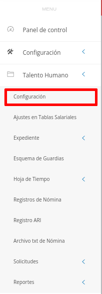
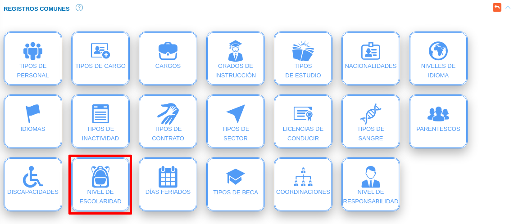

# Configuración Módulo de Talento Humano
****************************************

El usuario selecciona el módulo de Talento Humano en el menú lateral de los módulos del sistema, ahí visualizará las opciones **Configuración**, **Ajustes en Tablas salariales**, **Expediente**, **Registros de nómina**, **Solicitudes** y  **Reportes**, debiendo pulsar **Configuración** 

Figura 1: Menú del Módulo de Talento Humano

## Registros comunes

La sección de registros comunes es una herramienta de la **Configuración del Módulo de Talento Humano** que permite al administrador o un usuario con permisos especiales sobre el módulo de Talento Humano, ajustar el módulo a la organización usuaria a través de parámetros configurables.   Los datos registrados en esta sección serán considerados en todas las funcionalidades del módulo.

El usuario ingresará a **Registros Comunes**, visualizando las diferentes opciones de configuración: **Tipos de Personal, Tipos de Cargo, Cargos, Grados de Instrucción, Tipos de estudio, Nacionalidades, Niveles de Idioma, Idiomas, Tipos de inactividad, Tipos de contrato, Tipos de sector, Licencias de conducir, Tipos de sangre, Parentescos, Discapacidades, Nivel de escolaridad, Días feriados, Tipos de beca y Coordinaciones**.   

Figura 2: Registros comunes del módulo de Talento Humano

### Tipos de personal

A través de esta funcionalidad se gestiona información sobre los diferentes tipos de personal conformados en la organización, ejemplo: personal contratado.

El usuario selecciona el icono de **Tipo de personal**

#### Registro de tipo de personal

   - Complete el formulario **Tipos de personal** (ver Figura 3).   Asigne un nombre y descripción para el tipo de personal a través de los campos **Nombre** y  **Descripción** 
   -   Presione el botón  **Guardar** para registrar los cambios efectuados.
   -   Presione el botón  **Cancelar** para limpiar datos del formulario.
   -   Presione el botón  **Cerrar** para cerrar el formulario.

Figura 3: Registro de Tipo de Personal
 
### 
**Gestión de registros de tipo de personal**
-   Para editar un registro de **Tipo de personal** presione el botón **Editar**  del registro seleccionado de la tabla **Registros**.  A continuación complete el formulario **Tipo de personal** y presione el botón **Guardar** para almacenar los cambios efectuados.
-   Para eliminar un registro de **Tipo de personal** presione el botón **Eliminar**  del registro seleccionado de la tabla **Registros**. 

### Tipos de cargo

A través de esta funcionalidad se gestiona información sobre los diferentes tipos de cargos conformados en la organización, ejemplo: administrativo.

El usuario selecciona el icono de **Tipo de cargo**:

#### Registro de tipo de cargo

   - Complete el formulario **Tipos de cargo** (ver Figura 4). Asigne un nombre y descripción para el tipo de cargo a través de los campos **Nombre** y **Descripción**. 
   -   Presione el botón  **Guardar** para registrar los cambios efectuados.
   -   Presione el botón  **Cancelar** para limpiar datos del formulario.
   -   Presione el botón  **Cerrar** para cerrar el formulario.

Figura 4: Registro de Tipo de cargo
 
### 

**Gestión de registros de tipos de cargo**

-   Para editar un registro de **Tipos de cargo** presione el botón **Editar**  del registro seleccionado de la tabla **Registros**. A continuación complete el formulario **Tipos de cargo** y presione el botón **Guardar** para almacenar los cambios efectuados.
-   Para eliminar un registro de **Tipos de cargo** presione el botón **Eliminar**  del registro seleccionado de la tabla **Registros**. 

### Cargos

A través de esta funcionalidad se gestiona información sobre los diferentes cargos conformados en la organización, ejemplo: analista de investigación.

El usuario selecciona el icono de **Cargos**:

#### Registro de cargos

   - Complete el formulario **Cargos** (ver Figura 5). Asigne un nombre y descripción para el cargo a través de los campos **Nombre** y  **Descripción**. 
   -   Presione el botón  **Guardar** para registrar los cambios efectuados.
   -   Presione el botón  **Cancelar** para limpiar datos del formulario.
   -   Presione el botón  **Cerrar** para cerrar el formulario.

Figura 5: Registro de Cargo
 
### 
**Gestión de registros de cargos**

-   Para editar un registro de **Cargos** presione el botón **Editar**  del registro seleccionado de la tabla **Registros**. A continuación complete el formulario **Cargos** y presione el botón **Guardar** para almacenar los cambios efectuados.
-   Para eliminar un registro de **Cargos** presione el botón **Eliminar**  del registro seleccionado de la tabla **Registros**. 

### Grados de instrucción

A través de esta funcionalidad se gestiona información sobre los diferentes grados de instrucción del personal conformado en la organización, ejemplo: bachiller.

El usuario selecciona el icono de **Grados de Instrucción**

#### Registro de grados de instrucción

   - Complete el formulario **Grados de Instrucción** (ver Figura 6).   Asigne un nombre y descripción para el grado de instrucción a través de los campos **Nombre** y  **Descripción** 
   -   Presione el botón  **Guardar** para registrar los cambios efectuados.
   -   Presione el botón  **Cancelar** para limpiar datos del formulario.
   -   Presione el botón  **Cerrar** para cerrar el formulario.

Figura 6: Registro de grado de instrucción
 
####
**Gestión de registros de grado de instrucción**

-   Para editar un registro de **Grado de instrucción** presione el botón **Editar**  del registro seleccionado de la tabla **Registros**.  A continuación complete el formulario **Grados de Instrucción** y presione el botón **Guardar** para almacenar los cambios efectuados.
-   Para eliminar un registro de **Grados de Instrucción** presione el botón **Eliminar**  del registro seleccionado de la tabla **Registros**. 

### Tipos de estudio

A través de esta funcionalidad se gestiona información sobre los diferentes tipos de estudio, ejemplo: pregrado.

El usuario selecciona el icono de **Tipos de Estudio**

#### Registro de tipos de estudio

   - Complete el formulario **Tipos de Estudio** (ver Figura 7).   Asigne un nombre y descripción para el tipo de estudio a través de los campos **Nombre** y  **Descripción** 
   -   Presione el botón  **Guardar** para registrar los cambios efectuados.
   -   Presione el botón  **Cancelar** para limpiar datos del formulario.
   -   Presione el botón  **Cerrar** para cerrar el formulario.

Figura 7: Registro de tipos de estudios
 

####
**Gestión de registros de tipos de estudio**

-   Para editar un registro de **Tipos de Estudio** presione el botón **Editar**  del registro seleccionado de la tabla **Registros**.  A continuación complete el formulario **Tipos de Estudio** y presione el botón **Guardar** para almacenar los cambios efectuados.
-   Para eliminar un registro de **Tipos de Estudio** presione el botón **Eliminar**  del registro seleccionado de la tabla **Registros**. 

### Nacionalidades

A través de esta funcionalidad se gestiona información sobre las diferentes nacionalidades a registrar en el sistema, ejemplo: Venezolano(a).

El usuario selecciona el icono de **Nacionalidades**

#### Registro de nacionalidades

   - Complete el formulario **Nacionalidades** (ver Figura 8).   Asigne un nombre y descripción para la nacionalidad a través de los campos **Nombre** y  **Descripción** 
   -   Presione el botón  **Guardar** para registrar los cambios efectuados.
   -   Presione el botón  **Cancelar** para limpiar datos del formulario.
   -   Presione el botón  **Cerrar** para cerrar el formulario.

Figura 8: Registro de nacionalidades
 
####
**Gestión de registros de nacionalidades**

-   Para editar un registro de **Nacionalidades** presione el botón **Editar**  del registro seleccionado de la tabla **Registros**.  A continuación complete el formulario **Nacionalidades** y presione el botón **Guardar** para almacenar los cambios efectuados.
-   Para eliminar un registro de **Nacionalidades** presione el botón **Eliminar**  del registro seleccionado de la tabla **Registros**. 

### Niveles de idioma

A través de esta funcionalidad se gestiona información sobre los niveles de manejo de idiomas, ejemplo: Básico.

El usuario selecciona el icono de **Niveles de Idioma**

#### Registro de niveles de idioma

   - Complete el formulario **Niveles de Idioma** (ver Figura 9).   Asigne un nombre para el nivel de idioma a través del campo **Nombre** 
   -   Presione el botón  **Guardar** para registrar los cambios efectuados.
   -   Presione el botón  **Cancelar** para limpiar datos del formulario.
   -   Presione el botón  **Cerrar** para cerrar el formulario.

Figura 9: Registro de nivel de idioma
 
####
**Gestión de registros de niveles de idioma**

-   Para editar un registro de **Niveles de Idioma** presione el botón **Editar**  del registro seleccionado de la tabla **Registros**.  A continuación complete el formulario **Niveles de Idioma** y presione el botón **Guardar** para almacenar los cambios efectuados.
-   Para eliminar un registro de **Niveles de Idioma** presione el botón **Eliminar**  del registro seleccionado de la tabla **Registros**. 

### Idiomas

A través de esta funcionalidad se gestiona información sobre los idiomas a registrar en el sistema, ejemplo: Inglés.

El usuario selecciona el icono de **Idiomas**

#### Registro de idiomas

   - Complete el formulario **Idiomas** (ver Figura 10).   Asigne un nombre y un acrónimo para el idioma a través de los campos **Nombre** y **Acrónimo** 
   -   Presione el botón  **Guardar** para registrar los cambios efectuados.
   -   Presione el botón  **Cancelar** para limpiar datos del formulario.
   -   Presione el botón  **Cerrar** para cerrar el formulario.

Figura 10: Registro de idioma
 
####
**Gestión de registros de idiomas**

-   Para editar un registro de **Idiomas** presione el botón **Editar**  del registro seleccionado de la tabla **Registros**.  A continuación complete el formulario **Idiomas** y presione el botón **Guardar** para almacenar los cambios efectuados.
-   Para eliminar un registro de **Idiomas** presione el botón **Eliminar**  del registro seleccionado de la tabla **Registros**.

### Tipos de inactividad

A través de esta funcionalidad se gestiona información sobre los tipos de inactividad, ejemplo: Jubilado.

El usuario selecciona el icono de **Tipo de inactividad**

#### Registro de tipo de inactividad

   - Complete el formulario **Tipo de inactividad** (ver Figura 11).   Asigne un nombre para el tipo de inactividad a través del campo **Nombre**  
   -   Presione el botón  **Guardar** para registrar los cambios efectuados.
   -   Presione el botón  **Cancelar** para limpiar datos del formulario.
   -   Presione el botón  **Cerrar** para cerrar el formulario.

Figura 11: Registro de tipo de inactividad
 
####
**Gestión de registros de tipo de inactividad**

-   Para editar un registro de **Tipo de inactividad** presione el botón **Editar**  del registro seleccionado de la tabla **Registros**.  A continuación complete el formulario **Tipo de inactividad** y presione el botón **Guardar** para almacenar los cambios efectuados.
-   Para eliminar un registro de **Tipo de inactividad** presione el botón **Eliminar**  del registro seleccionado de la tabla **Registros**.

### Tipos de contrato

A través de esta funcionalidad se gestiona información sobre los diferentes tipos de contratos a gestionar en una organización, ejemplo: tiempo indeterminado.

El usuario selecciona el icono de **Tipo de contrato**

#### Registro de tipo de contrato

   - Complete el formulario **Tipo de contrato** (ver Figura 12).   Asigne un nombre para el tipo de contrato a través del campo **Nombre**  
   -   Presione el botón  **Guardar** para registrar los cambios efectuados.
   -   Presione el botón  **Cancelar** para limpiar datos del formulario.
   -   Presione el botón  **Cerrar** para cerrar el formulario.

Figura 12: Registro de tipo de contrato
 
####
**Gestión de registros de tipo de contrato**

-   Para editar un registro de **Tipo de contrato** presione el botón **Editar**  del registro seleccionado de la tabla **Registros**.  A continuación complete el formulario **Tipo de contrato** y presione el botón **Guardar** para almacenar los cambios efectuados.
-   Para eliminar un registro de **Tipo de contrato** presione el botón **Eliminar**  del registro seleccionado de la tabla **Registros**.

### Tipos de sector

A través de esta funcionalidad se gestiona información sobre los diferentes tipos de sectores a gestionar en una organización, ejemplo: privado.

El usuario selecciona el icono de **Tipo de sector**

#### Registro de tipo de sector

   - Complete el formulario **Tipo de sector** (ver Figura 13).   Asigne un nombre para el tipo de sector a través del campo **Nombre**  
   -   Presione el botón  **Guardar** para registrar los cambios efectuados.
   -   Presione el botón  **Cancelar** para limpiar datos del formulario.
   -   Presione el botón  **Cerrar** para cerrar el formulario.

Figura 13: Registro de tipo de sector
 
####
**Gestión de registros de tipo de sector**

-   Para editar un registro de **Tipo de sector** presione el botón **Editar**  del registro seleccionado de la tabla **Registros**.  A continuación complete el formulario **Tipo de sector** y presione el botón **Guardar** para almacenar los cambios efectuados.
-   Para eliminar un registro de **Tipo de sector** presione el botón **Eliminar**  del registro seleccionado de la tabla **Registros**.

### Licencia de conducir

A través de esta funcionalidad se gestiona información sobre los grados de licencia de conducir, ejemplo: primer grado.

El usuario selecciona el icono de **Licencia de conducir**

#### Registro de licencia de conducir

   - Complete el formulario **Licencia de conducir** (ver Figura 14).   Asigne un nombre y una descripción para la licencia de conducir a través de los campos **Nombre** y **Descripción**  
   -   Presione el botón  **Guardar** para registrar los cambios efectuados.
   -   Presione el botón  **Cancelar** para limpiar datos del formulario.
   -   Presione el botón  **Cerrar** para cerrar el formulario.

Figura 14: Registro de licencias de conducir
 
####
**Gestión de registros de licencia de conducir**

-   Para editar un registro de **licencia de conducir** presione el botón **Editar**  del registro seleccionado de la tabla **Registros**.  A continuación complete el formulario **licencia de conducir** y presione el botón **Guardar** para almacenar los cambios efectuados.
-   Para eliminar un registro de **licencia de conducir** presione el botón **Eliminar**  del registro seleccionado de la tabla **Registros**.

### Tipos de sangre

A través de esta funcionalidad se gestiona información sobre los diferentes tipos de sangre.

El usuario selecciona el icono de **Tipo de Sangre**

#### Registro de tipos de sangre

   - Complete el formulario **Tipo de Sangre** (ver Figura 15).   Asigne un nombre para el tipo de sangre a través del campo **Nombre**  
   -   Presione el botón  **Guardar** para registrar los cambios efectuados.
   -   Presione el botón  **Cancelar** para limpiar datos del formulario.
   -   Presione el botón  **Cerrar** para cerrar el formulario.

Figura 15: Registro de tipos de sangre
 
####
**Gestión de registros de tipo de sangre**

-   Para editar un registro de **Tipo de sangre** presione el botón **Editar**  del registro seleccionado de la tabla **Registros**.  A continuación complete el formulario **Tipo de sangre** y presione el botón **Guardar** para almacenar los cambios efectuados.
-   Para eliminar un registro de **Tipo de sangre** presione el botón **Eliminar**  del registro seleccionado de la tabla **Registros**.

#### Parentescos

A través de esta funcionalidad se gestiona información sobre los diferentes tipos de parentescos.
El usuario selecciona el icono Parentescos

#### Registro de Parentesco
   - Complete el formulario **Parentesco** (ver Figura 16).   Indique el nombre del parentesco requerido **Nombre**  
   -   Presione el botón  **Guardar** para registrar los cambios efectuados.
   -   Presione el botón  **Cancelar** para limpiar datos del formulario.
   -   Presione el botón  **Cerrar** para cerrar el formulario.

Figura 16: Registros de Parentesco

####

**Gestión de registros de Parentesco**

-   Para editar un registro de **Parentesco** presione el botón **Modificar Registro**  del registro seleccionado de la tabla **Parentesco**.  A continuación complete el formulario y presione el botón **Guardar** para almacenar los cambios efectuados.
-   Para eliminar un registro de **Parentesco** presione el botón **Eliminar**, el sistema emitirá una advertencia "¿Está seguro de eliminar este registro?"   del registro seleccionado de la tabla **Registros**.

### Discapacidades

A través de esta funcionalidad se gestiona información sobre las diferentes discapacidades, ejemplo: Discapacidad motora.

El usuario selecciona el icono de **Discapacidad**

#### Registro de discapacidades

   - Complete el formulario **Discapacidad** (ver Figura 17).   Asigne un nombre y una descripción para la discapacidad a través de los campos **Nombre** y **Descripción**  
   -   Presione el botón  **Guardar** para registrar los cambios efectuados.
   -   Presione el botón  **Cancelar** para limpiar datos del formulario.
   -   Presione el botón  **Cerrar** para cerrar el formulario.

Figura 17: Registro de discapacidades
 
###
**Gestión de registros de Discapacidades**

-   Para editar un registro de **Discapacidad** presione el botón **Editar**  del registro seleccionado de la tabla **Registros**.  A continuación complete el formulario **Discapacidad** y presione el botón **Guardar** para almacenar los cambios efectuados.
-   Para eliminar un registro de **Discapacidad** presione el botón **Eliminar**  del registro seleccionado de la tabla **Registros**.

### Nivel de escolaridad

A través de esta funcionalidad se gestiona información sobre los diferentes niveles de escolaridad, esto para efectos de los hijos de los trabajadores, ejemplo: Primaria.

El usuario selecciona el icono de **Nivel de escolaridad**

#### Registro de nivel de escolaridad

   - Complete el formulario **Nivel de escolaridad** (ver Figura 18).   Asigne un nombre y una descripción para el nivel de escolaridad a través de los campos **Nombre** y **Descripción**  
   -   Presione el botón  **Guardar** para registrar los cambios efectuados.
   -   Presione el botón  **Cancelar** para limpiar datos del formulario.
   -   Presione el botón  **Cerrar** para cerrar el formulario.

Figura 18: Registro de nivel de escolaridad
 
###
**Gestión de registros de nivel de escolaridad**

-   Para editar un registro de **Nivel de escolaridad** presione el botón **Editar**  del registro seleccionado de la tabla **Registros**.  A continuación complete el formulario **Nivel de escolaridad** y presione el botón **Guardar** para almacenar los cambios efectuados.
-   Para eliminar un registro de **Nivel de escolaridad** presione el botón **Eliminar**  del registro seleccionado de la tabla **Registros**.

### Días Feriados

A través de esta funcionalidad se gestiona información sobre los diferentes días feriados, esto para efectos de las solicitudes de los trabajadores.

El usuario selecciona el icono de **Días feriados**

#### Registro de días feriados

   - Complete el formulario **Días feriados** (ver Figura 19).   Asigne un día feriado y un nombre para el día feriado a través de los campos **día feriado** y **Nombre**  
   -   Presione el botón  **Guardar** para registrar los cambios efectuados.
   -   Presione el botón  **Cancelar** para limpiar datos del formulario.
   -   Presione el botón  **Cerrar** para cerrar el formulario.

Figura 19: Registro de días feriados
 
###
**Gestión de registros de días feriados**

-   Para editar un registro de **Días feriados** presione el botón **Editar**  del registro seleccionado de la tabla **Registros**.  A continuación complete el formulario **Días feriados** y presione el botón **Guardar** para almacenar los cambios efectuados.
-   Para eliminar un registro de **Días feriados** presione el botón **Eliminar**  del registro seleccionado de la tabla **Registros**.

### Tipos de Beca

A través de esta funcionalidad se gestiona información sobre los diferentes Tipos de Beca, esto para efectos de las solicitudes educativas de los trabajadores.

El usuario selecciona el icono de **Tipos de Beca**

Aquí el usuario encontrará una ficha que contiene "Nombre"	"Descripción"	"Acción" (Modificar o Eliminar). Se podrá determinar si corresponde a una "Beca completa": 100% del monto de la factura de la Institución, Beca parcial 1: 80% de la factura, Beca parcial 2: 80% del salario normal, entre otras posibles configuraciones.

#### Registro de Tipos de Beca

  
   - Complete el formulario **Tipos de Beca** (ver Figura 20). Asigne un tipo de Beca y un nombre a través de los campos **Nombre** y **Descripción**.  
   -   Presione el botón  **Guardar** para registrar los cambios efectuados.
   -   Presione el botón  **Cancelar** para limpiar datos del formulario.
   -   Presione el botón  **Cerrar** para cerrar el formulario.

Figura 20: Registro de Tipos de Beca
 
###
**Gestión de registros de Tipos de Beca**

-   Para editar un registro de *Tipos de Beca** presione el botón **Editar**  del registro seleccionado de la tabla **Registros**.  A continuación complete el formulario **Tipos de Beca** y presione el botón **Guardar** para almacenar los cambios efectuados.
-   Para eliminar un registro de **Tipos de Beca** presione el botón **Eliminar**  del registro seleccionado de la tabla **Registros**.

### Coordinaciones

A través de esta funcionalidad se gestiona información sobre las diferentes Coordinaciones vinculadas con los trabajadores.

Para utilizar el formulario seleccione el icono de **Coordinaciones**:

#### Registro de Coordinaciones

   - Complete el formulario **Coordinación** (ver Figura 21). Defina las diferentes coordinaciones a través de los campos **Nombre**, **Descripción** y **Departamento de adscripción**.
   -   Presione el botón  **Guardar** para registrar los cambios efectuados.
   -   Presione el botón  **Cancelar** para limpiar datos del formulario.
   -   Presione el botón  **Cerrar** para cerrar el formulario.

Figura 21: Registro de Tipos de Coordinaciones
 
###
**Gestión de registros de Coordinaciones**

-   Para editar un registro de **Tipos de Coordinaciones** presione el botón **Editar**  del registro seleccionado de la tabla **Registros**.  A continuación complete el formulario **Tipos de Coordinaciones** y presione el botón **Guardar** para almacenar los cambios efectuados.
-   Para eliminar un registro de **Tipos de Coordinaciones** presione el botón **Eliminar**  del registro seleccionado de la tabla **Registros**.
###
#### Nivel de Responsabilidades 
###
A través de esta funcionalidad se gestiona información sobre las diferentes responsabilidades vinculadas con los trabajadores.

Para utilizar el formulario seleccione el icono de **Nivel de Responsabilidades**:

###
En el formulario de NIVEL DE RESPONSABILIDADES el sistema muestra un botón (naranja desactivado/verde activado) para indicar el nivel de responsabilidad por departamento o coordinación.Este botón Departamento/Coordinación el sistema lo muestra por defecto deshabilitado y solicita por defecto la responsabilidad por Departamento. Si este botón se activa el sistema solicita la responsabilidad por coordinación. Para esto se presenta un desplegable para elegir el departamento/coordinación que corresponda. Seguidamente se especifica el **Responsable** que determina la persona que asumirá la responsabilidad del Departamento o Coordinación.
###
Más adelante, se cuenta con un desplegable para indicar el Cargo asociado al nivel de responsabilidad. Finalmente, el sistema muestra los botones “Cerrar”, “Cancelar” y “Guardar”.
###
Para cerrar se listan los registros guardados señalando: Departamento / Coordinación, Responsable, Cargo y Acción (Modificar o eliminar). 
#### Validaciones
Este formulario tiene algunas validaciones, las cuales son: 
###
1. El campo Departamento es de tipo selector y obligatorio.
###
2. El campo Responsable es de tipo selector y obligatorio.
###
3. El campo Cargo es de tipo selector y obligatorio.
###
4. El sistema debe validar que un Departamento/Coordinación posea sólo un responsable.
###
5. El sistema debe validar que un trabajador no posea más de un cargo de responsabilidad.
###
6. El campo cargo debe listar sólo los cargos de responsabilidad.
###

Figura 22: Nivel de Responsabilidades 
 
###
   -   Presione el botón  **Guardar** para registrar los cambios efectuados.
   -   Presione el botón  **Cancelar** para limpiar datos del formulario.
   -   Presione el botón  **Cerrar** para cerrar el formulario.
