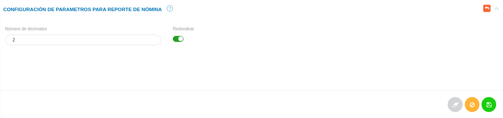

# Configuración Módulo de Talento Humano
****************************************

El usuario selecciona el módulo de Talento Humano en el menú lateral de los módulos del sistema, ahí visualizara las opciones **Configuración**, **Ajustes en Tablas salariales**, **Expediente**, **Registros de nómina**, **Solicitudes** y  **Reportes**, debiendo pulsar **Configuración** 

Figura 1: Menú del Módulo de Talento Humano

##
## Configuración de parámetros para reporte de nómina

Desde esta sección se establecen los parámetros para el reporte de nómina; tales como: el número de décimales a emplear, botón para activar o no el Redondeo y botón que permite activar o no los conceptos en cero.

Para completar esta configuración el usuario debe dirigirse al **Módulo de Talento Humano**, luego a **Configuración** y ubicarse en la sección **Configuración de parámetros para reporte de nómina**.

Figura 2: Configuración de parámetros para reporte de nómina

##
Una vez se establezcan los parámetros requeridos se puede ejecutar cualquier cambio haciendo uso de los **Botones de Acciones de Formulario**: 

-   Presione el botón **Guardar**   para registrar los cambios efectuados.
-   Presione el botón **Cancelar**   para cancelar registro y regresar a la ruta anterior.
-   Presione el botón **Borrar**  para eliminar datos del formulario.
-   Si desea recibir ayuda guiada, presione el botón .
-   Para retornar a la ruta anterior, presione el botón .

