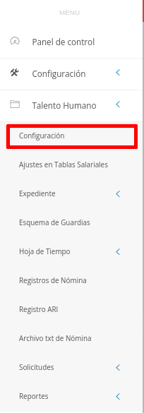

# Configuración Módulo de Talento Humano
****************************************

El usuario selecciona el módulo de Talento Humano en el menú lateral de los módulos del sistema, ahí visualizara las opciones **Configuración**, **Ajustes en Tablas salariales**, **Expediente**, **Registros de nómina**, **Solicitudes** y  **Reportes**, debiendo pulsar **Configuración** 

Figura 1: Menú del Módulo de Talento Humano

##
## Configuración de la edad laboral permitida

Desde esta sección se establece la edad laboral permitida, parámetro que será considerado en las diferentes secciones del módulo. Para completar esta configuración el usuario debe dirigirse al **Módulo de Talento Humano**, luego a **Configuración** y ubicarse en la sección **Configuración de la edad laboral permitida**.

Figura 2: Configuración de la Edad Laboral Permitida

##
Una vez se establezca el formato de códigos deseado se puede ejecutar cualquier cambio haciendo uso de los **Botones de Acciones de Formulario**: 

-   Presione el botón **Guardar**   para registrar los cambios efectuados.
-   Presione el botón **Cancelar**   para cancelar registro y regresar a la ruta anterior.
-   Presione el botón **Borrar**  para eliminar datos del formulario.
-   Si desea recibir ayuda guiada, presione el botón .
-   Para retornar a la ruta anterior, presione el botón .

