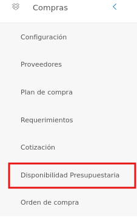
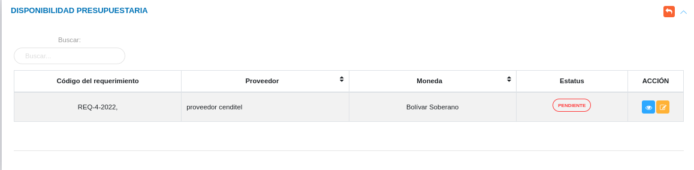
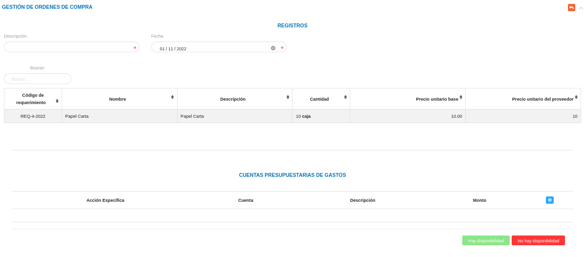
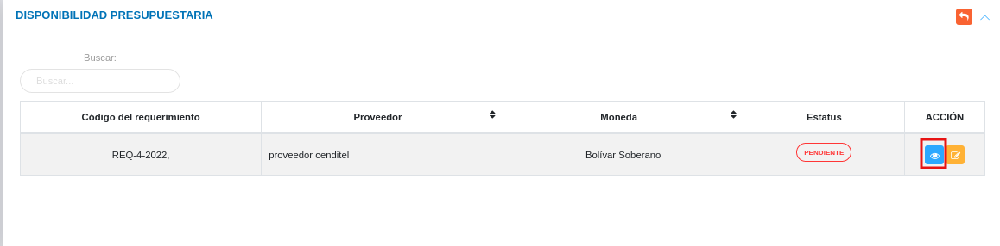
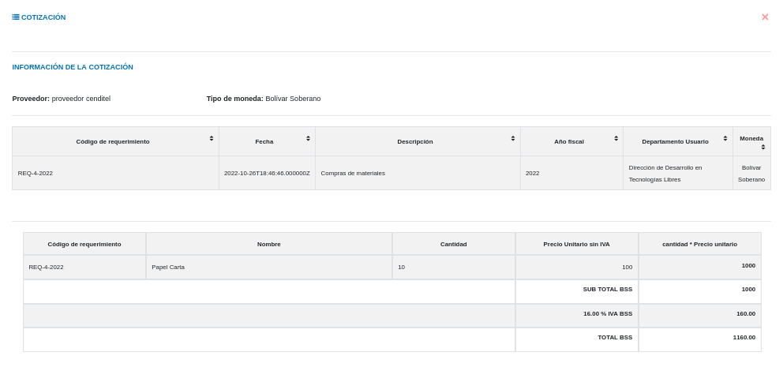
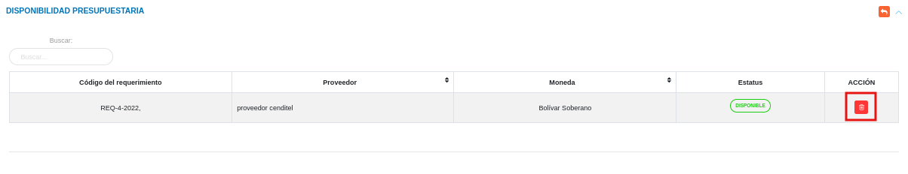

# Gestión de Disponibilidad Presupuestaria
************************

El usuario selecciona el módulo de Compras en el menú lateral de los módulos del sistema, ahí visualizara las opciones **Configuración**, **Proveedores**, **Plan de compras**, **Requerimientos**, **Cotización**, **Disponibilidad Presupuestaria** y **Orden de compras**, debiendo pulsar **Disponibilidad Presupuestaria** 

Figura 59: Menú del Módulo de Compras

## Disponibilidad Presupuestaria

A través de esta sección se lleva a cabo la gestión de disponibilidad presupuestaria en el módulo de compras. Esta sección lista los registros de disponibilidad presupuestaria con información relevante sobre cada uno de ellos, desde la tabla de registros es posible crear un nuevo registro o gestionar cualquier registro de disponibilidad presupuestaria.  

Figura 60: Tabla de registros de disponibilidad presupuestaria

### Registrar disponibilidad presupuestaria

-   El usuario ingresará a la opción **Disponibilidad Presupuestaria** 
-   Haciendo uso del botón **Solicitar Disponibilidad**  ubicado en la columna titulada **Acción** de un registro de disponibilidad presupuestaria que se desea solicitar.
-   El sistema despliega un formulario de disponibilidad presupuestaria para completar los datos del mismo. 
- Complete el formulario de disponibilidad presupuestaria. Tenga en consideración completar los campos obligatorios que son requeridos para el registro de una disponibilidad presupuestaria. 

Para agregar una cuenta presupuestaria acceda a **Presupuesto** > **Configuración(Proyectos y Acciones Especificas)** > **Formulación**. 

   
- Presione el botón **Guardar**   para registrar los cambios efectuados.
- Presione el botón **Cancelar**   para cancelar registro y regresar a la ruta anterior.
- Presione el botón **Borrar**  para eliminar datos del formulario.
- Si desea recibir ayuda guiada presione el botón .
- Para retornar a la ruta anterior presione el botón .

## Gestionar disponibilidad presupuestaria

La gestión de plan de compras se lleva a cabo a través del apartado **Disponibilidad Presupuestaria**. 

-   Para acceder a esta sección debe dirigirse a **Compras** y ubicarse en la sección **Disponibilidad Presupuestaria** apartado **Disponibilidad Presupuestaria** (ver Figura 60).

A través del apartado **Disponibilidad Presupuestaria** se listan los registros de **Disponibilidad Presupuestaria** en una tabla.   

Desde este apartado se pueden llevar a cabo las siguientes acciones: 

-   ***Registrar disponibilidad presupuestaria***.   
-   ***Consultar registros***.
-   ***Eliminar registros***. 

Figura 61: Disponibilidad presupuestaria registradas

### Registrar disponibilidad presupuestaria

-   Presione el botón **Solicitar Disponibilidad**  ubicado en ubicado en la columna titulada **Acción** de un registro de disponibilidad presupuestaria que se desea solicitar. 
-   A continuación complete el formulario siguiendo los pasos descritos en el apartado [Registrar disponibilidad presupuestaria](##Registrar-disponibilidad_presupuestaria).
-   Presione el botón **Guardar**   para registrar los cambios efectuados.

Figura 62: Registrar Disponibilidad Presupuestaria

### Consultar registros

-   Presione el botón **Consultar registro**  ubicado en la columna titulada **Acción** de un registro de disponibilidad presupuestaria  que se prefiere consultar. 

Figura 63: Consultar Registros de disponibilidad presupuestaria 

-   A continuación el sistema despliega una sección donde se describen los datos de la dispobnibilidad presupuestaria seleccionada. 

Figura 64: Datos de la disponibilidad presupuestaria

### Eliminar registros

-   Presione el botón **Eliminar registro**   ubicado en la columna titulada **Acción** del registro de disponibilidad presupuestaria que se desee seleccionar para eliminar del sistema. 

Figura 65: Eliminar Registros de disponibilidad presupuestaria

-   Confirme que esta seguro de eliminar el registro seleccionado a través de la ventana emergente, mediante el botón **Confirmar** y efectue los cambios. 