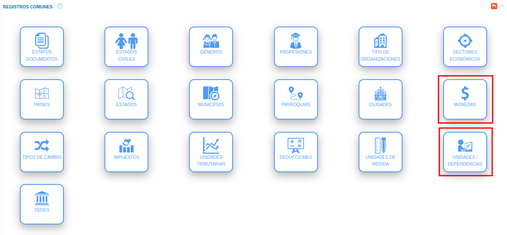
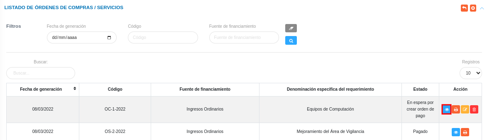
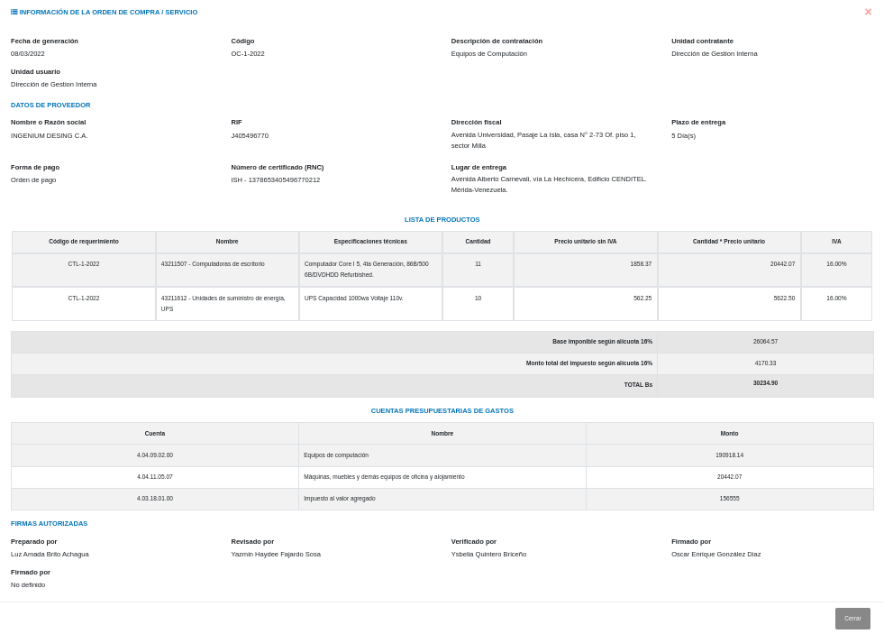

# Gestión de Orden de compra
************************

El usuario selecciona el módulo de Compras en el menú lateral de los módulos del sistema, ahí visualizará las opciones **Configuración**, **Proveedores**, **Planes de compras**, **Requerimientos**, **Cotizaciones**, y **Órdenes de compras/servicios**, debiendo pulsar **Órdenes de compras/servicios**. 

Figura 1: Menú del Módulo de Compras

  

## Orden de Compras/Servicios

A través de esta sección se lleva a cabo la gestión de orden de compras en el módulo de compras. Esta sección lista los registros de orden de compras con información relevante sobre cada uno de ellos. Desde la tabla de registros es posible crear un nuevo registro o gestionar cualquier registro de orden de compras.  

Figura 2: Tabla de registros de las órdenes de compras

  

### Registrar orden de compras 

-   El usuario ingresará a la opción **Órdenes de compras/servicios** 
-   Haciendo uso del botón **Crear**  ubicado en la esquina superior derecha de esta sección, se procede a realizar un nuevo registro de orden de compras.
-   El sistema despliega un formulario de orden de compras para completar los datos del mismo. 
- Complete el formulario de orden de compras. Tenga en consideración completar los campos obligatorios que son requeridos para el registro de un plan de compras. 

Para agregar tipos de monedas, unidad usuaria y unidad contratante acceda a **Configuración** > **Registros Comunes**. 

   
  

   -   ***Monedas***: Para crear un nuevo registro de monedas acceda a **Configuración** > **Registros Comunes** > **Monedas**.
   -   ***Unidad usuaria/Unidad contratante***: Para crear un nuevo registro de unidades/dependencias acceda a **Configuración** > **Registros comunes** > **Unidades/Dependencias**.

Para agregar proveedores del módulo de Compras acceda a **Compras** > **Proveedores**. 

   
  

Para agregar registros comunes del módulo de Compras acceda a **Compras** > **Configuración** > **Registros Comunes**. 

   
  

   -   ***Denominación del requerimiento***: Para crear un nuevo registro de objetos del proveedor acceda a **Compras** > **Configuración** > **Objetos del proveedor**.
   -   ***Modalidad de Compras***: Para crear un nuevo registro de tipo o modalidad de compras acceda a **Configuración** > **General** > **Registros Comunes** > **Modalidades de compras**.
  

- Presione el botón **Guardar**   para registrar los cambios efectuados.
- Presione el botón **Cancelar**   para cancelar registro y regresar a la ruta anterior.
- Presione el botón **Borrar**  para eliminar datos del formulario.
- Si desea recibir ayuda guiada presione el botón .
- Para retornar a la ruta anterior presione el botón .

## Gestionar orden de compras

La gestión de orden de compras se lleva a cabo a través del apartado **Órdenes de compras/servicios**. 

-   Para acceder a esta sección debe dirigirse a **Compras** y ubicarse en la sección **Órdenes de compras/servicios**. En este apartado se listan los registros en una tabla.

Desde este apartado se pueden llevar a cabo las siguientes acciones: 

-   ***Registrar orden de compras***.   
-   ***Consultar registros***.
-   ***Imprimir registros***. 
-   ***Editar registros***. 
-   ***Eliminar registros***. 

Figura 3: Órdenes de compras registradas

  

### Registrar orden de compras

-   Presione el botón **Crear registro**  ubicado en la parte superior derecha del apartado **Orden de compras**.

Figura 4: Registrar Orden de Compras

  

-   A continuación complete el formulario siguiendo los pasos descritos en el apartado [Registrar orden de compras](##Registrar-orden-de-compras).
-   Presione el botón **Guardar**   para registrar los cambios efectuados.

Figura 5: Formulario de registro de orden de compras 

  

### Consultar registros

-   Presione el botón **Consultar registro**  ubicado en la columna titulada **Acción** de un registro de orden de compras que se prefiere consultar. 

Figura 6: Consultar registros de orden de compras 

  

-   A continuación el sistema despliega una sección donde se describen los datos de la orden de compras seleccionada. 

Figura 7: Datos de la orden de compras

  

### Imprimir registro

-   Presione el botón **Imprimir registro**   ubicado en la columna titulada **Acción** del registro de orden de compras que se desee seleccionar para imprimir el reporte. 

Figura 8: Imprimir orden de compra

  

- El sistema presenta en un documento PDF, el archivo generado con la orden de compras. 

### Editar registros

-   Presione el botón **Editar registro**   ubicado en la columna titulada **Acción** del registro de orden de compras que se desee seleccionar para actualizar datos. 

Figura 9: Editar registros de orden de compras

  

-   Actualice los datos del formulario siguiendo los pasos descritos en el apartado [Registrar orden de compras](#registrar-orden-de-compras).
-   Presione el botón **Guardar**   para registrar los cambios efectuados.

### Eliminar registros

-   Presione el botón **Eliminar registro**   ubicado en la columna titulada **Acción** del registro de orden de compras que se desee seleccionar para eliminar del sistema. 

Figura 10: Eliminar registros de orden de compras

  

-   Confirme que esta seguro de eliminar el registro seleccionado a través de la ventana emergente, mediante el botón **Confirmar**. 
  
