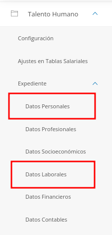
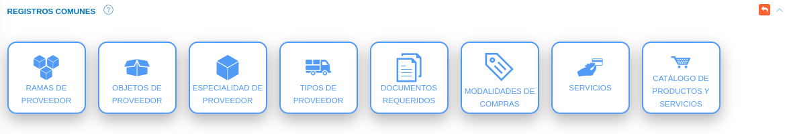
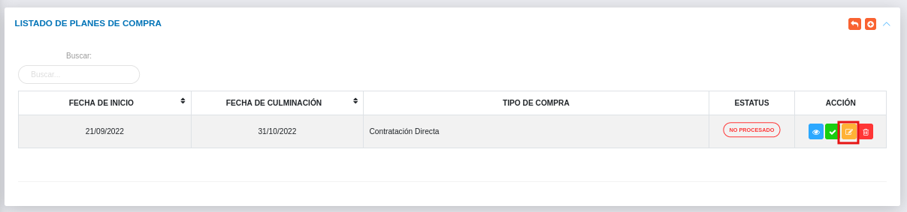

# Gestión de Plan de Compras
************************

El usuario selecciona el módulo de Compras en el menú lateral de los módulos del sistema, ahí visualizara las opciones **Configuración**, **Proveedores**, **Plan de compras**, **Requerimientos**, **Cotización**, **Disponibilidad Presupuestaria** y **Orden de compras**, debiendo pulsar **Plan de Compras** 

Figura 21: Menú del Módulo de Compras

## Plan de Compras

A través de esta sección se lleva a cabo la gestión de plan de compras en el módulo de compras. Esta sección lista los registros de planes de compras con información relevante sobre cada uno de ellos, desde la tabla de registros es posible crear un nuevo registro o gestionar cualquier registro de plan de compras.  

Figura 22: Tabla de registros de los planes de compras

### Registrar plan de compras 

-   El usuario ingresará a la opción **Plan de Compras** 
-   Haciendo uso del botón **Crear**  ubicado en la esquina superior derecha de esta sección(Figura 22 Tabla de registros de planes de compras), se procede a realizar un nuevo registro de plan de compras.
-   El sistema despliega un formulario de plan de compras para completar los datos del mismo. 
- Complete el formulario de plan de compras. Tenga en consideración completar los campos obligatorios que son requeridos para el registro de un plan de compras. 

Para agregar personal o responsable acceda a **Talento Humano** > **Expediente** > **Datos Personales y Datos Laborales**. 

   

   -   ***Datos personales***: Para crear un nuevo registro de datos personales acceda a **Talento Humano** > **Expediente** > **Datos personales**.
   -   ***Datos laborales***: Para crear un nuevo registro de datos laborales acceda a **Talento Humano** > **Expediente** > **Datos laborales**

 Para agregar registros comunes del módulo de Compras acceda a **Compras** > **Configuración** > **Registros Comunes**. 

   

   -   ***Tipo de compras***: Para crear un nuevo registro de tipo o modalidad de compras acceda a **Configuración** > **General** > **Registros Comunes** > **Modalidades de Compras**. 
  

- Presione el botón **Guardar**   para registrar los cambios efectuados.
- Presione el botón **Cancelar**   para cancelar registro y regresar a la ruta anterior.
- Presione el botón **Borrar**  para eliminar datos del formulario.
- Si desea recibir ayuda guiada presione el botón .
- Para retornar a la ruta anterior presione el botón .

## Gestionar plan de compras

La gestión de plan de compras se lleva a cabo a través del apartado **Plan de compras**. 

-   Para acceder a esta sección debe dirigirse a **Compras** y ubicarse en la sección **Plan de Compras** apartado **Plan de compras** (ver Figura 22).

A través del apartado **Plan de compras** se listan los registros de **Plan de compras** en una tabla.   

Desde este apartado se pueden llevar a cabo las siguientes acciones: 

-   ***Registrar plan de compras***.   
-   ***Consultar registros***.
-   ***Iniciar diagnostico***. 
-   ***Editar registros***. 
-   ***Eliminar registros***. 

Figura 23: Plan de compras registrados

### Registrar plan de compras

-   Presione el botón **Crear registro**  ubicado en la parte superior derecha del apartado **Plan de compras** (ver Figura 11)
-   A continuación complete el formulario siguiendo los pasos descritos en el apartado [Registrar plan de compras](##Registrar-plan-de-compras).
-   Presione el botón **Guardar**   para registrar los cambios efectuados.

Figura 24: Registrar Plan de Compras

### Consultar registros

-   Presione el botón **Consultar registro**  ubicado en la columna titulada **Acción** de un registro de plan de compras que se prefiere consultar. 

Figura 25: Consultar Registros de plan de compras 

-   A continuación el sistema despliega una sección donde se describen los datos del plan de compras seleccionado. 

Figura 26: Datos del plan de compras

### Iniciar Diagnostico

-   Presione el botón **Iniciar Diagnostico**   ubicado en la columna titulada **Acción** del registro de plan de compras que se desee seleccionar para actualizar datos. 

Figura 27: Iniciar diagnostico para un plan de compras

- Cargue el documento del plan de compras a través del botón  que se solicita en la ventana emergente 

Figura 28: Iniciar diagnostico para un plan de compras

-   Presione el botón  **Guardar** para registrar los cambios efectuados.
-   Presione el botón  **Cancelar** para limpiar datos del formulario.
-   Presione el botón  **Cerrar** para cerrar el formulario.

### Editar registros

-   Presione el botón **Editar registro**   ubicado en la columna titulada **Acción** del registro de plan de compras que se desee seleccionar para actualizar datos. 

Figura 29: Editar Registros de Plan de compras

-   Actualice los datos del formulario siguiendo los pasos descritos en el apartado [Registrar plan de compras](#registrar-plan-de-compras).
-   Presione el botón **Guardar**   para registrar los cambios efectuados.

### Eliminar registros

-   Presione el botón **Eliminar registro**   ubicado en la columna titulada **Acción** del registro de plan de compras que se desee seleccionar para eliminar del sistema. 

Figura 30: Eliminar Registros de Plan de compras

-   Confirme que esta seguro de eliminar el registro seleccionado a través de la ventana emergente, mediante el botón **Confirmar** y efectue los cambios. 