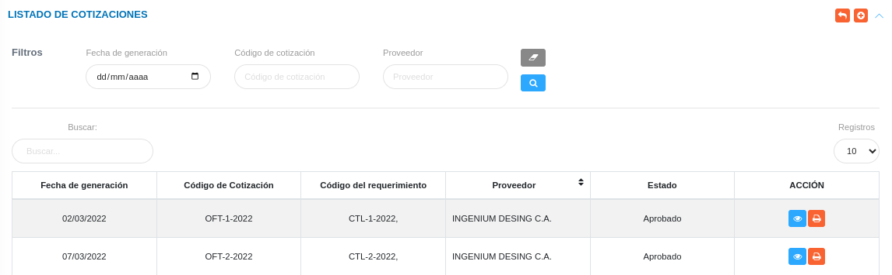
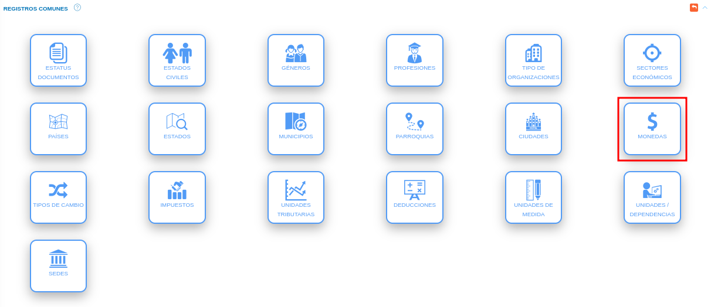

# Gestión de Cotizaciones
***************************

El usuario selecciona el módulo de Compras en el menú lateral de los módulos del sistema, ahí visualizara las opciones **Configuración**, **Proveedores**, **Plan de compras**, **Requerimientos**, **Cotización**, **Disponibilidad Presupuestaria** y **Orden de compras**, debiendo pulsar **Cotización** 

Figura 50:  Menú del Módulo de Compras

## Listado de Cotizaciones 

A través de esta sección se lleva a cabo la gestión de cotizaciones en el módulo de compras. Esta sección lista los registros de cotizaciones con información relevante sobre cada uno de ellos, desde la tabla de registros es posible crear un nuevo registro o gestionar cualquier registro de cotizaciones. 

Figura 51: Tabla de registros de las cotizaciones

### Registrar cotización  

-   El usuario ingresará a la opción **Cotización**. Seguidamente el sistema presenta la sección **Listado de cotización**  
-   Haciendo uso del botón **Crear**  ubicado en la esquina superior derecha de esta sección(Figura 51 Tabla de registros de cotización), se procede a realizar un nuevo registro de cotización. 
-   El sistema despliega un formulario de requerimientos para completar los datos del mismo. 
- Complete el formulario de cotizaciones. Tenga en consideración completar los campos obligatorios que son requeridos para el registro de una cotización. 

Para agregar tipos de monedas  acceda a **Configuración** > **General** > **Registros Comunes**. 

   

 Para agregar proveedores del módulo de Compras acceda a **Compras** > **Proveedores**. 

   

!!! info "Cotizaciones Parciales"
    - Si se desea generar una cotización parcial, se deben seleccionar los productos que se deseen usar para la cotización parcial en la columna "Acción" de la siguiente manera:
     
    - Al realizar esta acción, el sistema almacena la cotización como "Cotización Parcial", y permite generar una cotización con los productos restantes. 

- Presione el botón **Guardar**   para registrar los cambios efectuados.
- Presione el botón **Cancelar**   para cancelar registro y regresar a la ruta anterior.
- Presione el botón **Borrar**  para eliminar datos del formulario.
- Si desea recibir ayuda guiada presione el botón .
- Para retornar a la ruta anterior presione el botón .

## Gestionar cotización

La gestión de cotización se lleva a cabo a través del apartado **Cotizaciones**. 

-   Para acceder a esta sección debe dirigirse a **Compras** y ubicarse en la sección **Cotizaciones** apartado **Listado de Cotizaciones** (ver Figura 51).

A través del apartado **Listado de cotizaciones** se listan los registros de **Listado de cotizaciones** en una tabla.   

Desde este apartado se pueden llevar a cabo las siguientes acciones: 

-   ***Registrar cotizaciones***.   
-   ***Consultar registros***.
-   ***Solicitar Disponibilidad Presupuestaria***. 
-   ***Editar registros***. 
-   ***Eliminar registros***. 

Figura 52: Cotizaciones registradas

### Registrar cotizaciones

-   Presione el botón **Crear registro**  ubicado en la parte superior derecha del apartado **Cotizaciones** (ver Figura 52)
-   A continuación complete el formulario siguiendo los pasos descritos en el apartado [Registrar cotizaciones](##Registrar-cotizaciones).
-   Presione el botón **Guardar**   para registrar los cambios efectuados.

Figura 53: Registrar cotizaciones

### Consultar registros

-   Presione el botón **Consultar registro**  ubicado en la columna titulada **Acción** de un registro de cotizaciones que se prefiere consultar. 

Figura 53: Consultar Registros de cotizaciones 

-   A continuación el sistema despliega una sección donde se describen los datos de la cotización seleccionada.

Figura 54: Datos del cotizaciones

### Solicitar Disponibilidad Presupuestaria

-   Presione el botón **Solicitar disponibilidad presupuestaria**   ubicado en la columna titulada **Acción** del registro de cotizaciones que se desee seleccionar para solicitar disponibilidad presupuestaria. 

Figura 55: Solicitar Disponibilidad Presupuestaria

- El sistema presenta una ventana emergente donde se debe ingresar el usuario y el mensaje solicitado la disponibilidad presupuestaria. 

Figura 56: Mensaje para solicitar disponibilidad presupuestaria

### Editar registros

-   Presione el botón **Editar registro**   ubicado en la columna titulada **Acción** del registro de cotizaciones que se desee seleccionar para actualizar datos. 

Figura 57: Editar Registros de cotizaciones

-   Actualice los datos del formulario siguiendo los pasos descritos en el apartado [Registrar cotizaciones](#registrar-cotizaciones).
-   Presione el botón **Guardar**   para registrar los cambios efectuados.

### Eliminar registros

-   Presione el botón **Eliminar registro**   ubicado en la columna titulada **Acción** del registro de cotizaciones que se desee seleccionar para eliminar del sistema. 

Figura 58: Eliminar Registros de cotizacion

-   Confirme que esta seguro de eliminar el registro seleccionado a través de la ventana emergente, mediante el botón **Confirmar** y efectue los cambios.  

